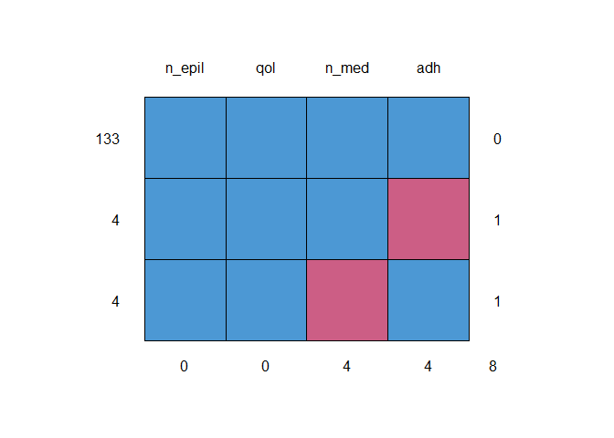
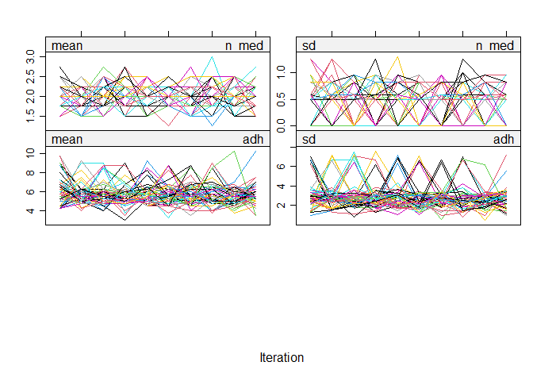
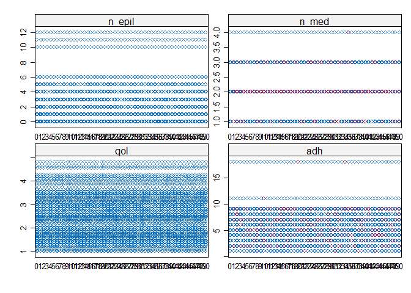

Multiple imputation by Chain Equation
================
Joshua Edefo
2024-01-09

Libraries

``` r
library(mice)
```

    ## Warning: package 'mice' was built under R version 4.3.2

``` r
library(readxl)
```

Importing data

``` r
e <- read.csv("C:/Users/joe62/OneDrive - Aberystwyth University/Apps/Desktop/R code/e.csv")
head(e)
```

    ##   n_epil n_med      qol adh
    ## 1      2     3 3.909091   1
    ## 2      2     2 3.363636   3
    ## 3      1     1 2.545455   2
    ## 4      1     2 1.909091   5
    ## 5      0     2 2.454545   4
    ## 6      1     2 1.636364   5

Preparing the data for multiple imputation

``` r
# check the type of variable and use the appropraite imputation method 9factor varaible and numeric variable)
str(e) 
```

    ## 'data.frame':    141 obs. of  4 variables:
    ##  $ n_epil: int  2 2 1 1 0 1 0 2 3 0 ...
    ##  $ n_med : int  3 2 1 2 2 2 2 2 3 2 ...
    ##  $ qol   : num  3.91 3.36 2.55 1.91 2.45 ...
    ##  $ adh   : int  1 3 2 5 4 5 3 4 4 7 ...

``` r
# check the pattern of missing data
summary(e)
```

    ##      n_epil           n_med            qol             adh        
    ##  Min.   : 0.000   Min.   :1.000   Min.   :1.000   Min.   : 1.000  
    ##  1st Qu.: 0.000   1st Qu.:2.000   1st Qu.:1.636   1st Qu.: 4.000  
    ##  Median : 1.000   Median :2.000   Median :2.455   Median : 6.000  
    ##  Mean   : 1.355   Mean   :2.073   Mean   :2.420   Mean   : 5.876  
    ##  3rd Qu.: 2.000   3rd Qu.:2.000   3rd Qu.:3.091   3rd Qu.: 7.000  
    ##  Max.   :12.000   Max.   :4.000   Max.   :4.818   Max.   :18.000  
    ##                   NA's   :4                       NA's   :4

``` r
md.pattern(e)
```

<!-- -->

    ##     n_epil qol n_med adh  
    ## 133      1   1     1   1 0
    ## 4        1   1     1   0 1
    ## 4        1   1     0   1 1
    ##          0   0     4   4 8

Reression analysis

``` r
# ordinary regression with listwise exclusion of missing data

reg.fit<-lm(qol~ n_med + n_epil + adh, data = e)
summary(reg.fit)
```

    ## 
    ## Call:
    ## lm(formula = qol ~ n_med + n_epil + adh, data = e)
    ## 
    ## Residuals:
    ##      Min       1Q   Median       3Q      Max 
    ## -1.20029 -0.52143 -0.07972  0.51562  1.69512 
    ## 
    ## Coefficients:
    ##             Estimate Std. Error t value Pr(>|t|)    
    ## (Intercept)  2.72212    0.27994   9.724  < 2e-16 ***
    ## n_med        0.11401    0.10920   1.044    0.298    
    ## n_epil       0.20026    0.02977   6.727 5.10e-10 ***
    ## adh         -0.13917    0.02388  -5.827 4.27e-08 ***
    ## ---
    ## Signif. codes:  0 '***' 0.001 '**' 0.01 '*' 0.05 '.' 0.1 ' ' 1
    ## 
    ## Residual standard error: 0.6905 on 129 degrees of freedom
    ##   (8 observations deleted due to missingness)
    ## Multiple R-squared:  0.4225, Adjusted R-squared:  0.409 
    ## F-statistic: 31.45 on 3 and 129 DF,  p-value: 2.507e-15

``` r
## step 1, imputing data

# m = no of imputations which is normally not less than the percentage of missing date, maxit = maximum no of iterations, 
#seed is to ensure than when you run the same number you get the same results, print = FALSE to avoid unncessary data 

imp.data <- mice(data = e, m= 50, maxit = 10, seed= 12345, print = FALSE )

imp.data
```

    ## Class: mids
    ## Number of multiple imputations:  50 
    ## Imputation methods:
    ## n_epil  n_med    qol    adh 
    ##     ""  "pmm"     ""  "pmm" 
    ## PredictorMatrix:
    ##        n_epil n_med qol adh
    ## n_epil      0     1   1   1
    ## n_med       1     0   1   1
    ## qol         1     1   0   1
    ## adh         1     1   1   0

``` r
# checking if covergence was achieved, wahat we do want to see a trend of mean constanly going down or up, if that occurs increase the number of iterations
plot (imp.data )
```

<!-- -->

``` r
# checking if imputed has a plausible values, imputed values should align with real data from sample
stripplot(imp.data)
```

<!-- -->

``` r
#continuous variable use pmm, while for binary variable is logreg


## step 2, running regressions, no of imputations is equal to number of regressions
# imputed data sets

imp.datasets<- complete(imp.data, "long")

imp.datasets
```

    ##      .imp .id n_epil n_med      qol adh
    ## 1       1   1      2     3 3.909091   1
    ## 2       1   2      2     2 3.363636   3
    ## 3       1   3      1     1 2.545455   2
    ## 4       1   4      1     2 1.909091   5
    ## 5       1   5      0     2 2.454545   4
    ## 6       1   6      1     2 1.636364   5
    ## 7       1   7      0     2 2.545455   3
    ## 8       1   8      2     2 2.363636   4
    ## 9       1   9      3     3 3.454545   4
    ## 10      1  10      0     2 1.909091   7
    ## 11      1  11      1     2 1.545455   7
    ## 12      1  12      1     2 1.818182   7
    ## 13      1  13      0     2 1.363636   2
    ## 14      1  14      2     1 3.090909   2
    ## 15      1  15      1     1 3.000000   2
    ## 16      1  16      1     3 2.454545   4
    ## 17      1  17      1     2 2.454545   5
    ## 18      1  18      1     3 4.000000   3
    ## 19      1  19      0     2 1.454545   7
    ## 20      1  20      0     2 1.454545   7
    ## 21      1  21      1     3 1.545455   7
    ## 22      1  22      0     1 1.727273   9
    ## 23      1  23      0     1 1.909091   6
    ## 24      1  24      0     2 1.636364   8
    ## 25      1  25      0     2 3.090909   9
    ## 26      1  26      0     2 2.363636   2
    ## 27      1  27      1     2 3.090909   3
    ## 28      1  28     10     2 3.454545   5
    ## 29      1  29      1     2 3.090909   4
    ## 30      1  30      1     2 4.090909   2
    ## 31      1  31      1     4 2.818182   5
    ## 32      1  32      1     3 3.090909   6
    ## 33      1  33      0     2 1.454545  11
    ## 34      1  34      1     3 2.454545  18
    ## 35      1  35      3     3 4.545455   2
    ## 36      1  36      1     2 3.090909   4
    ## 37      1  37      0     1 3.272727   4
    ## 38      1  38      1     2 1.545455   4
    ## 39      1  39      0     1 2.545455   4
    ## 40      1  40      1     3 3.272727   5
    ## 41      1  41      2     2 2.090909   6
    ## 42      1  42      1     2 2.545455   7
    ## 43      1  43      0     2 1.636364   7
    ## 44      1  44      1     2 1.272727   7
    ## 45      1  45      0     2 1.545455   9
    ## 46      1  46      4     2 3.000000   9
    ## 47      1  47      0     2 1.000000   9
    ## 48      1  48      6     2 3.000000   1
    ## 49      1  49      0     2 2.272727   4
    ## 50      1  50      0     2 1.454545   5
    ## 51      1  51      1     2 1.363636   6
    ## 52      1  52      0     2 1.272727   7
    ## 53      1  53      1     1 2.727273   7
    ## 54      1  54      0     1 1.000000   7
    ## 55      1  55      0     2 1.000000   9
    ## 56      1  56      3     2 4.272727   2
    ## 57      1  57      3     2 4.181818   3
    ## 58      1  58      1     2 2.545455   2
    ## 59      1  59      1     2 1.636364   5
    ## 60      1  60      1     2 2.909091   6
    ## 61      1  61      1     2 1.909091   7
    ## 62      1  62     12     2 3.545455   7
    ## 63      1  63      3     2 1.909091   9
    ## 64      1  64      0     3 2.454545   9
    ## 65      1  65      0     2 1.272727   9
    ## 66      1  66      0     1 2.272727   8
    ## 67      1  67      1     1 1.363636   8
    ## 68      1  68      1     2 2.090909   8
    ## 69      1  69      0     1 2.545455   9
    ## 70      1  70      1     2 1.818182   9
    ## 71      1  71      1     2 1.545455   7
    ## 72      1  72      1     2 3.454545   2
    ## 73      1  73      2     2 2.545455   3
    ## 74      1  74      5     2 3.454545   1
    ## 75      1  75      0     3 1.818182   3
    ## 76      1  76      3     3 3.181818   4
    ## 77      1  77      0     2 3.272727   5
    ## 78      1  78      5     2 4.090909   3
    ## 79      1  79      3     2 3.090909   4
    ## 80      1  80      0     2 1.454545   4
    ## 81      1  81      0     2 2.454545   4
    ## 82      1  82      0     3 1.727273   7
    ## 83      1  83      1     3 1.727273   5
    ## 84      1  84      0     3 1.181818   7
    ## 85      1  85      3     3 3.181818   5
    ## 86      1  86      5     2 2.000000   7
    ## 87      1  87      0     2 1.727273   7
    ## 88      1  88      0     2 3.636364   5
    ## 89      1  89      0     1 1.636364   6
    ## 90      1  90      0     2 2.454545   7
    ## 91      1  91      0     2 1.727273   6
    ## 92      1  92      1     2 1.454545   9
    ## 93      1  93      0     3 1.272727   9
    ## 94      1  94      0     2 2.727273   9
    ## 95      1  95      0     2 2.636364   9
    ## 96      1  96      1     2 3.090909   7
    ## 97      1  97      2     2 2.636364   8
    ## 98      1  98      0     1 1.181818   9
    ## 99      1  99      0     3 1.727273   9
    ## 100     1 100      3     2 4.181818   2
    ## 101     1 101      0     2 1.545455   2
    ## 102     1 102      0     2 2.909091   4
    ## 103     1 103      2     2 3.454545   4
    ## 104     1 104      2     2 1.454545   5
    ## 105     1 105      3     2 4.818182   3
    ## 106     1 106      5     2 4.636364   3
    ## 107     1 107      4     2 3.545455   4
    ## 108     1 108      0     1 2.800000   4
    ## 109     1 109      1     2 2.818182   3
    ## 110     1 110      1     2 1.636364   5
    ## 111     1 111      2     2 2.454545   4
    ## 112     1 112      0     2 1.090909   5
    ## 113     1 113      1     3 2.909091   5
    ## 114     1 114      1     2 2.454545   4
    ## 115     1 115      1     2 2.818182   5
    ## 116     1 116      0     2 1.181818   5
    ## 117     1 117      1     2 2.272727   4
    ## 118     1 118      3     3 3.363636   4
    ## 119     1 119      0     2 1.363636   7
    ## 120     1 120      1     2 1.727273   7
    ## 121     1 121      1     2 1.363636   7
    ## 122     1 122      0     3 2.454545   7
    ## 123     1 123      0     2 2.000000   7
    ## 124     1 124      1     2 2.272727   9
    ## 125     1 125      4     2 3.818182   4
    ## 126     1 126      4     2 3.272727   7
    ## 127     1 127      2     3 3.454545   6
    ## 128     1 128      0     2 2.909091   7
    ## 129     1 129      0     2 1.363636   7
    ## 130     1 130      0     2 1.636364   7
    ## 131     1 131      1     3 2.000000   7
    ## 132     1 132      0     2 1.818182   9
    ## 133     1 133      3     3 2.181818   8
    ## 134     1 134     11     2 2.909091   9
    ## 135     1 135      0     2 2.363636   9
    ## 136     1 136      1     2 1.909091   9
    ## 137     1 137      0     2 1.636364   9
    ## 138     1 138      0     2 1.000000   9
    ## 139     1 139      2     2 3.454545   8
    ## 140     1 140      6     1 3.636364   8
    ## 141     1 141      4     2 3.454545   9
    ## 142     2   1      2     3 3.909091   1
    ## 143     2   2      2     2 3.363636   3
    ## 144     2   3      1     1 2.545455   2
    ## 145     2   4      1     2 1.909091   5
    ## 146     2   5      0     2 2.454545   4
    ## 147     2   6      1     2 1.636364   5
    ## 148     2   7      0     2 2.545455   3
    ## 149     2   8      2     2 2.363636   4
    ## 150     2   9      3     3 3.454545   4
    ## 151     2  10      0     2 1.909091   7
    ## 152     2  11      1     2 1.545455   7
    ## 153     2  12      1     2 1.818182   7
    ## 154     2  13      0     2 1.363636   8
    ## 155     2  14      2     2 3.090909   2
    ## 156     2  15      1     1 3.000000   2
    ## 157     2  16      1     3 2.454545   4
    ## 158     2  17      1     2 2.454545   5
    ## 159     2  18      1     3 4.000000   3
    ## 160     2  19      0     2 1.454545   7
    ## 161     2  20      0     2 1.454545   7
    ## 162     2  21      1     3 1.545455   7
    ## 163     2  22      0     1 1.727273   9
    ## 164     2  23      0     1 1.909091   6
    ## 165     2  24      0     2 1.636364   8
    ## 166     2  25      0     2 3.090909   9
    ## 167     2  26      0     2 2.363636   2
    ## 168     2  27      1     2 3.090909   3
    ## 169     2  28     10     2 3.454545   5
    ## 170     2  29      1     2 3.090909   4
    ## 171     2  30      1     2 4.090909   5
    ## 172     2  31      1     4 2.818182   5
    ## 173     2  32      1     3 3.090909   6
    ## 174     2  33      0     2 1.454545  11
    ## 175     2  34      1     3 2.454545  18
    ## 176     2  35      3     3 4.545455   2
    ## 177     2  36      1     2 3.090909   4
    ## 178     2  37      0     1 3.272727   4
    ## 179     2  38      1     2 1.545455   4
    ## 180     2  39      0     1 2.545455   4
    ## 181     2  40      1     3 3.272727   5
    ## 182     2  41      2     2 2.090909   6
    ## 183     2  42      1     2 2.545455   7
    ## 184     2  43      0     2 1.636364   7
    ## 185     2  44      1     2 1.272727   7
    ## 186     2  45      0     2 1.545455   9
    ## 187     2  46      4     2 3.000000   9
    ## 188     2  47      0     2 1.000000   9
    ## 189     2  48      6     2 3.000000   1
    ## 190     2  49      0     2 2.272727   4
    ## 191     2  50      0     2 1.454545   5
    ## 192     2  51      1     2 1.363636   6
    ## 193     2  52      0     2 1.272727   7
    ## 194     2  53      1     1 2.727273   7
    ## 195     2  54      0     1 1.000000   9
    ## 196     2  55      0     2 1.000000   9
    ## 197     2  56      3     2 4.272727   2
    ## 198     2  57      3     2 4.181818   3
    ## 199     2  58      1     2 2.545455   2
    ## 200     2  59      1     2 1.636364   5
    ## 201     2  60      1     2 2.909091   6
    ## 202     2  61      1     2 1.909091   7
    ## 203     2  62     12     2 3.545455   7
    ## 204     2  63      3     2 1.909091   9
    ## 205     2  64      0     2 2.454545   9
    ## 206     2  65      0     2 1.272727   9
    ## 207     2  66      0     1 2.272727   8
    ## 208     2  67      1     1 1.363636   8
    ## 209     2  68      1     2 2.090909   8
    ## 210     2  69      0     1 2.545455   9
    ## 211     2  70      1     2 1.818182   9
    ## 212     2  71      1     2 1.545455   7
    ## 213     2  72      1     2 3.454545   2
    ## 214     2  73      2     2 2.545455   3
    ## 215     2  74      5     2 3.454545   1
    ## 216     2  75      0     3 1.818182   3
    ## 217     2  76      3     3 3.181818   4
    ## 218     2  77      0     2 3.272727   5
    ## 219     2  78      5     2 4.090909   3
    ## 220     2  79      3     2 3.090909   4
    ## 221     2  80      0     2 1.454545   4
    ## 222     2  81      0     2 2.454545   4
    ## 223     2  82      0     3 1.727273   7
    ## 224     2  83      1     3 1.727273   5
    ## 225     2  84      0     3 1.181818   7
    ## 226     2  85      3     3 3.181818   5
    ## 227     2  86      5     2 2.000000   7
    ## 228     2  87      0     2 1.727273   7
    ## 229     2  88      0     2 3.636364   5
    ## 230     2  89      0     1 1.636364   6
    ## 231     2  90      0     1 2.454545   7
    ## 232     2  91      0     2 1.727273   6
    ## 233     2  92      1     2 1.454545   9
    ## 234     2  93      0     3 1.272727   9
    ## 235     2  94      0     2 2.727273   9
    ## 236     2  95      0     2 2.636364   9
    ## 237     2  96      1     2 3.090909   7
    ## 238     2  97      2     2 2.636364   8
    ## 239     2  98      0     1 1.181818   9
    ## 240     2  99      0     3 1.727273   9
    ## 241     2 100      3     2 4.181818   2
    ## 242     2 101      0     2 1.545455   2
    ## 243     2 102      0     2 2.909091   4
    ## 244     2 103      2     2 3.454545   4
    ## 245     2 104      2     2 1.454545   5
    ## 246     2 105      3     2 4.818182   3
    ## 247     2 106      5     2 4.636364   3
    ## 248     2 107      4     2 3.545455   4
    ## 249     2 108      0     1 2.800000   4
    ## 250     2 109      1     2 2.818182   3
    ## 251     2 110      1     2 1.636364   5
    ## 252     2 111      2     2 2.454545   4
    ## 253     2 112      0     2 1.090909   5
    ## 254     2 113      1     3 2.909091   5
    ## 255     2 114      1     2 2.454545   4
    ## 256     2 115      1     2 2.818182   5
    ## 257     2 116      0     2 1.181818   5
    ## 258     2 117      1     2 2.272727   4
    ## 259     2 118      3     3 3.363636   4
    ## 260     2 119      0     2 1.363636   7
    ## 261     2 120      1     2 1.727273   7
    ## 262     2 121      1     2 1.363636   7
    ## 263     2 122      0     3 2.454545   7
    ## 264     2 123      0     2 2.000000   7
    ## 265     2 124      1     2 2.272727   8
    ## 266     2 125      4     2 3.818182   4
    ## 267     2 126      4     2 3.272727   7
    ## 268     2 127      2     3 3.454545   6
    ## 269     2 128      0     2 2.909091   7
    ## 270     2 129      0     2 1.363636   7
    ## 271     2 130      0     2 1.636364   7
    ## 272     2 131      1     3 2.000000   7
    ## 273     2 132      0     2 1.818182   9
    ## 274     2 133      3     3 2.181818   8
    ## 275     2 134     11     2 2.909091   9
    ## 276     2 135      0     2 2.363636   9
    ## 277     2 136      1     2 1.909091   9
    ## 278     2 137      0     2 1.636364   9
    ## 279     2 138      0     2 1.000000   9
    ## 280     2 139      2     2 3.454545   8
    ## 281     2 140      6     1 3.636364   8
    ## 282     2 141      4     2 3.454545   9
    ## 283     3   1      2     3 3.909091   1
    ## 284     3   2      2     2 3.363636   3
    ## 285     3   3      1     1 2.545455   2
    ## 286     3   4      1     2 1.909091   5
    ## 287     3   5      0     2 2.454545   4
    ## 288     3   6      1     2 1.636364   5
    ## 289     3   7      0     2 2.545455   3
    ## 290     3   8      2     2 2.363636   4
    ## 291     3   9      3     3 3.454545   4
    ## 292     3  10      0     2 1.909091   7
    ## 293     3  11      1     2 1.545455   7
    ## 294     3  12      1     2 1.818182   7
    ## 295     3  13      0     2 1.363636   7
    ## 296     3  14      2     1 3.090909   2
    ## 297     3  15      1     1 3.000000   2
    ## 298     3  16      1     3 2.454545   4
    ## 299     3  17      1     2 2.454545   5
    ## 300     3  18      1     3 4.000000   3
    ## 301     3  19      0     2 1.454545   7
    ## 302     3  20      0     2 1.454545   7
    ## 303     3  21      1     3 1.545455   7
    ## 304     3  22      0     1 1.727273   9
    ## 305     3  23      0     1 1.909091   6
    ## 306     3  24      0     2 1.636364   8
    ## 307     3  25      0     2 3.090909   9
    ## 308     3  26      0     2 2.363636   2
    ## 309     3  27      1     2 3.090909   3
    ## 310     3  28     10     2 3.454545   5
    ## 311     3  29      1     2 3.090909   4
    ## 312     3  30      1     2 4.090909   2
    ## 313     3  31      1     4 2.818182   5
    ## 314     3  32      1     3 3.090909   6
    ## 315     3  33      0     2 1.454545  11
    ## 316     3  34      1     3 2.454545  18
    ## 317     3  35      3     3 4.545455   2
    ## 318     3  36      1     2 3.090909   4
    ## 319     3  37      0     1 3.272727   4
    ## 320     3  38      1     2 1.545455   4
    ## 321     3  39      0     1 2.545455   4
    ## 322     3  40      1     3 3.272727   5
    ## 323     3  41      2     2 2.090909   6
    ## 324     3  42      1     2 2.545455   7
    ## 325     3  43      0     2 1.636364   7
    ## 326     3  44      1     2 1.272727   7
    ## 327     3  45      0     2 1.545455   9
    ## 328     3  46      4     2 3.000000   9
    ## 329     3  47      0     2 1.000000   9
    ## 330     3  48      6     2 3.000000   1
    ## 331     3  49      0     2 2.272727   4
    ## 332     3  50      0     2 1.454545   5
    ## 333     3  51      1     2 1.363636   6
    ## 334     3  52      0     2 1.272727   7
    ## 335     3  53      1     1 2.727273   7
    ## 336     3  54      0     1 1.000000   7
    ## 337     3  55      0     2 1.000000   9
    ## 338     3  56      3     2 4.272727   2
    ## 339     3  57      3     2 4.181818   3
    ## 340     3  58      1     2 2.545455   2
    ## 341     3  59      1     2 1.636364   5
    ## 342     3  60      1     2 2.909091   6
    ## 343     3  61      1     2 1.909091   7
    ## 344     3  62     12     2 3.545455   7
    ## 345     3  63      3     2 1.909091   9
    ## 346     3  64      0     2 2.454545   9
    ## 347     3  65      0     2 1.272727   9
    ## 348     3  66      0     1 2.272727   8
    ## 349     3  67      1     1 1.363636   8
    ## 350     3  68      1     2 2.090909   8
    ## 351     3  69      0     1 2.545455   9
    ## 352     3  70      1     2 1.818182   9
    ## 353     3  71      1     2 1.545455   7
    ## 354     3  72      1     2 3.454545   2
    ## 355     3  73      2     2 2.545455   3
    ## 356     3  74      5     2 3.454545   1
    ## 357     3  75      0     3 1.818182   3
    ## 358     3  76      3     3 3.181818   4
    ## 359     3  77      0     2 3.272727   5
    ## 360     3  78      5     2 4.090909   3
    ## 361     3  79      3     2 3.090909   4
    ## 362     3  80      0     2 1.454545   4
    ## 363     3  81      0     2 2.454545   4
    ## 364     3  82      0     3 1.727273   7
    ## 365     3  83      1     3 1.727273   5
    ## 366     3  84      0     3 1.181818   7
    ## 367     3  85      3     3 3.181818   5
    ## 368     3  86      5     2 2.000000   7
    ## 369     3  87      0     2 1.727273   7
    ## 370     3  88      0     2 3.636364   5
    ## 371     3  89      0     1 1.636364   6
    ## 372     3  90      0     2 2.454545   7
    ## 373     3  91      0     2 1.727273   6
    ## 374     3  92      1     2 1.454545   9
    ## 375     3  93      0     3 1.272727   9
    ## 376     3  94      0     2 2.727273   9
    ## 377     3  95      0     2 2.636364   9
    ## 378     3  96      1     2 3.090909   7
    ## 379     3  97      2     2 2.636364   8
    ## 380     3  98      0     1 1.181818   9
    ## 381     3  99      0     3 1.727273   9
    ## 382     3 100      3     2 4.181818   2
    ## 383     3 101      0     2 1.545455   2
    ## 384     3 102      0     2 2.909091   4
    ## 385     3 103      2     2 3.454545   4
    ## 386     3 104      2     2 1.454545   5
    ## 387     3 105      3     2 4.818182   3
    ## 388     3 106      5     2 4.636364   3
    ## 389     3 107      4     2 3.545455   4
    ## 390     3 108      0     1 2.800000   4
    ## 391     3 109      1     2 2.818182   3
    ## 392     3 110      1     2 1.636364   5
    ## 393     3 111      2     2 2.454545   4
    ## 394     3 112      0     2 1.090909   5
    ## 395     3 113      1     3 2.909091   5
    ## 396     3 114      1     2 2.454545   4
    ## 397     3 115      1     2 2.818182   5
    ## 398     3 116      0     2 1.181818   5
    ## 399     3 117      1     2 2.272727   4
    ## 400     3 118      3     3 3.363636   4
    ## 401     3 119      0     2 1.363636   7
    ## 402     3 120      1     2 1.727273   7
    ## 403     3 121      1     2 1.363636   7
    ## 404     3 122      0     3 2.454545   7
    ## 405     3 123      0     2 2.000000   7
    ## 406     3 124      1     2 2.272727   6
    ## 407     3 125      4     2 3.818182   4
    ## 408     3 126      4     2 3.272727   7
    ## 409     3 127      2     3 3.454545   6
    ## 410     3 128      0     2 2.909091   7
    ## 411     3 129      0     2 1.363636   7
    ## 412     3 130      0     2 1.636364   7
    ## 413     3 131      1     3 2.000000   7
    ## 414     3 132      0     2 1.818182   9
    ## 415     3 133      3     3 2.181818   8
    ## 416     3 134     11     2 2.909091   9
    ## 417     3 135      0     2 2.363636   9
    ## 418     3 136      1     2 1.909091   9
    ## 419     3 137      0     3 1.636364   9
    ## 420     3 138      0     2 1.000000   9
    ## 421     3 139      2     2 3.454545   8
    ## 422     3 140      6     1 3.636364   8
    ## 423     3 141      4     2 3.454545   9
    ## 424     4   1      2     3 3.909091   1
    ## 425     4   2      2     2 3.363636   3
    ## 426     4   3      1     1 2.545455   2
    ## 427     4   4      1     2 1.909091   5
    ## 428     4   5      0     2 2.454545   4
    ## 429     4   6      1     2 1.636364   5
    ## 430     4   7      0     2 2.545455   3
    ## 431     4   8      2     2 2.363636   4
    ## 432     4   9      3     3 3.454545   4
    ## 433     4  10      0     2 1.909091   7
    ## 434     4  11      1     2 1.545455   7
    ## 435     4  12      1     2 1.818182   7
    ## 436     4  13      0     2 1.363636   7
    ## 437     4  14      2     2 3.090909   2
    ## 438     4  15      1     1 3.000000   2
    ## 439     4  16      1     3 2.454545   4
    ## 440     4  17      1     2 2.454545   5
    ## 441     4  18      1     3 4.000000   3
    ## 442     4  19      0     2 1.454545   7
    ## 443     4  20      0     2 1.454545   7
    ## 444     4  21      1     3 1.545455   7
    ## 445     4  22      0     1 1.727273   9
    ## 446     4  23      0     1 1.909091   6
    ## 447     4  24      0     2 1.636364   8
    ## 448     4  25      0     2 3.090909   9
    ## 449     4  26      0     2 2.363636   2
    ## 450     4  27      1     2 3.090909   3
    ## 451     4  28     10     2 3.454545   5
    ## 452     4  29      1     2 3.090909   4
    ## 453     4  30      1     2 4.090909   2
    ## 454     4  31      1     4 2.818182   5
    ## 455     4  32      1     3 3.090909   6
    ## 456     4  33      0     2 1.454545  11
    ## 457     4  34      1     3 2.454545  18
    ## 458     4  35      3     3 4.545455   2
    ## 459     4  36      1     2 3.090909   4
    ## 460     4  37      0     1 3.272727   4
    ## 461     4  38      1     2 1.545455   4
    ## 462     4  39      0     1 2.545455   4
    ## 463     4  40      1     3 3.272727   5
    ## 464     4  41      2     2 2.090909   6
    ## 465     4  42      1     2 2.545455   7
    ## 466     4  43      0     2 1.636364   7
    ## 467     4  44      1     2 1.272727   7
    ## 468     4  45      0     2 1.545455   9
    ## 469     4  46      4     2 3.000000   9
    ## 470     4  47      0     2 1.000000   9
    ## 471     4  48      6     2 3.000000   1
    ## 472     4  49      0     2 2.272727   4
    ## 473     4  50      0     2 1.454545   5
    ## 474     4  51      1     2 1.363636   6
    ## 475     4  52      0     2 1.272727   7
    ## 476     4  53      1     1 2.727273   7
    ## 477     4  54      0     1 1.000000   9
    ## 478     4  55      0     2 1.000000   9
    ## 479     4  56      3     2 4.272727   2
    ## 480     4  57      3     2 4.181818   3
    ## 481     4  58      1     2 2.545455   2
    ## 482     4  59      1     2 1.636364   5
    ## 483     4  60      1     2 2.909091   6
    ## 484     4  61      1     2 1.909091   7
    ## 485     4  62     12     2 3.545455   7
    ## 486     4  63      3     2 1.909091   9
    ## 487     4  64      0     1 2.454545   9
    ## 488     4  65      0     2 1.272727   9
    ## 489     4  66      0     1 2.272727   8
    ## 490     4  67      1     1 1.363636   8
    ## 491     4  68      1     2 2.090909   8
    ## 492     4  69      0     1 2.545455   9
    ## 493     4  70      1     2 1.818182   9
    ## 494     4  71      1     2 1.545455   7
    ## 495     4  72      1     2 3.454545   2
    ## 496     4  73      2     2 2.545455   3
    ## 497     4  74      5     2 3.454545   1
    ## 498     4  75      0     3 1.818182   3
    ## 499     4  76      3     3 3.181818   4
    ## 500     4  77      0     2 3.272727   5
    ## 501     4  78      5     2 4.090909   3
    ## 502     4  79      3     2 3.090909   4
    ## 503     4  80      0     2 1.454545   4
    ## 504     4  81      0     2 2.454545   4
    ## 505     4  82      0     3 1.727273   7
    ## 506     4  83      1     3 1.727273   5
    ## 507     4  84      0     3 1.181818   7
    ## 508     4  85      3     3 3.181818   5
    ## 509     4  86      5     2 2.000000   7
    ## 510     4  87      0     2 1.727273   7
    ## 511     4  88      0     2 3.636364   5
    ## 512     4  89      0     1 1.636364   6
    ## 513     4  90      0     2 2.454545   7
    ## 514     4  91      0     2 1.727273   6
    ## 515     4  92      1     2 1.454545   9
    ## 516     4  93      0     3 1.272727   9
    ## 517     4  94      0     2 2.727273   9
    ## 518     4  95      0     2 2.636364   9
    ## 519     4  96      1     2 3.090909   7
    ## 520     4  97      2     2 2.636364   8
    ## 521     4  98      0     1 1.181818   9
    ## 522     4  99      0     3 1.727273   9
    ## 523     4 100      3     2 4.181818   2
    ## 524     4 101      0     2 1.545455   2
    ## 525     4 102      0     2 2.909091   4
    ## 526     4 103      2     2 3.454545   4
    ## 527     4 104      2     2 1.454545   5
    ## 528     4 105      3     2 4.818182   3
    ## 529     4 106      5     2 4.636364   3
    ## 530     4 107      4     2 3.545455   4
    ## 531     4 108      0     1 2.800000   4
    ## 532     4 109      1     2 2.818182   3
    ## 533     4 110      1     2 1.636364   5
    ## 534     4 111      2     2 2.454545   4
    ## 535     4 112      0     2 1.090909   5
    ## 536     4 113      1     3 2.909091   5
    ## 537     4 114      1     2 2.454545   4
    ## 538     4 115      1     2 2.818182   5
    ## 539     4 116      0     2 1.181818   5
    ## 540     4 117      1     2 2.272727   4
    ## 541     4 118      3     3 3.363636   4
    ## 542     4 119      0     2 1.363636   7
    ## 543     4 120      1     2 1.727273   7
    ## 544     4 121      1     2 1.363636   7
    ## 545     4 122      0     3 2.454545   7
    ## 546     4 123      0     2 2.000000   7
    ## 547     4 124      1     2 2.272727   4
    ## 548     4 125      4     2 3.818182   4
    ## 549     4 126      4     2 3.272727   7
    ## 550     4 127      2     3 3.454545   6
    ## 551     4 128      0     2 2.909091   7
    ## 552     4 129      0     2 1.363636   7
    ## 553     4 130      0     2 1.636364   7
    ## 554     4 131      1     3 2.000000   7
    ## 555     4 132      0     2 1.818182   9
    ## 556     4 133      3     3 2.181818   8
    ## 557     4 134     11     2 2.909091   9
    ## 558     4 135      0     2 2.363636   9
    ## 559     4 136      1     2 1.909091   9
    ## 560     4 137      0     2 1.636364   9
    ## 561     4 138      0     2 1.000000   9
    ## 562     4 139      2     2 3.454545   8
    ## 563     4 140      6     1 3.636364   8
    ## 564     4 141      4     2 3.454545   9
    ## 565     5   1      2     3 3.909091   1
    ## 566     5   2      2     2 3.363636   3
    ## 567     5   3      1     1 2.545455   2
    ## 568     5   4      1     2 1.909091   5
    ## 569     5   5      0     2 2.454545   4
    ## 570     5   6      1     2 1.636364   5
    ## 571     5   7      0     2 2.545455   3
    ## 572     5   8      2     2 2.363636   4
    ## 573     5   9      3     3 3.454545   4
    ## 574     5  10      0     2 1.909091   7
    ## 575     5  11      1     2 1.545455   7
    ## 576     5  12      1     2 1.818182   7
    ## 577     5  13      0     2 1.363636   9
    ## 578     5  14      2     3 3.090909   2
    ## 579     5  15      1     1 3.000000   2
    ## 580     5  16      1     3 2.454545   4
    ## 581     5  17      1     2 2.454545   5
    ## 582     5  18      1     3 4.000000   3
    ## 583     5  19      0     2 1.454545   7
    ## 584     5  20      0     2 1.454545   7
    ## 585     5  21      1     3 1.545455   7
    ## 586     5  22      0     1 1.727273   9
    ## 587     5  23      0     1 1.909091   6
    ## 588     5  24      0     2 1.636364   8
    ## 589     5  25      0     2 3.090909   9
    ## 590     5  26      0     2 2.363636   2
    ## 591     5  27      1     2 3.090909   3
    ## 592     5  28     10     2 3.454545   5
    ## 593     5  29      1     2 3.090909   4
    ## 594     5  30      1     2 4.090909   2
    ## 595     5  31      1     4 2.818182   5
    ## 596     5  32      1     3 3.090909   6
    ## 597     5  33      0     2 1.454545  11
    ## 598     5  34      1     3 2.454545  18
    ## 599     5  35      3     3 4.545455   2
    ## 600     5  36      1     2 3.090909   4
    ## 601     5  37      0     1 3.272727   4
    ## 602     5  38      1     2 1.545455   4
    ## 603     5  39      0     1 2.545455   4
    ## 604     5  40      1     3 3.272727   5
    ## 605     5  41      2     2 2.090909   6
    ## 606     5  42      1     2 2.545455   7
    ## 607     5  43      0     2 1.636364   7
    ## 608     5  44      1     2 1.272727   7
    ## 609     5  45      0     2 1.545455   9
    ## 610     5  46      4     2 3.000000   9
    ## 611     5  47      0     2 1.000000   9
    ## 612     5  48      6     2 3.000000   1
    ## 613     5  49      0     2 2.272727   4
    ## 614     5  50      0     2 1.454545   5
    ## 615     5  51      1     2 1.363636   6
    ## 616     5  52      0     2 1.272727   7
    ## 617     5  53      1     1 2.727273   7
    ## 618     5  54      0     1 1.000000   5
    ## 619     5  55      0     2 1.000000   9
    ## 620     5  56      3     2 4.272727   2
    ## 621     5  57      3     2 4.181818   3
    ## 622     5  58      1     2 2.545455   2
    ## 623     5  59      1     2 1.636364   5
    ## 624     5  60      1     2 2.909091   6
    ## 625     5  61      1     2 1.909091   7
    ## 626     5  62     12     2 3.545455   7
    ## 627     5  63      3     2 1.909091   9
    ## 628     5  64      0     2 2.454545   9
    ## 629     5  65      0     2 1.272727   9
    ## 630     5  66      0     1 2.272727   8
    ## 631     5  67      1     1 1.363636   8
    ## 632     5  68      1     2 2.090909   8
    ## 633     5  69      0     1 2.545455   9
    ## 634     5  70      1     2 1.818182   9
    ## 635     5  71      1     2 1.545455   7
    ## 636     5  72      1     2 3.454545   2
    ## 637     5  73      2     2 2.545455   3
    ## 638     5  74      5     2 3.454545   1
    ## 639     5  75      0     3 1.818182   3
    ## 640     5  76      3     3 3.181818   4
    ## 641     5  77      0     2 3.272727   5
    ## 642     5  78      5     2 4.090909   3
    ## 643     5  79      3     2 3.090909   4
    ## 644     5  80      0     2 1.454545   4
    ## 645     5  81      0     2 2.454545   4
    ## 646     5  82      0     3 1.727273   7
    ## 647     5  83      1     3 1.727273   5
    ## 648     5  84      0     3 1.181818   7
    ## 649     5  85      3     3 3.181818   5
    ## 650     5  86      5     2 2.000000   7
    ## 651     5  87      0     2 1.727273   7
    ## 652     5  88      0     2 3.636364   5
    ## 653     5  89      0     1 1.636364   6
    ## 654     5  90      0     2 2.454545   7
    ## 655     5  91      0     2 1.727273   6
    ## 656     5  92      1     2 1.454545   9
    ## 657     5  93      0     3 1.272727   9
    ## 658     5  94      0     2 2.727273   9
    ## 659     5  95      0     2 2.636364   9
    ## 660     5  96      1     2 3.090909   7
    ## 661     5  97      2     2 2.636364   8
    ## 662     5  98      0     1 1.181818   9
    ## 663     5  99      0     3 1.727273   9
    ## 664     5 100      3     2 4.181818   2
    ## 665     5 101      0     2 1.545455   2
    ## 666     5 102      0     2 2.909091   4
    ## 667     5 103      2     2 3.454545   4
    ## 668     5 104      2     2 1.454545   5
    ## 669     5 105      3     2 4.818182   3
    ## 670     5 106      5     2 4.636364   3
    ## 671     5 107      4     2 3.545455   4
    ## 672     5 108      0     1 2.800000   4
    ## 673     5 109      1     2 2.818182   3
    ## 674     5 110      1     2 1.636364   5
    ## 675     5 111      2     2 2.454545   4
    ## 676     5 112      0     2 1.090909   5
    ## 677     5 113      1     3 2.909091   5
    ## 678     5 114      1     2 2.454545   4
    ## 679     5 115      1     2 2.818182   5
    ## 680     5 116      0     2 1.181818   5
    ## 681     5 117      1     2 2.272727   4
    ## 682     5 118      3     3 3.363636   4
    ## 683     5 119      0     2 1.363636   7
    ## 684     5 120      1     2 1.727273   7
    ## 685     5 121      1     2 1.363636   7
    ## 686     5 122      0     3 2.454545   7
    ## 687     5 123      0     2 2.000000   7
    ## 688     5 124      1     2 2.272727   5
    ## 689     5 125      4     2 3.818182   4
    ## 690     5 126      4     2 3.272727   7
    ## 691     5 127      2     3 3.454545   6
    ## 692     5 128      0     2 2.909091   7
    ## 693     5 129      0     2 1.363636   7
    ## 694     5 130      0     2 1.636364   7
    ## 695     5 131      1     3 2.000000   7
    ## 696     5 132      0     2 1.818182   9
    ## 697     5 133      3     3 2.181818   8
    ## 698     5 134     11     2 2.909091   9
    ## 699     5 135      0     2 2.363636   9
    ## 700     5 136      1     2 1.909091   9
    ## 701     5 137      0     2 1.636364   9
    ## 702     5 138      0     2 1.000000   9
    ## 703     5 139      2     2 3.454545   8
    ## 704     5 140      6     1 3.636364   8
    ## 705     5 141      4     2 3.454545   9
    ## 706     6   1      2     3 3.909091   1
    ## 707     6   2      2     2 3.363636   3
    ## 708     6   3      1     1 2.545455   2
    ## 709     6   4      1     2 1.909091   5
    ## 710     6   5      0     2 2.454545   4
    ## 711     6   6      1     2 1.636364   5
    ## 712     6   7      0     2 2.545455   3
    ## 713     6   8      2     2 2.363636   4
    ## 714     6   9      3     3 3.454545   4
    ## 715     6  10      0     2 1.909091   7
    ## 716     6  11      1     2 1.545455   7
    ## 717     6  12      1     2 1.818182   7
    ## 718     6  13      0     2 1.363636   7
    ## 719     6  14      2     2 3.090909   2
    ## 720     6  15      1     1 3.000000   2
    ## 721     6  16      1     3 2.454545   4
    ## 722     6  17      1     2 2.454545   5
    ## 723     6  18      1     3 4.000000   3
    ## 724     6  19      0     2 1.454545   7
    ## 725     6  20      0     2 1.454545   7
    ## 726     6  21      1     3 1.545455   7
    ## 727     6  22      0     1 1.727273   9
    ## 728     6  23      0     1 1.909091   6
    ## 729     6  24      0     2 1.636364   8
    ## 730     6  25      0     2 3.090909   9
    ## 731     6  26      0     2 2.363636   2
    ## 732     6  27      1     2 3.090909   3
    ## 733     6  28     10     2 3.454545   5
    ## 734     6  29      1     2 3.090909   4
    ## 735     6  30      1     2 4.090909   2
    ## 736     6  31      1     4 2.818182   5
    ## 737     6  32      1     3 3.090909   6
    ## 738     6  33      0     2 1.454545  11
    ## 739     6  34      1     3 2.454545  18
    ## 740     6  35      3     3 4.545455   2
    ## 741     6  36      1     2 3.090909   4
    ## 742     6  37      0     1 3.272727   4
    ## 743     6  38      1     2 1.545455   4
    ## 744     6  39      0     1 2.545455   4
    ## 745     6  40      1     3 3.272727   5
    ## 746     6  41      2     2 2.090909   6
    ## 747     6  42      1     2 2.545455   7
    ## 748     6  43      0     2 1.636364   7
    ## 749     6  44      1     2 1.272727   7
    ## 750     6  45      0     2 1.545455   9
    ## 751     6  46      4     2 3.000000   9
    ## 752     6  47      0     2 1.000000   9
    ## 753     6  48      6     2 3.000000   1
    ## 754     6  49      0     2 2.272727   4
    ## 755     6  50      0     2 1.454545   5
    ## 756     6  51      1     2 1.363636   6
    ## 757     6  52      0     2 1.272727   7
    ## 758     6  53      1     1 2.727273   7
    ## 759     6  54      0     1 1.000000   5
    ## 760     6  55      0     2 1.000000   9
    ## 761     6  56      3     2 4.272727   2
    ## 762     6  57      3     2 4.181818   3
    ## 763     6  58      1     2 2.545455   2
    ## 764     6  59      1     2 1.636364   5
    ## 765     6  60      1     2 2.909091   6
    ## 766     6  61      1     2 1.909091   7
    ## 767     6  62     12     2 3.545455   7
    ## 768     6  63      3     2 1.909091   9
    ## 769     6  64      0     2 2.454545   9
    ## 770     6  65      0     2 1.272727   9
    ## 771     6  66      0     1 2.272727   8
    ## 772     6  67      1     1 1.363636   8
    ## 773     6  68      1     2 2.090909   8
    ## 774     6  69      0     1 2.545455   9
    ## 775     6  70      1     2 1.818182   9
    ## 776     6  71      1     2 1.545455   7
    ## 777     6  72      1     2 3.454545   2
    ## 778     6  73      2     2 2.545455   3
    ## 779     6  74      5     2 3.454545   1
    ## 780     6  75      0     3 1.818182   3
    ## 781     6  76      3     3 3.181818   4
    ## 782     6  77      0     2 3.272727   5
    ## 783     6  78      5     2 4.090909   3
    ## 784     6  79      3     2 3.090909   4
    ## 785     6  80      0     2 1.454545   4
    ## 786     6  81      0     2 2.454545   4
    ## 787     6  82      0     3 1.727273   7
    ## 788     6  83      1     3 1.727273   5
    ## 789     6  84      0     3 1.181818   7
    ## 790     6  85      3     3 3.181818   5
    ## 791     6  86      5     2 2.000000   7
    ## 792     6  87      0     2 1.727273   7
    ## 793     6  88      0     2 3.636364   5
    ## 794     6  89      0     1 1.636364   6
    ## 795     6  90      0     2 2.454545   7
    ## 796     6  91      0     2 1.727273   6
    ## 797     6  92      1     2 1.454545   9
    ## 798     6  93      0     3 1.272727   9
    ## 799     6  94      0     2 2.727273   9
    ## 800     6  95      0     2 2.636364   9
    ## 801     6  96      1     2 3.090909   7
    ## 802     6  97      2     2 2.636364   8
    ## 803     6  98      0     1 1.181818   9
    ## 804     6  99      0     3 1.727273   9
    ## 805     6 100      3     2 4.181818   2
    ## 806     6 101      0     2 1.545455   2
    ## 807     6 102      0     2 2.909091   4
    ## 808     6 103      2     2 3.454545   4
    ## 809     6 104      2     2 1.454545   5
    ## 810     6 105      3     2 4.818182   3
    ## 811     6 106      5     2 4.636364   3
    ## 812     6 107      4     2 3.545455   4
    ## 813     6 108      0     1 2.800000   4
    ## 814     6 109      1     2 2.818182   3
    ## 815     6 110      1     2 1.636364   5
    ## 816     6 111      2     2 2.454545   4
    ## 817     6 112      0     2 1.090909   5
    ## 818     6 113      1     3 2.909091   5
    ## 819     6 114      1     2 2.454545   4
    ## 820     6 115      1     2 2.818182   5
    ## 821     6 116      0     2 1.181818   5
    ## 822     6 117      1     2 2.272727   4
    ## 823     6 118      3     3 3.363636   4
    ## 824     6 119      0     2 1.363636   7
    ## 825     6 120      1     2 1.727273   7
    ## 826     6 121      1     2 1.363636   7
    ## 827     6 122      0     3 2.454545   7
    ## 828     6 123      0     2 2.000000   7
    ## 829     6 124      1     2 2.272727   4
    ## 830     6 125      4     2 3.818182   4
    ## 831     6 126      4     2 3.272727   7
    ## 832     6 127      2     3 3.454545   6
    ## 833     6 128      0     2 2.909091   7
    ## 834     6 129      0     2 1.363636   7
    ## 835     6 130      0     2 1.636364   7
    ## 836     6 131      1     3 2.000000   7
    ## 837     6 132      0     2 1.818182   9
    ## 838     6 133      3     3 2.181818   8
    ## 839     6 134     11     2 2.909091   9
    ## 840     6 135      0     2 2.363636   9
    ## 841     6 136      1     2 1.909091   9
    ## 842     6 137      0     2 1.636364   9
    ## 843     6 138      0     2 1.000000   9
    ## 844     6 139      2     2 3.454545   8
    ## 845     6 140      6     1 3.636364   8
    ## 846     6 141      4     2 3.454545   9
    ## 847     7   1      2     3 3.909091   1
    ## 848     7   2      2     2 3.363636   3
    ## 849     7   3      1     1 2.545455   2
    ## 850     7   4      1     2 1.909091   5
    ## 851     7   5      0     2 2.454545   4
    ## 852     7   6      1     2 1.636364   5
    ## 853     7   7      0     2 2.545455   3
    ## 854     7   8      2     2 2.363636   4
    ## 855     7   9      3     3 3.454545   4
    ## 856     7  10      0     2 1.909091   7
    ## 857     7  11      1     2 1.545455   7
    ## 858     7  12      1     2 1.818182   7
    ## 859     7  13      0     2 1.363636   5
    ## 860     7  14      2     2 3.090909   2
    ## 861     7  15      1     1 3.000000   2
    ## 862     7  16      1     3 2.454545   4
    ## 863     7  17      1     2 2.454545   5
    ## 864     7  18      1     3 4.000000   3
    ## 865     7  19      0     2 1.454545   7
    ## 866     7  20      0     2 1.454545   7
    ## 867     7  21      1     3 1.545455   7
    ## 868     7  22      0     1 1.727273   9
    ## 869     7  23      0     1 1.909091   6
    ## 870     7  24      0     2 1.636364   8
    ## 871     7  25      0     2 3.090909   9
    ## 872     7  26      0     2 2.363636   2
    ## 873     7  27      1     2 3.090909   3
    ## 874     7  28     10     2 3.454545   5
    ## 875     7  29      1     2 3.090909   4
    ## 876     7  30      1     2 4.090909   3
    ## 877     7  31      1     4 2.818182   5
    ## 878     7  32      1     3 3.090909   6
    ## 879     7  33      0     2 1.454545  11
    ## 880     7  34      1     3 2.454545  18
    ## 881     7  35      3     3 4.545455   2
    ## 882     7  36      1     2 3.090909   4
    ## 883     7  37      0     1 3.272727   4
    ## 884     7  38      1     2 1.545455   4
    ## 885     7  39      0     1 2.545455   4
    ## 886     7  40      1     3 3.272727   5
    ## 887     7  41      2     2 2.090909   6
    ## 888     7  42      1     2 2.545455   7
    ## 889     7  43      0     2 1.636364   7
    ## 890     7  44      1     2 1.272727   7
    ## 891     7  45      0     2 1.545455   9
    ## 892     7  46      4     2 3.000000   9
    ## 893     7  47      0     2 1.000000   9
    ## 894     7  48      6     2 3.000000   1
    ## 895     7  49      0     2 2.272727   4
    ## 896     7  50      0     2 1.454545   5
    ## 897     7  51      1     2 1.363636   6
    ## 898     7  52      0     2 1.272727   7
    ## 899     7  53      1     1 2.727273   7
    ## 900     7  54      0     1 1.000000   5
    ## 901     7  55      0     2 1.000000   9
    ## 902     7  56      3     2 4.272727   2
    ## 903     7  57      3     2 4.181818   3
    ## 904     7  58      1     2 2.545455   2
    ## 905     7  59      1     2 1.636364   5
    ## 906     7  60      1     2 2.909091   6
    ## 907     7  61      1     2 1.909091   7
    ## 908     7  62     12     2 3.545455   7
    ## 909     7  63      3     2 1.909091   9
    ## 910     7  64      0     2 2.454545   9
    ## 911     7  65      0     2 1.272727   9
    ## 912     7  66      0     1 2.272727   8
    ## 913     7  67      1     1 1.363636   8
    ## 914     7  68      1     2 2.090909   8
    ## 915     7  69      0     1 2.545455   9
    ## 916     7  70      1     2 1.818182   9
    ## 917     7  71      1     2 1.545455   7
    ## 918     7  72      1     2 3.454545   2
    ## 919     7  73      2     2 2.545455   3
    ## 920     7  74      5     2 3.454545   1
    ## 921     7  75      0     3 1.818182   3
    ## 922     7  76      3     3 3.181818   4
    ## 923     7  77      0     2 3.272727   5
    ## 924     7  78      5     2 4.090909   3
    ## 925     7  79      3     2 3.090909   4
    ## 926     7  80      0     2 1.454545   4
    ## 927     7  81      0     2 2.454545   4
    ## 928     7  82      0     3 1.727273   7
    ## 929     7  83      1     3 1.727273   5
    ## 930     7  84      0     3 1.181818   7
    ## 931     7  85      3     3 3.181818   5
    ## 932     7  86      5     2 2.000000   7
    ## 933     7  87      0     2 1.727273   7
    ## 934     7  88      0     2 3.636364   5
    ## 935     7  89      0     1 1.636364   6
    ## 936     7  90      0     2 2.454545   7
    ## 937     7  91      0     2 1.727273   6
    ## 938     7  92      1     2 1.454545   9
    ## 939     7  93      0     3 1.272727   9
    ## 940     7  94      0     2 2.727273   9
    ## 941     7  95      0     2 2.636364   9
    ## 942     7  96      1     2 3.090909   7
    ## 943     7  97      2     2 2.636364   8
    ## 944     7  98      0     1 1.181818   9
    ## 945     7  99      0     3 1.727273   9
    ## 946     7 100      3     2 4.181818   2
    ## 947     7 101      0     2 1.545455   2
    ## 948     7 102      0     2 2.909091   4
    ## 949     7 103      2     2 3.454545   4
    ## 950     7 104      2     2 1.454545   5
    ## 951     7 105      3     2 4.818182   3
    ## 952     7 106      5     2 4.636364   3
    ## 953     7 107      4     2 3.545455   4
    ## 954     7 108      0     1 2.800000   4
    ## 955     7 109      1     2 2.818182   3
    ## 956     7 110      1     2 1.636364   5
    ## 957     7 111      2     2 2.454545   4
    ## 958     7 112      0     2 1.090909   5
    ## 959     7 113      1     3 2.909091   5
    ## 960     7 114      1     2 2.454545   4
    ## 961     7 115      1     2 2.818182   5
    ## 962     7 116      0     2 1.181818   5
    ## 963     7 117      1     2 2.272727   4
    ## 964     7 118      3     3 3.363636   4
    ## 965     7 119      0     2 1.363636   7
    ## 966     7 120      1     2 1.727273   7
    ## 967     7 121      1     2 1.363636   7
    ## 968     7 122      0     3 2.454545   7
    ## 969     7 123      0     2 2.000000   7
    ## 970     7 124      1     2 2.272727   7
    ## 971     7 125      4     2 3.818182   4
    ## 972     7 126      4     2 3.272727   7
    ## 973     7 127      2     3 3.454545   6
    ## 974     7 128      0     2 2.909091   7
    ## 975     7 129      0     2 1.363636   7
    ## 976     7 130      0     2 1.636364   7
    ## 977     7 131      1     3 2.000000   7
    ## 978     7 132      0     2 1.818182   9
    ## 979     7 133      3     3 2.181818   8
    ## 980     7 134     11     2 2.909091   9
    ## 981     7 135      0     2 2.363636   9
    ## 982     7 136      1     2 1.909091   9
    ## 983     7 137      0     2 1.636364   9
    ## 984     7 138      0     2 1.000000   9
    ## 985     7 139      2     2 3.454545   8
    ## 986     7 140      6     1 3.636364   8
    ## 987     7 141      4     2 3.454545   9
    ## 988     8   1      2     3 3.909091   1
    ## 989     8   2      2     2 3.363636   3
    ## 990     8   3      1     1 2.545455   2
    ## 991     8   4      1     2 1.909091   5
    ## 992     8   5      0     2 2.454545   4
    ## 993     8   6      1     2 1.636364   5
    ## 994     8   7      0     2 2.545455   3
    ## 995     8   8      2     2 2.363636   4
    ## 996     8   9      3     3 3.454545   4
    ## 997     8  10      0     2 1.909091   7
    ## 998     8  11      1     2 1.545455   7
    ## 999     8  12      1     2 1.818182   7
    ## 1000    8  13      0     2 1.363636   5
    ## 1001    8  14      2     2 3.090909   2
    ## 1002    8  15      1     1 3.000000   2
    ## 1003    8  16      1     3 2.454545   4
    ## 1004    8  17      1     2 2.454545   5
    ## 1005    8  18      1     3 4.000000   3
    ## 1006    8  19      0     2 1.454545   7
    ## 1007    8  20      0     2 1.454545   7
    ## 1008    8  21      1     3 1.545455   7
    ## 1009    8  22      0     1 1.727273   9
    ## 1010    8  23      0     1 1.909091   6
    ## 1011    8  24      0     2 1.636364   8
    ## 1012    8  25      0     2 3.090909   9
    ## 1013    8  26      0     2 2.363636   2
    ## 1014    8  27      1     2 3.090909   3
    ## 1015    8  28     10     2 3.454545   5
    ## 1016    8  29      1     2 3.090909   4
    ## 1017    8  30      1     2 4.090909   3
    ## 1018    8  31      1     4 2.818182   5
    ## 1019    8  32      1     3 3.090909   6
    ## 1020    8  33      0     2 1.454545  11
    ## 1021    8  34      1     3 2.454545  18
    ## 1022    8  35      3     3 4.545455   2
    ## 1023    8  36      1     2 3.090909   4
    ## 1024    8  37      0     1 3.272727   4
    ## 1025    8  38      1     2 1.545455   4
    ## 1026    8  39      0     1 2.545455   4
    ## 1027    8  40      1     3 3.272727   5
    ## 1028    8  41      2     2 2.090909   6
    ## 1029    8  42      1     2 2.545455   7
    ## 1030    8  43      0     2 1.636364   7
    ## 1031    8  44      1     2 1.272727   7
    ## 1032    8  45      0     2 1.545455   9
    ## 1033    8  46      4     2 3.000000   9
    ## 1034    8  47      0     2 1.000000   9
    ## 1035    8  48      6     2 3.000000   1
    ## 1036    8  49      0     2 2.272727   4
    ## 1037    8  50      0     2 1.454545   5
    ## 1038    8  51      1     2 1.363636   6
    ## 1039    8  52      0     2 1.272727   7
    ## 1040    8  53      1     1 2.727273   7
    ## 1041    8  54      0     1 1.000000   5
    ## 1042    8  55      0     2 1.000000   9
    ## 1043    8  56      3     2 4.272727   2
    ## 1044    8  57      3     2 4.181818   3
    ## 1045    8  58      1     2 2.545455   2
    ## 1046    8  59      1     2 1.636364   5
    ## 1047    8  60      1     2 2.909091   6
    ## 1048    8  61      1     2 1.909091   7
    ## 1049    8  62     12     2 3.545455   7
    ## 1050    8  63      3     2 1.909091   9
    ## 1051    8  64      0     3 2.454545   9
    ## 1052    8  65      0     2 1.272727   9
    ## 1053    8  66      0     1 2.272727   8
    ## 1054    8  67      1     1 1.363636   8
    ## 1055    8  68      1     2 2.090909   8
    ## 1056    8  69      0     1 2.545455   9
    ## 1057    8  70      1     2 1.818182   9
    ## 1058    8  71      1     2 1.545455   7
    ## 1059    8  72      1     2 3.454545   2
    ## 1060    8  73      2     2 2.545455   3
    ## 1061    8  74      5     2 3.454545   1
    ## 1062    8  75      0     3 1.818182   3
    ## 1063    8  76      3     3 3.181818   4
    ## 1064    8  77      0     2 3.272727   5
    ## 1065    8  78      5     2 4.090909   3
    ## 1066    8  79      3     2 3.090909   4
    ## 1067    8  80      0     2 1.454545   4
    ## 1068    8  81      0     2 2.454545   4
    ## 1069    8  82      0     3 1.727273   7
    ## 1070    8  83      1     3 1.727273   5
    ## 1071    8  84      0     3 1.181818   7
    ## 1072    8  85      3     3 3.181818   5
    ## 1073    8  86      5     2 2.000000   7
    ## 1074    8  87      0     2 1.727273   7
    ## 1075    8  88      0     2 3.636364   5
    ## 1076    8  89      0     1 1.636364   6
    ## 1077    8  90      0     2 2.454545   7
    ## 1078    8  91      0     2 1.727273   6
    ## 1079    8  92      1     2 1.454545   9
    ## 1080    8  93      0     3 1.272727   9
    ## 1081    8  94      0     2 2.727273   9
    ## 1082    8  95      0     2 2.636364   9
    ## 1083    8  96      1     2 3.090909   7
    ## 1084    8  97      2     2 2.636364   8
    ## 1085    8  98      0     1 1.181818   9
    ## 1086    8  99      0     3 1.727273   9
    ## 1087    8 100      3     2 4.181818   2
    ## 1088    8 101      0     2 1.545455   2
    ## 1089    8 102      0     2 2.909091   4
    ## 1090    8 103      2     2 3.454545   4
    ## 1091    8 104      2     2 1.454545   5
    ## 1092    8 105      3     2 4.818182   3
    ## 1093    8 106      5     2 4.636364   3
    ## 1094    8 107      4     2 3.545455   4
    ## 1095    8 108      0     1 2.800000   4
    ## 1096    8 109      1     2 2.818182   3
    ## 1097    8 110      1     2 1.636364   5
    ## 1098    8 111      2     2 2.454545   4
    ## 1099    8 112      0     2 1.090909   5
    ## 1100    8 113      1     3 2.909091   5
    ## 1101    8 114      1     2 2.454545   4
    ## 1102    8 115      1     2 2.818182   5
    ## 1103    8 116      0     2 1.181818   5
    ## 1104    8 117      1     2 2.272727   4
    ## 1105    8 118      3     3 3.363636   4
    ## 1106    8 119      0     2 1.363636   7
    ## 1107    8 120      1     2 1.727273   7
    ## 1108    8 121      1     2 1.363636   7
    ## 1109    8 122      0     3 2.454545   7
    ## 1110    8 123      0     2 2.000000   7
    ## 1111    8 124      1     2 2.272727   4
    ## 1112    8 125      4     2 3.818182   4
    ## 1113    8 126      4     2 3.272727   7
    ## 1114    8 127      2     3 3.454545   6
    ## 1115    8 128      0     2 2.909091   7
    ## 1116    8 129      0     2 1.363636   7
    ## 1117    8 130      0     2 1.636364   7
    ## 1118    8 131      1     3 2.000000   7
    ## 1119    8 132      0     2 1.818182   9
    ## 1120    8 133      3     3 2.181818   8
    ## 1121    8 134     11     2 2.909091   9
    ## 1122    8 135      0     2 2.363636   9
    ## 1123    8 136      1     2 1.909091   9
    ## 1124    8 137      0     1 1.636364   9
    ## 1125    8 138      0     2 1.000000   9
    ## 1126    8 139      2     2 3.454545   8
    ## 1127    8 140      6     1 3.636364   8
    ## 1128    8 141      4     2 3.454545   9
    ## 1129    9   1      2     3 3.909091   1
    ## 1130    9   2      2     2 3.363636   3
    ## 1131    9   3      1     1 2.545455   2
    ## 1132    9   4      1     2 1.909091   5
    ## 1133    9   5      0     2 2.454545   4
    ## 1134    9   6      1     2 1.636364   5
    ## 1135    9   7      0     2 2.545455   3
    ## 1136    9   8      2     2 2.363636   4
    ## 1137    9   9      3     3 3.454545   4
    ## 1138    9  10      0     2 1.909091   7
    ## 1139    9  11      1     2 1.545455   7
    ## 1140    9  12      1     2 1.818182   7
    ## 1141    9  13      0     2 1.363636   7
    ## 1142    9  14      2     2 3.090909   2
    ## 1143    9  15      1     1 3.000000   2
    ## 1144    9  16      1     3 2.454545   4
    ## 1145    9  17      1     2 2.454545   5
    ## 1146    9  18      1     3 4.000000   3
    ## 1147    9  19      0     2 1.454545   7
    ## 1148    9  20      0     2 1.454545   7
    ## 1149    9  21      1     3 1.545455   7
    ## 1150    9  22      0     1 1.727273   9
    ## 1151    9  23      0     1 1.909091   6
    ## 1152    9  24      0     2 1.636364   8
    ## 1153    9  25      0     2 3.090909   9
    ## 1154    9  26      0     2 2.363636   2
    ## 1155    9  27      1     2 3.090909   3
    ## 1156    9  28     10     2 3.454545   5
    ## 1157    9  29      1     2 3.090909   4
    ## 1158    9  30      1     2 4.090909   2
    ## 1159    9  31      1     4 2.818182   5
    ## 1160    9  32      1     3 3.090909   6
    ## 1161    9  33      0     2 1.454545  11
    ## 1162    9  34      1     3 2.454545  18
    ## 1163    9  35      3     3 4.545455   2
    ## 1164    9  36      1     2 3.090909   4
    ## 1165    9  37      0     1 3.272727   4
    ## 1166    9  38      1     2 1.545455   4
    ## 1167    9  39      0     1 2.545455   4
    ## 1168    9  40      1     3 3.272727   5
    ## 1169    9  41      2     2 2.090909   6
    ## 1170    9  42      1     2 2.545455   7
    ## 1171    9  43      0     2 1.636364   7
    ## 1172    9  44      1     2 1.272727   7
    ## 1173    9  45      0     2 1.545455   9
    ## 1174    9  46      4     2 3.000000   9
    ## 1175    9  47      0     2 1.000000   9
    ## 1176    9  48      6     2 3.000000   1
    ## 1177    9  49      0     2 2.272727   4
    ## 1178    9  50      0     2 1.454545   5
    ## 1179    9  51      1     2 1.363636   6
    ## 1180    9  52      0     2 1.272727   7
    ## 1181    9  53      1     1 2.727273   7
    ## 1182    9  54      0     1 1.000000   9
    ## 1183    9  55      0     2 1.000000   9
    ## 1184    9  56      3     2 4.272727   2
    ## 1185    9  57      3     2 4.181818   3
    ## 1186    9  58      1     2 2.545455   2
    ## 1187    9  59      1     2 1.636364   5
    ## 1188    9  60      1     2 2.909091   6
    ## 1189    9  61      1     2 1.909091   7
    ## 1190    9  62     12     2 3.545455   7
    ## 1191    9  63      3     2 1.909091   9
    ## 1192    9  64      0     2 2.454545   9
    ## 1193    9  65      0     2 1.272727   9
    ## 1194    9  66      0     1 2.272727   8
    ## 1195    9  67      1     1 1.363636   8
    ## 1196    9  68      1     2 2.090909   8
    ## 1197    9  69      0     1 2.545455   9
    ## 1198    9  70      1     2 1.818182   9
    ## 1199    9  71      1     2 1.545455   7
    ## 1200    9  72      1     2 3.454545   2
    ## 1201    9  73      2     2 2.545455   3
    ## 1202    9  74      5     2 3.454545   1
    ## 1203    9  75      0     3 1.818182   3
    ## 1204    9  76      3     3 3.181818   4
    ## 1205    9  77      0     2 3.272727   5
    ## 1206    9  78      5     2 4.090909   3
    ## 1207    9  79      3     2 3.090909   4
    ## 1208    9  80      0     2 1.454545   4
    ## 1209    9  81      0     2 2.454545   4
    ## 1210    9  82      0     3 1.727273   7
    ## 1211    9  83      1     3 1.727273   5
    ## 1212    9  84      0     3 1.181818   7
    ## 1213    9  85      3     3 3.181818   5
    ## 1214    9  86      5     2 2.000000   7
    ## 1215    9  87      0     2 1.727273   7
    ## 1216    9  88      0     2 3.636364   5
    ## 1217    9  89      0     1 1.636364   6
    ## 1218    9  90      0     1 2.454545   7
    ## 1219    9  91      0     2 1.727273   6
    ## 1220    9  92      1     2 1.454545   9
    ## 1221    9  93      0     3 1.272727   9
    ## 1222    9  94      0     2 2.727273   9
    ## 1223    9  95      0     2 2.636364   9
    ## 1224    9  96      1     2 3.090909   7
    ## 1225    9  97      2     2 2.636364   8
    ## 1226    9  98      0     1 1.181818   9
    ## 1227    9  99      0     3 1.727273   9
    ## 1228    9 100      3     2 4.181818   2
    ## 1229    9 101      0     2 1.545455   2
    ## 1230    9 102      0     2 2.909091   4
    ## 1231    9 103      2     2 3.454545   4
    ## 1232    9 104      2     2 1.454545   5
    ## 1233    9 105      3     2 4.818182   3
    ## 1234    9 106      5     2 4.636364   3
    ## 1235    9 107      4     2 3.545455   4
    ## 1236    9 108      0     1 2.800000   4
    ## 1237    9 109      1     2 2.818182   3
    ## 1238    9 110      1     2 1.636364   5
    ## 1239    9 111      2     2 2.454545   4
    ## 1240    9 112      0     2 1.090909   5
    ## 1241    9 113      1     3 2.909091   5
    ## 1242    9 114      1     2 2.454545   4
    ## 1243    9 115      1     2 2.818182   5
    ## 1244    9 116      0     2 1.181818   5
    ## 1245    9 117      1     2 2.272727   4
    ## 1246    9 118      3     3 3.363636   4
    ## 1247    9 119      0     2 1.363636   7
    ## 1248    9 120      1     2 1.727273   7
    ## 1249    9 121      1     2 1.363636   7
    ## 1250    9 122      0     3 2.454545   7
    ## 1251    9 123      0     2 2.000000   7
    ## 1252    9 124      1     2 2.272727   6
    ## 1253    9 125      4     2 3.818182   4
    ## 1254    9 126      4     2 3.272727   7
    ## 1255    9 127      2     3 3.454545   6
    ## 1256    9 128      0     2 2.909091   7
    ## 1257    9 129      0     2 1.363636   7
    ## 1258    9 130      0     2 1.636364   7
    ## 1259    9 131      1     3 2.000000   7
    ## 1260    9 132      0     2 1.818182   9
    ## 1261    9 133      3     3 2.181818   8
    ## 1262    9 134     11     2 2.909091   9
    ## 1263    9 135      0     2 2.363636   9
    ## 1264    9 136      1     2 1.909091   9
    ## 1265    9 137      0     2 1.636364   9
    ## 1266    9 138      0     2 1.000000   9
    ## 1267    9 139      2     2 3.454545   8
    ## 1268    9 140      6     1 3.636364   8
    ## 1269    9 141      4     2 3.454545   9
    ## 1270   10   1      2     3 3.909091   1
    ## 1271   10   2      2     2 3.363636   3
    ## 1272   10   3      1     1 2.545455   2
    ## 1273   10   4      1     2 1.909091   5
    ## 1274   10   5      0     2 2.454545   4
    ## 1275   10   6      1     2 1.636364   5
    ## 1276   10   7      0     2 2.545455   3
    ## 1277   10   8      2     2 2.363636   4
    ## 1278   10   9      3     3 3.454545   4
    ## 1279   10  10      0     2 1.909091   7
    ## 1280   10  11      1     2 1.545455   7
    ## 1281   10  12      1     2 1.818182   7
    ## 1282   10  13      0     2 1.363636   3
    ## 1283   10  14      2     2 3.090909   2
    ## 1284   10  15      1     1 3.000000   2
    ## 1285   10  16      1     3 2.454545   4
    ## 1286   10  17      1     2 2.454545   5
    ## 1287   10  18      1     3 4.000000   3
    ## 1288   10  19      0     2 1.454545   7
    ## 1289   10  20      0     2 1.454545   7
    ## 1290   10  21      1     3 1.545455   7
    ## 1291   10  22      0     1 1.727273   9
    ## 1292   10  23      0     1 1.909091   6
    ## 1293   10  24      0     2 1.636364   8
    ## 1294   10  25      0     2 3.090909   9
    ## 1295   10  26      0     2 2.363636   2
    ## 1296   10  27      1     2 3.090909   3
    ## 1297   10  28     10     2 3.454545   5
    ## 1298   10  29      1     2 3.090909   4
    ## 1299   10  30      1     2 4.090909   3
    ## 1300   10  31      1     4 2.818182   5
    ## 1301   10  32      1     3 3.090909   6
    ## 1302   10  33      0     2 1.454545  11
    ## 1303   10  34      1     3 2.454545  18
    ## 1304   10  35      3     3 4.545455   2
    ## 1305   10  36      1     2 3.090909   4
    ## 1306   10  37      0     1 3.272727   4
    ## 1307   10  38      1     2 1.545455   4
    ## 1308   10  39      0     1 2.545455   4
    ## 1309   10  40      1     3 3.272727   5
    ## 1310   10  41      2     2 2.090909   6
    ## 1311   10  42      1     2 2.545455   7
    ## 1312   10  43      0     2 1.636364   7
    ## 1313   10  44      1     2 1.272727   7
    ## 1314   10  45      0     2 1.545455   9
    ## 1315   10  46      4     2 3.000000   9
    ## 1316   10  47      0     2 1.000000   9
    ## 1317   10  48      6     2 3.000000   1
    ## 1318   10  49      0     2 2.272727   4
    ## 1319   10  50      0     2 1.454545   5
    ## 1320   10  51      1     2 1.363636   6
    ## 1321   10  52      0     2 1.272727   7
    ## 1322   10  53      1     1 2.727273   7
    ## 1323   10  54      0     1 1.000000  11
    ## 1324   10  55      0     2 1.000000   9
    ## 1325   10  56      3     2 4.272727   2
    ## 1326   10  57      3     2 4.181818   3
    ## 1327   10  58      1     2 2.545455   2
    ## 1328   10  59      1     2 1.636364   5
    ## 1329   10  60      1     2 2.909091   6
    ## 1330   10  61      1     2 1.909091   7
    ## 1331   10  62     12     2 3.545455   7
    ## 1332   10  63      3     2 1.909091   9
    ## 1333   10  64      0     3 2.454545   9
    ## 1334   10  65      0     2 1.272727   9
    ## 1335   10  66      0     1 2.272727   8
    ## 1336   10  67      1     1 1.363636   8
    ## 1337   10  68      1     2 2.090909   8
    ## 1338   10  69      0     1 2.545455   9
    ## 1339   10  70      1     2 1.818182   9
    ## 1340   10  71      1     2 1.545455   7
    ## 1341   10  72      1     2 3.454545   2
    ## 1342   10  73      2     2 2.545455   3
    ## 1343   10  74      5     2 3.454545   1
    ## 1344   10  75      0     3 1.818182   3
    ## 1345   10  76      3     3 3.181818   4
    ## 1346   10  77      0     2 3.272727   5
    ## 1347   10  78      5     2 4.090909   3
    ## 1348   10  79      3     2 3.090909   4
    ## 1349   10  80      0     2 1.454545   4
    ## 1350   10  81      0     2 2.454545   4
    ## 1351   10  82      0     3 1.727273   7
    ## 1352   10  83      1     3 1.727273   5
    ## 1353   10  84      0     3 1.181818   7
    ## 1354   10  85      3     3 3.181818   5
    ## 1355   10  86      5     2 2.000000   7
    ## 1356   10  87      0     2 1.727273   7
    ## 1357   10  88      0     2 3.636364   5
    ## 1358   10  89      0     1 1.636364   6
    ## 1359   10  90      0     2 2.454545   7
    ## 1360   10  91      0     2 1.727273   6
    ## 1361   10  92      1     2 1.454545   9
    ## 1362   10  93      0     3 1.272727   9
    ## 1363   10  94      0     2 2.727273   9
    ## 1364   10  95      0     2 2.636364   9
    ## 1365   10  96      1     2 3.090909   7
    ## 1366   10  97      2     2 2.636364   8
    ## 1367   10  98      0     1 1.181818   9
    ## 1368   10  99      0     3 1.727273   9
    ## 1369   10 100      3     2 4.181818   2
    ## 1370   10 101      0     2 1.545455   2
    ## 1371   10 102      0     2 2.909091   4
    ## 1372   10 103      2     2 3.454545   4
    ## 1373   10 104      2     2 1.454545   5
    ## 1374   10 105      3     2 4.818182   3
    ## 1375   10 106      5     2 4.636364   3
    ## 1376   10 107      4     2 3.545455   4
    ## 1377   10 108      0     1 2.800000   4
    ## 1378   10 109      1     2 2.818182   3
    ## 1379   10 110      1     2 1.636364   5
    ## 1380   10 111      2     2 2.454545   4
    ## 1381   10 112      0     2 1.090909   5
    ## 1382   10 113      1     3 2.909091   5
    ## 1383   10 114      1     2 2.454545   4
    ## 1384   10 115      1     2 2.818182   5
    ## 1385   10 116      0     2 1.181818   5
    ## 1386   10 117      1     2 2.272727   4
    ## 1387   10 118      3     3 3.363636   4
    ## 1388   10 119      0     2 1.363636   7
    ## 1389   10 120      1     2 1.727273   7
    ## 1390   10 121      1     2 1.363636   7
    ## 1391   10 122      0     3 2.454545   7
    ## 1392   10 123      0     2 2.000000   7
    ## 1393   10 124      1     2 2.272727   5
    ## 1394   10 125      4     2 3.818182   4
    ## 1395   10 126      4     2 3.272727   7
    ## 1396   10 127      2     3 3.454545   6
    ## 1397   10 128      0     2 2.909091   7
    ## 1398   10 129      0     2 1.363636   7
    ## 1399   10 130      0     2 1.636364   7
    ## 1400   10 131      1     3 2.000000   7
    ## 1401   10 132      0     2 1.818182   9
    ## 1402   10 133      3     3 2.181818   8
    ## 1403   10 134     11     2 2.909091   9
    ## 1404   10 135      0     2 2.363636   9
    ## 1405   10 136      1     2 1.909091   9
    ## 1406   10 137      0     2 1.636364   9
    ## 1407   10 138      0     2 1.000000   9
    ## 1408   10 139      2     2 3.454545   8
    ## 1409   10 140      6     1 3.636364   8
    ## 1410   10 141      4     2 3.454545   9
    ## 1411   11   1      2     3 3.909091   1
    ## 1412   11   2      2     2 3.363636   3
    ## 1413   11   3      1     1 2.545455   2
    ## 1414   11   4      1     2 1.909091   5
    ## 1415   11   5      0     2 2.454545   4
    ## 1416   11   6      1     2 1.636364   5
    ## 1417   11   7      0     2 2.545455   3
    ## 1418   11   8      2     2 2.363636   4
    ## 1419   11   9      3     3 3.454545   4
    ## 1420   11  10      0     2 1.909091   7
    ## 1421   11  11      1     2 1.545455   7
    ## 1422   11  12      1     2 1.818182   7
    ## 1423   11  13      0     2 1.363636   5
    ## 1424   11  14      2     3 3.090909   2
    ## 1425   11  15      1     1 3.000000   2
    ## 1426   11  16      1     3 2.454545   4
    ## 1427   11  17      1     2 2.454545   5
    ## 1428   11  18      1     3 4.000000   3
    ## 1429   11  19      0     2 1.454545   7
    ## 1430   11  20      0     2 1.454545   7
    ## 1431   11  21      1     3 1.545455   7
    ## 1432   11  22      0     1 1.727273   9
    ## 1433   11  23      0     1 1.909091   6
    ## 1434   11  24      0     2 1.636364   8
    ## 1435   11  25      0     2 3.090909   9
    ## 1436   11  26      0     2 2.363636   2
    ## 1437   11  27      1     2 3.090909   3
    ## 1438   11  28     10     2 3.454545   5
    ## 1439   11  29      1     2 3.090909   4
    ## 1440   11  30      1     2 4.090909   2
    ## 1441   11  31      1     4 2.818182   5
    ## 1442   11  32      1     3 3.090909   6
    ## 1443   11  33      0     2 1.454545  11
    ## 1444   11  34      1     3 2.454545  18
    ## 1445   11  35      3     3 4.545455   2
    ## 1446   11  36      1     2 3.090909   4
    ## 1447   11  37      0     1 3.272727   4
    ## 1448   11  38      1     2 1.545455   4
    ## 1449   11  39      0     1 2.545455   4
    ## 1450   11  40      1     3 3.272727   5
    ## 1451   11  41      2     2 2.090909   6
    ## 1452   11  42      1     2 2.545455   7
    ## 1453   11  43      0     2 1.636364   7
    ## 1454   11  44      1     2 1.272727   7
    ## 1455   11  45      0     2 1.545455   9
    ## 1456   11  46      4     2 3.000000   9
    ## 1457   11  47      0     2 1.000000   9
    ## 1458   11  48      6     2 3.000000   1
    ## 1459   11  49      0     2 2.272727   4
    ## 1460   11  50      0     2 1.454545   5
    ## 1461   11  51      1     2 1.363636   6
    ## 1462   11  52      0     2 1.272727   7
    ## 1463   11  53      1     1 2.727273   7
    ## 1464   11  54      0     1 1.000000   9
    ## 1465   11  55      0     2 1.000000   9
    ## 1466   11  56      3     2 4.272727   2
    ## 1467   11  57      3     2 4.181818   3
    ## 1468   11  58      1     2 2.545455   2
    ## 1469   11  59      1     2 1.636364   5
    ## 1470   11  60      1     2 2.909091   6
    ## 1471   11  61      1     2 1.909091   7
    ## 1472   11  62     12     2 3.545455   7
    ## 1473   11  63      3     2 1.909091   9
    ## 1474   11  64      0     2 2.454545   9
    ## 1475   11  65      0     2 1.272727   9
    ## 1476   11  66      0     1 2.272727   8
    ## 1477   11  67      1     1 1.363636   8
    ## 1478   11  68      1     2 2.090909   8
    ## 1479   11  69      0     1 2.545455   9
    ## 1480   11  70      1     2 1.818182   9
    ## 1481   11  71      1     2 1.545455   7
    ## 1482   11  72      1     2 3.454545   2
    ## 1483   11  73      2     2 2.545455   3
    ## 1484   11  74      5     2 3.454545   1
    ## 1485   11  75      0     3 1.818182   3
    ## 1486   11  76      3     3 3.181818   4
    ## 1487   11  77      0     2 3.272727   5
    ## 1488   11  78      5     2 4.090909   3
    ## 1489   11  79      3     2 3.090909   4
    ## 1490   11  80      0     2 1.454545   4
    ## 1491   11  81      0     2 2.454545   4
    ## 1492   11  82      0     3 1.727273   7
    ## 1493   11  83      1     3 1.727273   5
    ## 1494   11  84      0     3 1.181818   7
    ## 1495   11  85      3     3 3.181818   5
    ## 1496   11  86      5     2 2.000000   7
    ## 1497   11  87      0     2 1.727273   7
    ## 1498   11  88      0     2 3.636364   5
    ## 1499   11  89      0     1 1.636364   6
    ## 1500   11  90      0     3 2.454545   7
    ## 1501   11  91      0     2 1.727273   6
    ## 1502   11  92      1     2 1.454545   9
    ## 1503   11  93      0     3 1.272727   9
    ## 1504   11  94      0     2 2.727273   9
    ## 1505   11  95      0     2 2.636364   9
    ## 1506   11  96      1     2 3.090909   7
    ## 1507   11  97      2     2 2.636364   8
    ## 1508   11  98      0     1 1.181818   9
    ## 1509   11  99      0     3 1.727273   9
    ## 1510   11 100      3     2 4.181818   2
    ## 1511   11 101      0     2 1.545455   2
    ## 1512   11 102      0     2 2.909091   4
    ## 1513   11 103      2     2 3.454545   4
    ## 1514   11 104      2     2 1.454545   5
    ## 1515   11 105      3     2 4.818182   3
    ## 1516   11 106      5     2 4.636364   3
    ## 1517   11 107      4     2 3.545455   4
    ## 1518   11 108      0     1 2.800000   4
    ## 1519   11 109      1     2 2.818182   3
    ## 1520   11 110      1     2 1.636364   5
    ## 1521   11 111      2     2 2.454545   4
    ## 1522   11 112      0     2 1.090909   5
    ## 1523   11 113      1     3 2.909091   5
    ## 1524   11 114      1     2 2.454545   4
    ## 1525   11 115      1     2 2.818182   5
    ## 1526   11 116      0     2 1.181818   5
    ## 1527   11 117      1     2 2.272727   4
    ## 1528   11 118      3     3 3.363636   4
    ## 1529   11 119      0     2 1.363636   7
    ## 1530   11 120      1     2 1.727273   7
    ## 1531   11 121      1     2 1.363636   7
    ## 1532   11 122      0     3 2.454545   7
    ## 1533   11 123      0     2 2.000000   7
    ## 1534   11 124      1     2 2.272727   7
    ## 1535   11 125      4     2 3.818182   4
    ## 1536   11 126      4     2 3.272727   7
    ## 1537   11 127      2     3 3.454545   6
    ## 1538   11 128      0     2 2.909091   7
    ## 1539   11 129      0     2 1.363636   7
    ## 1540   11 130      0     2 1.636364   7
    ## 1541   11 131      1     3 2.000000   7
    ## 1542   11 132      0     2 1.818182   9
    ## 1543   11 133      3     3 2.181818   8
    ## 1544   11 134     11     2 2.909091   9
    ## 1545   11 135      0     2 2.363636   9
    ## 1546   11 136      1     2 1.909091   9
    ## 1547   11 137      0     2 1.636364   9
    ## 1548   11 138      0     2 1.000000   9
    ## 1549   11 139      2     2 3.454545   8
    ## 1550   11 140      6     1 3.636364   8
    ## 1551   11 141      4     2 3.454545   9
    ## 1552   12   1      2     3 3.909091   1
    ## 1553   12   2      2     2 3.363636   3
    ## 1554   12   3      1     1 2.545455   2
    ## 1555   12   4      1     2 1.909091   5
    ## 1556   12   5      0     2 2.454545   4
    ## 1557   12   6      1     2 1.636364   5
    ## 1558   12   7      0     2 2.545455   3
    ## 1559   12   8      2     2 2.363636   4
    ## 1560   12   9      3     3 3.454545   4
    ## 1561   12  10      0     2 1.909091   7
    ## 1562   12  11      1     2 1.545455   7
    ## 1563   12  12      1     2 1.818182   7
    ## 1564   12  13      0     2 1.363636   6
    ## 1565   12  14      2     2 3.090909   2
    ## 1566   12  15      1     1 3.000000   2
    ## 1567   12  16      1     3 2.454545   4
    ## 1568   12  17      1     2 2.454545   5
    ## 1569   12  18      1     3 4.000000   3
    ## 1570   12  19      0     2 1.454545   7
    ## 1571   12  20      0     2 1.454545   7
    ## 1572   12  21      1     3 1.545455   7
    ## 1573   12  22      0     1 1.727273   9
    ## 1574   12  23      0     1 1.909091   6
    ## 1575   12  24      0     2 1.636364   8
    ## 1576   12  25      0     2 3.090909   9
    ## 1577   12  26      0     2 2.363636   2
    ## 1578   12  27      1     2 3.090909   3
    ## 1579   12  28     10     2 3.454545   5
    ## 1580   12  29      1     2 3.090909   4
    ## 1581   12  30      1     2 4.090909   2
    ## 1582   12  31      1     4 2.818182   5
    ## 1583   12  32      1     3 3.090909   6
    ## 1584   12  33      0     2 1.454545  11
    ## 1585   12  34      1     3 2.454545  18
    ## 1586   12  35      3     3 4.545455   2
    ## 1587   12  36      1     2 3.090909   4
    ## 1588   12  37      0     1 3.272727   4
    ## 1589   12  38      1     2 1.545455   4
    ## 1590   12  39      0     1 2.545455   4
    ## 1591   12  40      1     3 3.272727   5
    ## 1592   12  41      2     2 2.090909   6
    ## 1593   12  42      1     2 2.545455   7
    ## 1594   12  43      0     2 1.636364   7
    ## 1595   12  44      1     2 1.272727   7
    ## 1596   12  45      0     2 1.545455   9
    ## 1597   12  46      4     2 3.000000   9
    ## 1598   12  47      0     2 1.000000   9
    ## 1599   12  48      6     2 3.000000   1
    ## 1600   12  49      0     2 2.272727   4
    ## 1601   12  50      0     2 1.454545   5
    ## 1602   12  51      1     2 1.363636   6
    ## 1603   12  52      0     2 1.272727   7
    ## 1604   12  53      1     1 2.727273   7
    ## 1605   12  54      0     1 1.000000   9
    ## 1606   12  55      0     2 1.000000   9
    ## 1607   12  56      3     2 4.272727   2
    ## 1608   12  57      3     2 4.181818   3
    ## 1609   12  58      1     2 2.545455   2
    ## 1610   12  59      1     2 1.636364   5
    ## 1611   12  60      1     2 2.909091   6
    ## 1612   12  61      1     2 1.909091   7
    ## 1613   12  62     12     2 3.545455   7
    ## 1614   12  63      3     2 1.909091   9
    ## 1615   12  64      0     2 2.454545   9
    ## 1616   12  65      0     2 1.272727   9
    ## 1617   12  66      0     1 2.272727   8
    ## 1618   12  67      1     1 1.363636   8
    ## 1619   12  68      1     2 2.090909   8
    ## 1620   12  69      0     1 2.545455   9
    ## 1621   12  70      1     2 1.818182   9
    ## 1622   12  71      1     2 1.545455   7
    ## 1623   12  72      1     2 3.454545   2
    ## 1624   12  73      2     2 2.545455   3
    ## 1625   12  74      5     2 3.454545   1
    ## 1626   12  75      0     3 1.818182   3
    ## 1627   12  76      3     3 3.181818   4
    ## 1628   12  77      0     2 3.272727   5
    ## 1629   12  78      5     2 4.090909   3
    ## 1630   12  79      3     2 3.090909   4
    ## 1631   12  80      0     2 1.454545   4
    ## 1632   12  81      0     2 2.454545   4
    ## 1633   12  82      0     3 1.727273   7
    ## 1634   12  83      1     3 1.727273   5
    ## 1635   12  84      0     3 1.181818   7
    ## 1636   12  85      3     3 3.181818   5
    ## 1637   12  86      5     2 2.000000   7
    ## 1638   12  87      0     2 1.727273   7
    ## 1639   12  88      0     2 3.636364   5
    ## 1640   12  89      0     1 1.636364   6
    ## 1641   12  90      0     2 2.454545   7
    ## 1642   12  91      0     2 1.727273   6
    ## 1643   12  92      1     2 1.454545   9
    ## 1644   12  93      0     3 1.272727   9
    ## 1645   12  94      0     2 2.727273   9
    ## 1646   12  95      0     2 2.636364   9
    ## 1647   12  96      1     2 3.090909   7
    ## 1648   12  97      2     2 2.636364   8
    ## 1649   12  98      0     1 1.181818   9
    ## 1650   12  99      0     3 1.727273   9
    ## 1651   12 100      3     2 4.181818   2
    ## 1652   12 101      0     2 1.545455   2
    ## 1653   12 102      0     2 2.909091   4
    ## 1654   12 103      2     2 3.454545   4
    ## 1655   12 104      2     2 1.454545   5
    ## 1656   12 105      3     2 4.818182   3
    ## 1657   12 106      5     2 4.636364   3
    ## 1658   12 107      4     2 3.545455   4
    ## 1659   12 108      0     1 2.800000   4
    ## 1660   12 109      1     2 2.818182   3
    ## 1661   12 110      1     2 1.636364   5
    ## 1662   12 111      2     2 2.454545   4
    ## 1663   12 112      0     2 1.090909   5
    ## 1664   12 113      1     3 2.909091   5
    ## 1665   12 114      1     2 2.454545   4
    ## 1666   12 115      1     2 2.818182   5
    ## 1667   12 116      0     2 1.181818   5
    ## 1668   12 117      1     2 2.272727   4
    ## 1669   12 118      3     3 3.363636   4
    ## 1670   12 119      0     2 1.363636   7
    ## 1671   12 120      1     2 1.727273   7
    ## 1672   12 121      1     2 1.363636   7
    ## 1673   12 122      0     3 2.454545   7
    ## 1674   12 123      0     2 2.000000   7
    ## 1675   12 124      1     2 2.272727   4
    ## 1676   12 125      4     2 3.818182   4
    ## 1677   12 126      4     2 3.272727   7
    ## 1678   12 127      2     3 3.454545   6
    ## 1679   12 128      0     2 2.909091   7
    ## 1680   12 129      0     2 1.363636   7
    ## 1681   12 130      0     2 1.636364   7
    ## 1682   12 131      1     3 2.000000   7
    ## 1683   12 132      0     2 1.818182   9
    ## 1684   12 133      3     3 2.181818   8
    ## 1685   12 134     11     2 2.909091   9
    ## 1686   12 135      0     2 2.363636   9
    ## 1687   12 136      1     2 1.909091   9
    ## 1688   12 137      0     1 1.636364   9
    ## 1689   12 138      0     2 1.000000   9
    ## 1690   12 139      2     2 3.454545   8
    ## 1691   12 140      6     1 3.636364   8
    ## 1692   12 141      4     2 3.454545   9
    ## 1693   13   1      2     3 3.909091   1
    ## 1694   13   2      2     2 3.363636   3
    ## 1695   13   3      1     1 2.545455   2
    ## 1696   13   4      1     2 1.909091   5
    ## 1697   13   5      0     2 2.454545   4
    ## 1698   13   6      1     2 1.636364   5
    ## 1699   13   7      0     2 2.545455   3
    ## 1700   13   8      2     2 2.363636   4
    ## 1701   13   9      3     3 3.454545   4
    ## 1702   13  10      0     2 1.909091   7
    ## 1703   13  11      1     2 1.545455   7
    ## 1704   13  12      1     2 1.818182   7
    ## 1705   13  13      0     2 1.363636   7
    ## 1706   13  14      2     2 3.090909   2
    ## 1707   13  15      1     1 3.000000   2
    ## 1708   13  16      1     3 2.454545   4
    ## 1709   13  17      1     2 2.454545   5
    ## 1710   13  18      1     3 4.000000   3
    ## 1711   13  19      0     2 1.454545   7
    ## 1712   13  20      0     2 1.454545   7
    ## 1713   13  21      1     3 1.545455   7
    ## 1714   13  22      0     1 1.727273   9
    ## 1715   13  23      0     1 1.909091   6
    ## 1716   13  24      0     2 1.636364   8
    ## 1717   13  25      0     2 3.090909   9
    ## 1718   13  26      0     2 2.363636   2
    ## 1719   13  27      1     2 3.090909   3
    ## 1720   13  28     10     2 3.454545   5
    ## 1721   13  29      1     2 3.090909   4
    ## 1722   13  30      1     2 4.090909   4
    ## 1723   13  31      1     4 2.818182   5
    ## 1724   13  32      1     3 3.090909   6
    ## 1725   13  33      0     2 1.454545  11
    ## 1726   13  34      1     3 2.454545  18
    ## 1727   13  35      3     3 4.545455   2
    ## 1728   13  36      1     2 3.090909   4
    ## 1729   13  37      0     1 3.272727   4
    ## 1730   13  38      1     2 1.545455   4
    ## 1731   13  39      0     1 2.545455   4
    ## 1732   13  40      1     3 3.272727   5
    ## 1733   13  41      2     2 2.090909   6
    ## 1734   13  42      1     2 2.545455   7
    ## 1735   13  43      0     2 1.636364   7
    ## 1736   13  44      1     2 1.272727   7
    ## 1737   13  45      0     2 1.545455   9
    ## 1738   13  46      4     2 3.000000   9
    ## 1739   13  47      0     2 1.000000   9
    ## 1740   13  48      6     2 3.000000   1
    ## 1741   13  49      0     2 2.272727   4
    ## 1742   13  50      0     2 1.454545   5
    ## 1743   13  51      1     2 1.363636   6
    ## 1744   13  52      0     2 1.272727   7
    ## 1745   13  53      1     1 2.727273   7
    ## 1746   13  54      0     1 1.000000   5
    ## 1747   13  55      0     2 1.000000   9
    ## 1748   13  56      3     2 4.272727   2
    ## 1749   13  57      3     2 4.181818   3
    ## 1750   13  58      1     2 2.545455   2
    ## 1751   13  59      1     2 1.636364   5
    ## 1752   13  60      1     2 2.909091   6
    ## 1753   13  61      1     2 1.909091   7
    ## 1754   13  62     12     2 3.545455   7
    ## 1755   13  63      3     2 1.909091   9
    ## 1756   13  64      0     3 2.454545   9
    ## 1757   13  65      0     2 1.272727   9
    ## 1758   13  66      0     1 2.272727   8
    ## 1759   13  67      1     1 1.363636   8
    ## 1760   13  68      1     2 2.090909   8
    ## 1761   13  69      0     1 2.545455   9
    ## 1762   13  70      1     2 1.818182   9
    ## 1763   13  71      1     2 1.545455   7
    ## 1764   13  72      1     2 3.454545   2
    ## 1765   13  73      2     2 2.545455   3
    ## 1766   13  74      5     2 3.454545   1
    ## 1767   13  75      0     3 1.818182   3
    ## 1768   13  76      3     3 3.181818   4
    ## 1769   13  77      0     2 3.272727   5
    ## 1770   13  78      5     2 4.090909   3
    ## 1771   13  79      3     2 3.090909   4
    ## 1772   13  80      0     2 1.454545   4
    ## 1773   13  81      0     2 2.454545   4
    ## 1774   13  82      0     3 1.727273   7
    ## 1775   13  83      1     3 1.727273   5
    ## 1776   13  84      0     3 1.181818   7
    ## 1777   13  85      3     3 3.181818   5
    ## 1778   13  86      5     2 2.000000   7
    ## 1779   13  87      0     2 1.727273   7
    ## 1780   13  88      0     2 3.636364   5
    ## 1781   13  89      0     1 1.636364   6
    ## 1782   13  90      0     2 2.454545   7
    ## 1783   13  91      0     2 1.727273   6
    ## 1784   13  92      1     2 1.454545   9
    ## 1785   13  93      0     3 1.272727   9
    ## 1786   13  94      0     2 2.727273   9
    ## 1787   13  95      0     2 2.636364   9
    ## 1788   13  96      1     2 3.090909   7
    ## 1789   13  97      2     2 2.636364   8
    ## 1790   13  98      0     1 1.181818   9
    ## 1791   13  99      0     3 1.727273   9
    ## 1792   13 100      3     2 4.181818   2
    ## 1793   13 101      0     2 1.545455   2
    ## 1794   13 102      0     2 2.909091   4
    ## 1795   13 103      2     2 3.454545   4
    ## 1796   13 104      2     2 1.454545   5
    ## 1797   13 105      3     2 4.818182   3
    ## 1798   13 106      5     2 4.636364   3
    ## 1799   13 107      4     2 3.545455   4
    ## 1800   13 108      0     1 2.800000   4
    ## 1801   13 109      1     2 2.818182   3
    ## 1802   13 110      1     2 1.636364   5
    ## 1803   13 111      2     2 2.454545   4
    ## 1804   13 112      0     2 1.090909   5
    ## 1805   13 113      1     3 2.909091   5
    ## 1806   13 114      1     2 2.454545   4
    ## 1807   13 115      1     2 2.818182   5
    ## 1808   13 116      0     2 1.181818   5
    ## 1809   13 117      1     2 2.272727   4
    ## 1810   13 118      3     3 3.363636   4
    ## 1811   13 119      0     2 1.363636   7
    ## 1812   13 120      1     2 1.727273   7
    ## 1813   13 121      1     2 1.363636   7
    ## 1814   13 122      0     3 2.454545   7
    ## 1815   13 123      0     2 2.000000   7
    ## 1816   13 124      1     2 2.272727   4
    ## 1817   13 125      4     2 3.818182   4
    ## 1818   13 126      4     2 3.272727   7
    ## 1819   13 127      2     3 3.454545   6
    ## 1820   13 128      0     2 2.909091   7
    ## 1821   13 129      0     2 1.363636   7
    ## 1822   13 130      0     2 1.636364   7
    ## 1823   13 131      1     3 2.000000   7
    ## 1824   13 132      0     2 1.818182   9
    ## 1825   13 133      3     3 2.181818   8
    ## 1826   13 134     11     2 2.909091   9
    ## 1827   13 135      0     2 2.363636   9
    ## 1828   13 136      1     2 1.909091   9
    ## 1829   13 137      0     2 1.636364   9
    ## 1830   13 138      0     2 1.000000   9
    ## 1831   13 139      2     2 3.454545   8
    ## 1832   13 140      6     1 3.636364   8
    ## 1833   13 141      4     2 3.454545   9
    ## 1834   14   1      2     3 3.909091   1
    ## 1835   14   2      2     2 3.363636   3
    ## 1836   14   3      1     1 2.545455   2
    ## 1837   14   4      1     2 1.909091   5
    ## 1838   14   5      0     2 2.454545   4
    ## 1839   14   6      1     2 1.636364   5
    ## 1840   14   7      0     2 2.545455   3
    ## 1841   14   8      2     2 2.363636   4
    ## 1842   14   9      3     3 3.454545   4
    ## 1843   14  10      0     2 1.909091   7
    ## 1844   14  11      1     2 1.545455   7
    ## 1845   14  12      1     2 1.818182   7
    ## 1846   14  13      0     2 1.363636   7
    ## 1847   14  14      2     2 3.090909   2
    ## 1848   14  15      1     1 3.000000   2
    ## 1849   14  16      1     3 2.454545   4
    ## 1850   14  17      1     2 2.454545   5
    ## 1851   14  18      1     3 4.000000   3
    ## 1852   14  19      0     2 1.454545   7
    ## 1853   14  20      0     2 1.454545   7
    ## 1854   14  21      1     3 1.545455   7
    ## 1855   14  22      0     1 1.727273   9
    ## 1856   14  23      0     1 1.909091   6
    ## 1857   14  24      0     2 1.636364   8
    ## 1858   14  25      0     2 3.090909   9
    ## 1859   14  26      0     2 2.363636   2
    ## 1860   14  27      1     2 3.090909   3
    ## 1861   14  28     10     2 3.454545   5
    ## 1862   14  29      1     2 3.090909   4
    ## 1863   14  30      1     2 4.090909   2
    ## 1864   14  31      1     4 2.818182   5
    ## 1865   14  32      1     3 3.090909   6
    ## 1866   14  33      0     2 1.454545  11
    ## 1867   14  34      1     3 2.454545  18
    ## 1868   14  35      3     3 4.545455   2
    ## 1869   14  36      1     2 3.090909   4
    ## 1870   14  37      0     1 3.272727   4
    ## 1871   14  38      1     2 1.545455   4
    ## 1872   14  39      0     1 2.545455   4
    ## 1873   14  40      1     3 3.272727   5
    ## 1874   14  41      2     2 2.090909   6
    ## 1875   14  42      1     2 2.545455   7
    ## 1876   14  43      0     2 1.636364   7
    ## 1877   14  44      1     2 1.272727   7
    ## 1878   14  45      0     2 1.545455   9
    ## 1879   14  46      4     2 3.000000   9
    ## 1880   14  47      0     2 1.000000   9
    ## 1881   14  48      6     2 3.000000   1
    ## 1882   14  49      0     2 2.272727   4
    ## 1883   14  50      0     2 1.454545   5
    ## 1884   14  51      1     2 1.363636   6
    ## 1885   14  52      0     2 1.272727   7
    ## 1886   14  53      1     1 2.727273   7
    ## 1887   14  54      0     1 1.000000   9
    ## 1888   14  55      0     2 1.000000   9
    ## 1889   14  56      3     2 4.272727   2
    ## 1890   14  57      3     2 4.181818   3
    ## 1891   14  58      1     2 2.545455   2
    ## 1892   14  59      1     2 1.636364   5
    ## 1893   14  60      1     2 2.909091   6
    ## 1894   14  61      1     2 1.909091   7
    ## 1895   14  62     12     2 3.545455   7
    ## 1896   14  63      3     2 1.909091   9
    ## 1897   14  64      0     3 2.454545   9
    ## 1898   14  65      0     2 1.272727   9
    ## 1899   14  66      0     1 2.272727   8
    ## 1900   14  67      1     1 1.363636   8
    ## 1901   14  68      1     2 2.090909   8
    ## 1902   14  69      0     1 2.545455   9
    ## 1903   14  70      1     2 1.818182   9
    ## 1904   14  71      1     2 1.545455   7
    ## 1905   14  72      1     2 3.454545   2
    ## 1906   14  73      2     2 2.545455   3
    ## 1907   14  74      5     2 3.454545   1
    ## 1908   14  75      0     3 1.818182   3
    ## 1909   14  76      3     3 3.181818   4
    ## 1910   14  77      0     2 3.272727   5
    ## 1911   14  78      5     2 4.090909   3
    ## 1912   14  79      3     2 3.090909   4
    ## 1913   14  80      0     2 1.454545   4
    ## 1914   14  81      0     2 2.454545   4
    ## 1915   14  82      0     3 1.727273   7
    ## 1916   14  83      1     3 1.727273   5
    ## 1917   14  84      0     3 1.181818   7
    ## 1918   14  85      3     3 3.181818   5
    ## 1919   14  86      5     2 2.000000   7
    ## 1920   14  87      0     2 1.727273   7
    ## 1921   14  88      0     2 3.636364   5
    ## 1922   14  89      0     1 1.636364   6
    ## 1923   14  90      0     2 2.454545   7
    ## 1924   14  91      0     2 1.727273   6
    ## 1925   14  92      1     2 1.454545   9
    ## 1926   14  93      0     3 1.272727   9
    ## 1927   14  94      0     2 2.727273   9
    ## 1928   14  95      0     2 2.636364   9
    ## 1929   14  96      1     2 3.090909   7
    ## 1930   14  97      2     2 2.636364   8
    ## 1931   14  98      0     1 1.181818   9
    ## 1932   14  99      0     3 1.727273   9
    ## 1933   14 100      3     2 4.181818   2
    ## 1934   14 101      0     2 1.545455   2
    ## 1935   14 102      0     2 2.909091   4
    ## 1936   14 103      2     2 3.454545   4
    ## 1937   14 104      2     2 1.454545   5
    ## 1938   14 105      3     2 4.818182   3
    ## 1939   14 106      5     2 4.636364   3
    ## 1940   14 107      4     2 3.545455   4
    ## 1941   14 108      0     1 2.800000   4
    ## 1942   14 109      1     2 2.818182   3
    ## 1943   14 110      1     2 1.636364   5
    ## 1944   14 111      2     2 2.454545   4
    ## 1945   14 112      0     2 1.090909   5
    ## 1946   14 113      1     3 2.909091   5
    ## 1947   14 114      1     2 2.454545   4
    ## 1948   14 115      1     2 2.818182   5
    ## 1949   14 116      0     2 1.181818   5
    ## 1950   14 117      1     2 2.272727   4
    ## 1951   14 118      3     3 3.363636   4
    ## 1952   14 119      0     2 1.363636   7
    ## 1953   14 120      1     2 1.727273   7
    ## 1954   14 121      1     2 1.363636   7
    ## 1955   14 122      0     3 2.454545   7
    ## 1956   14 123      0     2 2.000000   7
    ## 1957   14 124      1     2 2.272727   7
    ## 1958   14 125      4     2 3.818182   4
    ## 1959   14 126      4     2 3.272727   7
    ## 1960   14 127      2     3 3.454545   6
    ## 1961   14 128      0     2 2.909091   7
    ## 1962   14 129      0     2 1.363636   7
    ## 1963   14 130      0     2 1.636364   7
    ## 1964   14 131      1     3 2.000000   7
    ## 1965   14 132      0     2 1.818182   9
    ## 1966   14 133      3     3 2.181818   8
    ## 1967   14 134     11     2 2.909091   9
    ## 1968   14 135      0     2 2.363636   9
    ## 1969   14 136      1     2 1.909091   9
    ## 1970   14 137      0     2 1.636364   9
    ## 1971   14 138      0     2 1.000000   9
    ## 1972   14 139      2     2 3.454545   8
    ## 1973   14 140      6     1 3.636364   8
    ## 1974   14 141      4     2 3.454545   9
    ## 1975   15   1      2     3 3.909091   1
    ## 1976   15   2      2     2 3.363636   3
    ## 1977   15   3      1     1 2.545455   2
    ## 1978   15   4      1     2 1.909091   5
    ## 1979   15   5      0     2 2.454545   4
    ## 1980   15   6      1     2 1.636364   5
    ## 1981   15   7      0     2 2.545455   3
    ## 1982   15   8      2     2 2.363636   4
    ## 1983   15   9      3     3 3.454545   4
    ## 1984   15  10      0     2 1.909091   7
    ## 1985   15  11      1     2 1.545455   7
    ## 1986   15  12      1     2 1.818182   7
    ## 1987   15  13      0     2 1.363636   7
    ## 1988   15  14      2     2 3.090909   2
    ## 1989   15  15      1     1 3.000000   2
    ## 1990   15  16      1     3 2.454545   4
    ## 1991   15  17      1     2 2.454545   5
    ## 1992   15  18      1     3 4.000000   3
    ## 1993   15  19      0     2 1.454545   7
    ## 1994   15  20      0     2 1.454545   7
    ## 1995   15  21      1     3 1.545455   7
    ## 1996   15  22      0     1 1.727273   9
    ## 1997   15  23      0     1 1.909091   6
    ## 1998   15  24      0     2 1.636364   8
    ## 1999   15  25      0     2 3.090909   9
    ## 2000   15  26      0     2 2.363636   2
    ## 2001   15  27      1     2 3.090909   3
    ## 2002   15  28     10     2 3.454545   5
    ## 2003   15  29      1     2 3.090909   4
    ## 2004   15  30      1     2 4.090909   4
    ## 2005   15  31      1     4 2.818182   5
    ## 2006   15  32      1     3 3.090909   6
    ## 2007   15  33      0     2 1.454545  11
    ## 2008   15  34      1     3 2.454545  18
    ## 2009   15  35      3     3 4.545455   2
    ## 2010   15  36      1     2 3.090909   4
    ## 2011   15  37      0     1 3.272727   4
    ## 2012   15  38      1     2 1.545455   4
    ## 2013   15  39      0     1 2.545455   4
    ## 2014   15  40      1     3 3.272727   5
    ## 2015   15  41      2     2 2.090909   6
    ## 2016   15  42      1     2 2.545455   7
    ## 2017   15  43      0     2 1.636364   7
    ## 2018   15  44      1     2 1.272727   7
    ## 2019   15  45      0     2 1.545455   9
    ## 2020   15  46      4     2 3.000000   9
    ## 2021   15  47      0     2 1.000000   9
    ## 2022   15  48      6     2 3.000000   1
    ## 2023   15  49      0     2 2.272727   4
    ## 2024   15  50      0     2 1.454545   5
    ## 2025   15  51      1     2 1.363636   6
    ## 2026   15  52      0     2 1.272727   7
    ## 2027   15  53      1     1 2.727273   7
    ## 2028   15  54      0     1 1.000000   9
    ## 2029   15  55      0     2 1.000000   9
    ## 2030   15  56      3     2 4.272727   2
    ## 2031   15  57      3     2 4.181818   3
    ## 2032   15  58      1     2 2.545455   2
    ## 2033   15  59      1     2 1.636364   5
    ## 2034   15  60      1     2 2.909091   6
    ## 2035   15  61      1     2 1.909091   7
    ## 2036   15  62     12     2 3.545455   7
    ## 2037   15  63      3     2 1.909091   9
    ## 2038   15  64      0     2 2.454545   9
    ## 2039   15  65      0     2 1.272727   9
    ## 2040   15  66      0     1 2.272727   8
    ## 2041   15  67      1     1 1.363636   8
    ## 2042   15  68      1     2 2.090909   8
    ## 2043   15  69      0     1 2.545455   9
    ## 2044   15  70      1     2 1.818182   9
    ## 2045   15  71      1     2 1.545455   7
    ## 2046   15  72      1     2 3.454545   2
    ## 2047   15  73      2     2 2.545455   3
    ## 2048   15  74      5     2 3.454545   1
    ## 2049   15  75      0     3 1.818182   3
    ## 2050   15  76      3     3 3.181818   4
    ## 2051   15  77      0     2 3.272727   5
    ## 2052   15  78      5     2 4.090909   3
    ## 2053   15  79      3     2 3.090909   4
    ## 2054   15  80      0     2 1.454545   4
    ## 2055   15  81      0     2 2.454545   4
    ## 2056   15  82      0     3 1.727273   7
    ## 2057   15  83      1     3 1.727273   5
    ## 2058   15  84      0     3 1.181818   7
    ## 2059   15  85      3     3 3.181818   5
    ## 2060   15  86      5     2 2.000000   7
    ## 2061   15  87      0     2 1.727273   7
    ## 2062   15  88      0     2 3.636364   5
    ## 2063   15  89      0     1 1.636364   6
    ## 2064   15  90      0     1 2.454545   7
    ## 2065   15  91      0     2 1.727273   6
    ## 2066   15  92      1     2 1.454545   9
    ## 2067   15  93      0     3 1.272727   9
    ## 2068   15  94      0     2 2.727273   9
    ## 2069   15  95      0     2 2.636364   9
    ## 2070   15  96      1     2 3.090909   7
    ## 2071   15  97      2     2 2.636364   8
    ## 2072   15  98      0     1 1.181818   9
    ## 2073   15  99      0     3 1.727273   9
    ## 2074   15 100      3     2 4.181818   2
    ## 2075   15 101      0     2 1.545455   2
    ## 2076   15 102      0     2 2.909091   4
    ## 2077   15 103      2     2 3.454545   4
    ## 2078   15 104      2     2 1.454545   5
    ## 2079   15 105      3     2 4.818182   3
    ## 2080   15 106      5     2 4.636364   3
    ## 2081   15 107      4     2 3.545455   4
    ## 2082   15 108      0     1 2.800000   4
    ## 2083   15 109      1     2 2.818182   3
    ## 2084   15 110      1     2 1.636364   5
    ## 2085   15 111      2     2 2.454545   4
    ## 2086   15 112      0     2 1.090909   5
    ## 2087   15 113      1     3 2.909091   5
    ## 2088   15 114      1     2 2.454545   4
    ## 2089   15 115      1     2 2.818182   5
    ## 2090   15 116      0     2 1.181818   5
    ## 2091   15 117      1     2 2.272727   4
    ## 2092   15 118      3     3 3.363636   4
    ## 2093   15 119      0     2 1.363636   7
    ## 2094   15 120      1     2 1.727273   7
    ## 2095   15 121      1     2 1.363636   7
    ## 2096   15 122      0     3 2.454545   7
    ## 2097   15 123      0     2 2.000000   7
    ## 2098   15 124      1     2 2.272727   8
    ## 2099   15 125      4     2 3.818182   4
    ## 2100   15 126      4     2 3.272727   7
    ## 2101   15 127      2     3 3.454545   6
    ## 2102   15 128      0     2 2.909091   7
    ## 2103   15 129      0     2 1.363636   7
    ## 2104   15 130      0     2 1.636364   7
    ## 2105   15 131      1     3 2.000000   7
    ## 2106   15 132      0     2 1.818182   9
    ## 2107   15 133      3     3 2.181818   8
    ## 2108   15 134     11     2 2.909091   9
    ## 2109   15 135      0     2 2.363636   9
    ## 2110   15 136      1     2 1.909091   9
    ## 2111   15 137      0     2 1.636364   9
    ## 2112   15 138      0     2 1.000000   9
    ## 2113   15 139      2     2 3.454545   8
    ## 2114   15 140      6     1 3.636364   8
    ## 2115   15 141      4     2 3.454545   9
    ## 2116   16   1      2     3 3.909091   1
    ## 2117   16   2      2     2 3.363636   3
    ## 2118   16   3      1     1 2.545455   2
    ## 2119   16   4      1     2 1.909091   5
    ## 2120   16   5      0     2 2.454545   4
    ## 2121   16   6      1     2 1.636364   5
    ## 2122   16   7      0     2 2.545455   3
    ## 2123   16   8      2     2 2.363636   4
    ## 2124   16   9      3     3 3.454545   4
    ## 2125   16  10      0     2 1.909091   7
    ## 2126   16  11      1     2 1.545455   7
    ## 2127   16  12      1     2 1.818182   7
    ## 2128   16  13      0     2 1.363636   9
    ## 2129   16  14      2     2 3.090909   2
    ## 2130   16  15      1     1 3.000000   2
    ## 2131   16  16      1     3 2.454545   4
    ## 2132   16  17      1     2 2.454545   5
    ## 2133   16  18      1     3 4.000000   3
    ## 2134   16  19      0     2 1.454545   7
    ## 2135   16  20      0     2 1.454545   7
    ## 2136   16  21      1     3 1.545455   7
    ## 2137   16  22      0     1 1.727273   9
    ## 2138   16  23      0     1 1.909091   6
    ## 2139   16  24      0     2 1.636364   8
    ## 2140   16  25      0     2 3.090909   9
    ## 2141   16  26      0     2 2.363636   2
    ## 2142   16  27      1     2 3.090909   3
    ## 2143   16  28     10     2 3.454545   5
    ## 2144   16  29      1     2 3.090909   4
    ## 2145   16  30      1     2 4.090909   2
    ## 2146   16  31      1     4 2.818182   5
    ## 2147   16  32      1     3 3.090909   6
    ## 2148   16  33      0     2 1.454545  11
    ## 2149   16  34      1     3 2.454545  18
    ## 2150   16  35      3     3 4.545455   2
    ## 2151   16  36      1     2 3.090909   4
    ## 2152   16  37      0     1 3.272727   4
    ## 2153   16  38      1     2 1.545455   4
    ## 2154   16  39      0     1 2.545455   4
    ## 2155   16  40      1     3 3.272727   5
    ## 2156   16  41      2     2 2.090909   6
    ## 2157   16  42      1     2 2.545455   7
    ## 2158   16  43      0     2 1.636364   7
    ## 2159   16  44      1     2 1.272727   7
    ## 2160   16  45      0     2 1.545455   9
    ## 2161   16  46      4     2 3.000000   9
    ## 2162   16  47      0     2 1.000000   9
    ## 2163   16  48      6     2 3.000000   1
    ## 2164   16  49      0     2 2.272727   4
    ## 2165   16  50      0     2 1.454545   5
    ## 2166   16  51      1     2 1.363636   6
    ## 2167   16  52      0     2 1.272727   7
    ## 2168   16  53      1     1 2.727273   7
    ## 2169   16  54      0     1 1.000000   9
    ## 2170   16  55      0     2 1.000000   9
    ## 2171   16  56      3     2 4.272727   2
    ## 2172   16  57      3     2 4.181818   3
    ## 2173   16  58      1     2 2.545455   2
    ## 2174   16  59      1     2 1.636364   5
    ## 2175   16  60      1     2 2.909091   6
    ## 2176   16  61      1     2 1.909091   7
    ## 2177   16  62     12     2 3.545455   7
    ## 2178   16  63      3     2 1.909091   9
    ## 2179   16  64      0     3 2.454545   9
    ## 2180   16  65      0     2 1.272727   9
    ## 2181   16  66      0     1 2.272727   8
    ## 2182   16  67      1     1 1.363636   8
    ## 2183   16  68      1     2 2.090909   8
    ## 2184   16  69      0     1 2.545455   9
    ## 2185   16  70      1     2 1.818182   9
    ## 2186   16  71      1     2 1.545455   7
    ## 2187   16  72      1     2 3.454545   2
    ## 2188   16  73      2     2 2.545455   3
    ## 2189   16  74      5     2 3.454545   1
    ## 2190   16  75      0     3 1.818182   3
    ## 2191   16  76      3     3 3.181818   4
    ## 2192   16  77      0     2 3.272727   5
    ## 2193   16  78      5     2 4.090909   3
    ## 2194   16  79      3     2 3.090909   4
    ## 2195   16  80      0     2 1.454545   4
    ## 2196   16  81      0     2 2.454545   4
    ## 2197   16  82      0     3 1.727273   7
    ## 2198   16  83      1     3 1.727273   5
    ## 2199   16  84      0     3 1.181818   7
    ## 2200   16  85      3     3 3.181818   5
    ## 2201   16  86      5     2 2.000000   7
    ## 2202   16  87      0     2 1.727273   7
    ## 2203   16  88      0     2 3.636364   5
    ## 2204   16  89      0     1 1.636364   6
    ## 2205   16  90      0     3 2.454545   7
    ## 2206   16  91      0     2 1.727273   6
    ## 2207   16  92      1     2 1.454545   9
    ## 2208   16  93      0     3 1.272727   9
    ## 2209   16  94      0     2 2.727273   9
    ## 2210   16  95      0     2 2.636364   9
    ## 2211   16  96      1     2 3.090909   7
    ## 2212   16  97      2     2 2.636364   8
    ## 2213   16  98      0     1 1.181818   9
    ## 2214   16  99      0     3 1.727273   9
    ## 2215   16 100      3     2 4.181818   2
    ## 2216   16 101      0     2 1.545455   2
    ## 2217   16 102      0     2 2.909091   4
    ## 2218   16 103      2     2 3.454545   4
    ## 2219   16 104      2     2 1.454545   5
    ## 2220   16 105      3     2 4.818182   3
    ## 2221   16 106      5     2 4.636364   3
    ## 2222   16 107      4     2 3.545455   4
    ## 2223   16 108      0     1 2.800000   4
    ## 2224   16 109      1     2 2.818182   3
    ## 2225   16 110      1     2 1.636364   5
    ## 2226   16 111      2     2 2.454545   4
    ## 2227   16 112      0     2 1.090909   5
    ## 2228   16 113      1     3 2.909091   5
    ## 2229   16 114      1     2 2.454545   4
    ## 2230   16 115      1     2 2.818182   5
    ## 2231   16 116      0     2 1.181818   5
    ## 2232   16 117      1     2 2.272727   4
    ## 2233   16 118      3     3 3.363636   4
    ## 2234   16 119      0     2 1.363636   7
    ## 2235   16 120      1     2 1.727273   7
    ## 2236   16 121      1     2 1.363636   7
    ## 2237   16 122      0     3 2.454545   7
    ## 2238   16 123      0     2 2.000000   7
    ## 2239   16 124      1     2 2.272727   7
    ## 2240   16 125      4     2 3.818182   4
    ## 2241   16 126      4     2 3.272727   7
    ## 2242   16 127      2     3 3.454545   6
    ## 2243   16 128      0     2 2.909091   7
    ## 2244   16 129      0     2 1.363636   7
    ## 2245   16 130      0     2 1.636364   7
    ## 2246   16 131      1     3 2.000000   7
    ## 2247   16 132      0     2 1.818182   9
    ## 2248   16 133      3     3 2.181818   8
    ## 2249   16 134     11     2 2.909091   9
    ## 2250   16 135      0     2 2.363636   9
    ## 2251   16 136      1     2 1.909091   9
    ## 2252   16 137      0     2 1.636364   9
    ## 2253   16 138      0     2 1.000000   9
    ## 2254   16 139      2     2 3.454545   8
    ## 2255   16 140      6     1 3.636364   8
    ## 2256   16 141      4     2 3.454545   9
    ## 2257   17   1      2     3 3.909091   1
    ## 2258   17   2      2     2 3.363636   3
    ## 2259   17   3      1     1 2.545455   2
    ## 2260   17   4      1     2 1.909091   5
    ## 2261   17   5      0     2 2.454545   4
    ## 2262   17   6      1     2 1.636364   5
    ## 2263   17   7      0     2 2.545455   3
    ## 2264   17   8      2     2 2.363636   4
    ## 2265   17   9      3     3 3.454545   4
    ## 2266   17  10      0     2 1.909091   7
    ## 2267   17  11      1     2 1.545455   7
    ## 2268   17  12      1     2 1.818182   7
    ## 2269   17  13      0     2 1.363636   9
    ## 2270   17  14      2     2 3.090909   2
    ## 2271   17  15      1     1 3.000000   2
    ## 2272   17  16      1     3 2.454545   4
    ## 2273   17  17      1     2 2.454545   5
    ## 2274   17  18      1     3 4.000000   3
    ## 2275   17  19      0     2 1.454545   7
    ## 2276   17  20      0     2 1.454545   7
    ## 2277   17  21      1     3 1.545455   7
    ## 2278   17  22      0     1 1.727273   9
    ## 2279   17  23      0     1 1.909091   6
    ## 2280   17  24      0     2 1.636364   8
    ## 2281   17  25      0     2 3.090909   9
    ## 2282   17  26      0     2 2.363636   2
    ## 2283   17  27      1     2 3.090909   3
    ## 2284   17  28     10     2 3.454545   5
    ## 2285   17  29      1     2 3.090909   4
    ## 2286   17  30      1     2 4.090909   3
    ## 2287   17  31      1     4 2.818182   5
    ## 2288   17  32      1     3 3.090909   6
    ## 2289   17  33      0     2 1.454545  11
    ## 2290   17  34      1     3 2.454545  18
    ## 2291   17  35      3     3 4.545455   2
    ## 2292   17  36      1     2 3.090909   4
    ## 2293   17  37      0     1 3.272727   4
    ## 2294   17  38      1     2 1.545455   4
    ## 2295   17  39      0     1 2.545455   4
    ## 2296   17  40      1     3 3.272727   5
    ## 2297   17  41      2     2 2.090909   6
    ## 2298   17  42      1     2 2.545455   7
    ## 2299   17  43      0     2 1.636364   7
    ## 2300   17  44      1     2 1.272727   7
    ## 2301   17  45      0     2 1.545455   9
    ## 2302   17  46      4     2 3.000000   9
    ## 2303   17  47      0     2 1.000000   9
    ## 2304   17  48      6     2 3.000000   1
    ## 2305   17  49      0     2 2.272727   4
    ## 2306   17  50      0     2 1.454545   5
    ## 2307   17  51      1     2 1.363636   6
    ## 2308   17  52      0     2 1.272727   7
    ## 2309   17  53      1     1 2.727273   7
    ## 2310   17  54      0     1 1.000000   9
    ## 2311   17  55      0     2 1.000000   9
    ## 2312   17  56      3     2 4.272727   2
    ## 2313   17  57      3     2 4.181818   3
    ## 2314   17  58      1     2 2.545455   2
    ## 2315   17  59      1     2 1.636364   5
    ## 2316   17  60      1     2 2.909091   6
    ## 2317   17  61      1     2 1.909091   7
    ## 2318   17  62     12     2 3.545455   7
    ## 2319   17  63      3     2 1.909091   9
    ## 2320   17  64      0     3 2.454545   9
    ## 2321   17  65      0     2 1.272727   9
    ## 2322   17  66      0     1 2.272727   8
    ## 2323   17  67      1     1 1.363636   8
    ## 2324   17  68      1     2 2.090909   8
    ## 2325   17  69      0     1 2.545455   9
    ## 2326   17  70      1     2 1.818182   9
    ## 2327   17  71      1     2 1.545455   7
    ## 2328   17  72      1     2 3.454545   2
    ## 2329   17  73      2     2 2.545455   3
    ## 2330   17  74      5     2 3.454545   1
    ## 2331   17  75      0     3 1.818182   3
    ## 2332   17  76      3     3 3.181818   4
    ## 2333   17  77      0     2 3.272727   5
    ## 2334   17  78      5     2 4.090909   3
    ## 2335   17  79      3     2 3.090909   4
    ## 2336   17  80      0     2 1.454545   4
    ## 2337   17  81      0     2 2.454545   4
    ## 2338   17  82      0     3 1.727273   7
    ## 2339   17  83      1     3 1.727273   5
    ## 2340   17  84      0     3 1.181818   7
    ## 2341   17  85      3     3 3.181818   5
    ## 2342   17  86      5     2 2.000000   7
    ## 2343   17  87      0     2 1.727273   7
    ## 2344   17  88      0     2 3.636364   5
    ## 2345   17  89      0     1 1.636364   6
    ## 2346   17  90      0     2 2.454545   7
    ## 2347   17  91      0     2 1.727273   6
    ## 2348   17  92      1     2 1.454545   9
    ## 2349   17  93      0     3 1.272727   9
    ## 2350   17  94      0     2 2.727273   9
    ## 2351   17  95      0     2 2.636364   9
    ## 2352   17  96      1     2 3.090909   7
    ## 2353   17  97      2     2 2.636364   8
    ## 2354   17  98      0     1 1.181818   9
    ## 2355   17  99      0     3 1.727273   9
    ## 2356   17 100      3     2 4.181818   2
    ## 2357   17 101      0     2 1.545455   2
    ## 2358   17 102      0     2 2.909091   4
    ## 2359   17 103      2     2 3.454545   4
    ## 2360   17 104      2     2 1.454545   5
    ## 2361   17 105      3     2 4.818182   3
    ## 2362   17 106      5     2 4.636364   3
    ## 2363   17 107      4     2 3.545455   4
    ## 2364   17 108      0     1 2.800000   4
    ## 2365   17 109      1     2 2.818182   3
    ## 2366   17 110      1     2 1.636364   5
    ## 2367   17 111      2     2 2.454545   4
    ## 2368   17 112      0     2 1.090909   5
    ## 2369   17 113      1     3 2.909091   5
    ## 2370   17 114      1     2 2.454545   4
    ## 2371   17 115      1     2 2.818182   5
    ## 2372   17 116      0     2 1.181818   5
    ## 2373   17 117      1     2 2.272727   4
    ## 2374   17 118      3     3 3.363636   4
    ## 2375   17 119      0     2 1.363636   7
    ## 2376   17 120      1     2 1.727273   7
    ## 2377   17 121      1     2 1.363636   7
    ## 2378   17 122      0     3 2.454545   7
    ## 2379   17 123      0     2 2.000000   7
    ## 2380   17 124      1     2 2.272727   4
    ## 2381   17 125      4     2 3.818182   4
    ## 2382   17 126      4     2 3.272727   7
    ## 2383   17 127      2     3 3.454545   6
    ## 2384   17 128      0     2 2.909091   7
    ## 2385   17 129      0     2 1.363636   7
    ## 2386   17 130      0     2 1.636364   7
    ## 2387   17 131      1     3 2.000000   7
    ## 2388   17 132      0     2 1.818182   9
    ## 2389   17 133      3     3 2.181818   8
    ## 2390   17 134     11     2 2.909091   9
    ## 2391   17 135      0     2 2.363636   9
    ## 2392   17 136      1     2 1.909091   9
    ## 2393   17 137      0     2 1.636364   9
    ## 2394   17 138      0     2 1.000000   9
    ## 2395   17 139      2     2 3.454545   8
    ## 2396   17 140      6     1 3.636364   8
    ## 2397   17 141      4     2 3.454545   9
    ## 2398   18   1      2     3 3.909091   1
    ## 2399   18   2      2     2 3.363636   3
    ## 2400   18   3      1     1 2.545455   2
    ## 2401   18   4      1     2 1.909091   5
    ## 2402   18   5      0     2 2.454545   4
    ## 2403   18   6      1     2 1.636364   5
    ## 2404   18   7      0     2 2.545455   3
    ## 2405   18   8      2     2 2.363636   4
    ## 2406   18   9      3     3 3.454545   4
    ## 2407   18  10      0     2 1.909091   7
    ## 2408   18  11      1     2 1.545455   7
    ## 2409   18  12      1     2 1.818182   7
    ## 2410   18  13      0     2 1.363636   9
    ## 2411   18  14      2     2 3.090909   2
    ## 2412   18  15      1     1 3.000000   2
    ## 2413   18  16      1     3 2.454545   4
    ## 2414   18  17      1     2 2.454545   5
    ## 2415   18  18      1     3 4.000000   3
    ## 2416   18  19      0     2 1.454545   7
    ## 2417   18  20      0     2 1.454545   7
    ## 2418   18  21      1     3 1.545455   7
    ## 2419   18  22      0     1 1.727273   9
    ## 2420   18  23      0     1 1.909091   6
    ## 2421   18  24      0     2 1.636364   8
    ## 2422   18  25      0     2 3.090909   9
    ## 2423   18  26      0     2 2.363636   2
    ## 2424   18  27      1     2 3.090909   3
    ## 2425   18  28     10     2 3.454545   5
    ## 2426   18  29      1     2 3.090909   4
    ## 2427   18  30      1     2 4.090909   2
    ## 2428   18  31      1     4 2.818182   5
    ## 2429   18  32      1     3 3.090909   6
    ## 2430   18  33      0     2 1.454545  11
    ## 2431   18  34      1     3 2.454545  18
    ## 2432   18  35      3     3 4.545455   2
    ## 2433   18  36      1     2 3.090909   4
    ## 2434   18  37      0     1 3.272727   4
    ## 2435   18  38      1     2 1.545455   4
    ## 2436   18  39      0     1 2.545455   4
    ## 2437   18  40      1     3 3.272727   5
    ## 2438   18  41      2     2 2.090909   6
    ## 2439   18  42      1     2 2.545455   7
    ## 2440   18  43      0     2 1.636364   7
    ## 2441   18  44      1     2 1.272727   7
    ## 2442   18  45      0     2 1.545455   9
    ## 2443   18  46      4     2 3.000000   9
    ## 2444   18  47      0     2 1.000000   9
    ## 2445   18  48      6     2 3.000000   1
    ## 2446   18  49      0     2 2.272727   4
    ## 2447   18  50      0     2 1.454545   5
    ## 2448   18  51      1     2 1.363636   6
    ## 2449   18  52      0     2 1.272727   7
    ## 2450   18  53      1     1 2.727273   7
    ## 2451   18  54      0     1 1.000000   7
    ## 2452   18  55      0     2 1.000000   9
    ## 2453   18  56      3     2 4.272727   2
    ## 2454   18  57      3     2 4.181818   3
    ## 2455   18  58      1     2 2.545455   2
    ## 2456   18  59      1     2 1.636364   5
    ## 2457   18  60      1     2 2.909091   6
    ## 2458   18  61      1     2 1.909091   7
    ## 2459   18  62     12     2 3.545455   7
    ## 2460   18  63      3     2 1.909091   9
    ## 2461   18  64      0     2 2.454545   9
    ## 2462   18  65      0     2 1.272727   9
    ## 2463   18  66      0     1 2.272727   8
    ## 2464   18  67      1     1 1.363636   8
    ## 2465   18  68      1     2 2.090909   8
    ## 2466   18  69      0     1 2.545455   9
    ## 2467   18  70      1     2 1.818182   9
    ## 2468   18  71      1     2 1.545455   7
    ## 2469   18  72      1     2 3.454545   2
    ## 2470   18  73      2     2 2.545455   3
    ## 2471   18  74      5     2 3.454545   1
    ## 2472   18  75      0     3 1.818182   3
    ## 2473   18  76      3     3 3.181818   4
    ## 2474   18  77      0     2 3.272727   5
    ## 2475   18  78      5     2 4.090909   3
    ## 2476   18  79      3     2 3.090909   4
    ## 2477   18  80      0     2 1.454545   4
    ## 2478   18  81      0     2 2.454545   4
    ## 2479   18  82      0     3 1.727273   7
    ## 2480   18  83      1     3 1.727273   5
    ## 2481   18  84      0     3 1.181818   7
    ## 2482   18  85      3     3 3.181818   5
    ## 2483   18  86      5     2 2.000000   7
    ## 2484   18  87      0     2 1.727273   7
    ## 2485   18  88      0     2 3.636364   5
    ## 2486   18  89      0     1 1.636364   6
    ## 2487   18  90      0     2 2.454545   7
    ## 2488   18  91      0     2 1.727273   6
    ## 2489   18  92      1     2 1.454545   9
    ## 2490   18  93      0     3 1.272727   9
    ## 2491   18  94      0     2 2.727273   9
    ## 2492   18  95      0     2 2.636364   9
    ## 2493   18  96      1     2 3.090909   7
    ## 2494   18  97      2     2 2.636364   8
    ## 2495   18  98      0     1 1.181818   9
    ## 2496   18  99      0     3 1.727273   9
    ## 2497   18 100      3     2 4.181818   2
    ## 2498   18 101      0     2 1.545455   2
    ## 2499   18 102      0     2 2.909091   4
    ## 2500   18 103      2     2 3.454545   4
    ## 2501   18 104      2     2 1.454545   5
    ## 2502   18 105      3     2 4.818182   3
    ## 2503   18 106      5     2 4.636364   3
    ## 2504   18 107      4     2 3.545455   4
    ## 2505   18 108      0     1 2.800000   4
    ## 2506   18 109      1     2 2.818182   3
    ## 2507   18 110      1     2 1.636364   5
    ## 2508   18 111      2     2 2.454545   4
    ## 2509   18 112      0     2 1.090909   5
    ## 2510   18 113      1     3 2.909091   5
    ## 2511   18 114      1     2 2.454545   4
    ## 2512   18 115      1     2 2.818182   5
    ## 2513   18 116      0     2 1.181818   5
    ## 2514   18 117      1     2 2.272727   4
    ## 2515   18 118      3     3 3.363636   4
    ## 2516   18 119      0     2 1.363636   7
    ## 2517   18 120      1     2 1.727273   7
    ## 2518   18 121      1     2 1.363636   7
    ## 2519   18 122      0     3 2.454545   7
    ## 2520   18 123      0     2 2.000000   7
    ## 2521   18 124      1     2 2.272727   8
    ## 2522   18 125      4     2 3.818182   4
    ## 2523   18 126      4     2 3.272727   7
    ## 2524   18 127      2     3 3.454545   6
    ## 2525   18 128      0     2 2.909091   7
    ## 2526   18 129      0     2 1.363636   7
    ## 2527   18 130      0     2 1.636364   7
    ## 2528   18 131      1     3 2.000000   7
    ## 2529   18 132      0     2 1.818182   9
    ## 2530   18 133      3     3 2.181818   8
    ## 2531   18 134     11     2 2.909091   9
    ## 2532   18 135      0     2 2.363636   9
    ## 2533   18 136      1     2 1.909091   9
    ## 2534   18 137      0     2 1.636364   9
    ## 2535   18 138      0     2 1.000000   9
    ## 2536   18 139      2     2 3.454545   8
    ## 2537   18 140      6     1 3.636364   8
    ## 2538   18 141      4     2 3.454545   9
    ## 2539   19   1      2     3 3.909091   1
    ## 2540   19   2      2     2 3.363636   3
    ## 2541   19   3      1     1 2.545455   2
    ## 2542   19   4      1     2 1.909091   5
    ## 2543   19   5      0     2 2.454545   4
    ## 2544   19   6      1     2 1.636364   5
    ## 2545   19   7      0     2 2.545455   3
    ## 2546   19   8      2     2 2.363636   4
    ## 2547   19   9      3     3 3.454545   4
    ## 2548   19  10      0     2 1.909091   7
    ## 2549   19  11      1     2 1.545455   7
    ## 2550   19  12      1     2 1.818182   7
    ## 2551   19  13      0     2 1.363636   9
    ## 2552   19  14      2     3 3.090909   2
    ## 2553   19  15      1     1 3.000000   2
    ## 2554   19  16      1     3 2.454545   4
    ## 2555   19  17      1     2 2.454545   5
    ## 2556   19  18      1     3 4.000000   3
    ## 2557   19  19      0     2 1.454545   7
    ## 2558   19  20      0     2 1.454545   7
    ## 2559   19  21      1     3 1.545455   7
    ## 2560   19  22      0     1 1.727273   9
    ## 2561   19  23      0     1 1.909091   6
    ## 2562   19  24      0     2 1.636364   8
    ## 2563   19  25      0     2 3.090909   9
    ## 2564   19  26      0     2 2.363636   2
    ## 2565   19  27      1     2 3.090909   3
    ## 2566   19  28     10     2 3.454545   5
    ## 2567   19  29      1     2 3.090909   4
    ## 2568   19  30      1     2 4.090909   4
    ## 2569   19  31      1     4 2.818182   5
    ## 2570   19  32      1     3 3.090909   6
    ## 2571   19  33      0     2 1.454545  11
    ## 2572   19  34      1     3 2.454545  18
    ## 2573   19  35      3     3 4.545455   2
    ## 2574   19  36      1     2 3.090909   4
    ## 2575   19  37      0     1 3.272727   4
    ## 2576   19  38      1     2 1.545455   4
    ## 2577   19  39      0     1 2.545455   4
    ## 2578   19  40      1     3 3.272727   5
    ## 2579   19  41      2     2 2.090909   6
    ## 2580   19  42      1     2 2.545455   7
    ## 2581   19  43      0     2 1.636364   7
    ## 2582   19  44      1     2 1.272727   7
    ## 2583   19  45      0     2 1.545455   9
    ## 2584   19  46      4     2 3.000000   9
    ## 2585   19  47      0     2 1.000000   9
    ## 2586   19  48      6     2 3.000000   1
    ## 2587   19  49      0     2 2.272727   4
    ## 2588   19  50      0     2 1.454545   5
    ## 2589   19  51      1     2 1.363636   6
    ## 2590   19  52      0     2 1.272727   7
    ## 2591   19  53      1     1 2.727273   7
    ## 2592   19  54      0     1 1.000000   9
    ## 2593   19  55      0     2 1.000000   9
    ## 2594   19  56      3     2 4.272727   2
    ## 2595   19  57      3     2 4.181818   3
    ## 2596   19  58      1     2 2.545455   2
    ## 2597   19  59      1     2 1.636364   5
    ## 2598   19  60      1     2 2.909091   6
    ## 2599   19  61      1     2 1.909091   7
    ## 2600   19  62     12     2 3.545455   7
    ## 2601   19  63      3     2 1.909091   9
    ## 2602   19  64      0     2 2.454545   9
    ## 2603   19  65      0     2 1.272727   9
    ## 2604   19  66      0     1 2.272727   8
    ## 2605   19  67      1     1 1.363636   8
    ## 2606   19  68      1     2 2.090909   8
    ## 2607   19  69      0     1 2.545455   9
    ## 2608   19  70      1     2 1.818182   9
    ## 2609   19  71      1     2 1.545455   7
    ## 2610   19  72      1     2 3.454545   2
    ## 2611   19  73      2     2 2.545455   3
    ## 2612   19  74      5     2 3.454545   1
    ## 2613   19  75      0     3 1.818182   3
    ## 2614   19  76      3     3 3.181818   4
    ## 2615   19  77      0     2 3.272727   5
    ## 2616   19  78      5     2 4.090909   3
    ## 2617   19  79      3     2 3.090909   4
    ## 2618   19  80      0     2 1.454545   4
    ## 2619   19  81      0     2 2.454545   4
    ## 2620   19  82      0     3 1.727273   7
    ## 2621   19  83      1     3 1.727273   5
    ## 2622   19  84      0     3 1.181818   7
    ## 2623   19  85      3     3 3.181818   5
    ## 2624   19  86      5     2 2.000000   7
    ## 2625   19  87      0     2 1.727273   7
    ## 2626   19  88      0     2 3.636364   5
    ## 2627   19  89      0     1 1.636364   6
    ## 2628   19  90      0     2 2.454545   7
    ## 2629   19  91      0     2 1.727273   6
    ## 2630   19  92      1     2 1.454545   9
    ## 2631   19  93      0     3 1.272727   9
    ## 2632   19  94      0     2 2.727273   9
    ## 2633   19  95      0     2 2.636364   9
    ## 2634   19  96      1     2 3.090909   7
    ## 2635   19  97      2     2 2.636364   8
    ## 2636   19  98      0     1 1.181818   9
    ## 2637   19  99      0     3 1.727273   9
    ## 2638   19 100      3     2 4.181818   2
    ## 2639   19 101      0     2 1.545455   2
    ## 2640   19 102      0     2 2.909091   4
    ## 2641   19 103      2     2 3.454545   4
    ## 2642   19 104      2     2 1.454545   5
    ## 2643   19 105      3     2 4.818182   3
    ## 2644   19 106      5     2 4.636364   3
    ## 2645   19 107      4     2 3.545455   4
    ## 2646   19 108      0     1 2.800000   4
    ## 2647   19 109      1     2 2.818182   3
    ## 2648   19 110      1     2 1.636364   5
    ## 2649   19 111      2     2 2.454545   4
    ## 2650   19 112      0     2 1.090909   5
    ## 2651   19 113      1     3 2.909091   5
    ## 2652   19 114      1     2 2.454545   4
    ## 2653   19 115      1     2 2.818182   5
    ## 2654   19 116      0     2 1.181818   5
    ## 2655   19 117      1     2 2.272727   4
    ## 2656   19 118      3     3 3.363636   4
    ## 2657   19 119      0     2 1.363636   7
    ## 2658   19 120      1     2 1.727273   7
    ## 2659   19 121      1     2 1.363636   7
    ## 2660   19 122      0     3 2.454545   7
    ## 2661   19 123      0     2 2.000000   7
    ## 2662   19 124      1     2 2.272727   6
    ## 2663   19 125      4     2 3.818182   4
    ## 2664   19 126      4     2 3.272727   7
    ## 2665   19 127      2     3 3.454545   6
    ## 2666   19 128      0     2 2.909091   7
    ## 2667   19 129      0     2 1.363636   7
    ## 2668   19 130      0     2 1.636364   7
    ## 2669   19 131      1     3 2.000000   7
    ## 2670   19 132      0     2 1.818182   9
    ## 2671   19 133      3     3 2.181818   8
    ## 2672   19 134     11     2 2.909091   9
    ## 2673   19 135      0     2 2.363636   9
    ## 2674   19 136      1     2 1.909091   9
    ## 2675   19 137      0     2 1.636364   9
    ## 2676   19 138      0     2 1.000000   9
    ## 2677   19 139      2     2 3.454545   8
    ## 2678   19 140      6     1 3.636364   8
    ## 2679   19 141      4     2 3.454545   9
    ## 2680   20   1      2     3 3.909091   1
    ## 2681   20   2      2     2 3.363636   3
    ## 2682   20   3      1     1 2.545455   2
    ## 2683   20   4      1     2 1.909091   5
    ## 2684   20   5      0     2 2.454545   4
    ## 2685   20   6      1     2 1.636364   5
    ## 2686   20   7      0     2 2.545455   3
    ## 2687   20   8      2     2 2.363636   4
    ## 2688   20   9      3     3 3.454545   4
    ## 2689   20  10      0     2 1.909091   7
    ## 2690   20  11      1     2 1.545455   7
    ## 2691   20  12      1     2 1.818182   7
    ## 2692   20  13      0     2 1.363636   5
    ## 2693   20  14      2     2 3.090909   2
    ## 2694   20  15      1     1 3.000000   2
    ## 2695   20  16      1     3 2.454545   4
    ## 2696   20  17      1     2 2.454545   5
    ## 2697   20  18      1     3 4.000000   3
    ## 2698   20  19      0     2 1.454545   7
    ## 2699   20  20      0     2 1.454545   7
    ## 2700   20  21      1     3 1.545455   7
    ## 2701   20  22      0     1 1.727273   9
    ## 2702   20  23      0     1 1.909091   6
    ## 2703   20  24      0     2 1.636364   8
    ## 2704   20  25      0     2 3.090909   9
    ## 2705   20  26      0     2 2.363636   2
    ## 2706   20  27      1     2 3.090909   3
    ## 2707   20  28     10     2 3.454545   5
    ## 2708   20  29      1     2 3.090909   4
    ## 2709   20  30      1     2 4.090909   2
    ## 2710   20  31      1     4 2.818182   5
    ## 2711   20  32      1     3 3.090909   6
    ## 2712   20  33      0     2 1.454545  11
    ## 2713   20  34      1     3 2.454545  18
    ## 2714   20  35      3     3 4.545455   2
    ## 2715   20  36      1     2 3.090909   4
    ## 2716   20  37      0     1 3.272727   4
    ## 2717   20  38      1     2 1.545455   4
    ## 2718   20  39      0     1 2.545455   4
    ## 2719   20  40      1     3 3.272727   5
    ## 2720   20  41      2     2 2.090909   6
    ## 2721   20  42      1     2 2.545455   7
    ## 2722   20  43      0     2 1.636364   7
    ## 2723   20  44      1     2 1.272727   7
    ## 2724   20  45      0     2 1.545455   9
    ## 2725   20  46      4     2 3.000000   9
    ## 2726   20  47      0     2 1.000000   9
    ## 2727   20  48      6     2 3.000000   1
    ## 2728   20  49      0     2 2.272727   4
    ## 2729   20  50      0     2 1.454545   5
    ## 2730   20  51      1     2 1.363636   6
    ## 2731   20  52      0     2 1.272727   7
    ## 2732   20  53      1     1 2.727273   7
    ## 2733   20  54      0     1 1.000000   5
    ## 2734   20  55      0     2 1.000000   9
    ## 2735   20  56      3     2 4.272727   2
    ## 2736   20  57      3     2 4.181818   3
    ## 2737   20  58      1     2 2.545455   2
    ## 2738   20  59      1     2 1.636364   5
    ## 2739   20  60      1     2 2.909091   6
    ## 2740   20  61      1     2 1.909091   7
    ## 2741   20  62     12     2 3.545455   7
    ## 2742   20  63      3     2 1.909091   9
    ## 2743   20  64      0     2 2.454545   9
    ## 2744   20  65      0     2 1.272727   9
    ## 2745   20  66      0     1 2.272727   8
    ## 2746   20  67      1     1 1.363636   8
    ## 2747   20  68      1     2 2.090909   8
    ## 2748   20  69      0     1 2.545455   9
    ## 2749   20  70      1     2 1.818182   9
    ## 2750   20  71      1     2 1.545455   7
    ## 2751   20  72      1     2 3.454545   2
    ## 2752   20  73      2     2 2.545455   3
    ## 2753   20  74      5     2 3.454545   1
    ## 2754   20  75      0     3 1.818182   3
    ## 2755   20  76      3     3 3.181818   4
    ## 2756   20  77      0     2 3.272727   5
    ## 2757   20  78      5     2 4.090909   3
    ## 2758   20  79      3     2 3.090909   4
    ## 2759   20  80      0     2 1.454545   4
    ## 2760   20  81      0     2 2.454545   4
    ## 2761   20  82      0     3 1.727273   7
    ## 2762   20  83      1     3 1.727273   5
    ## 2763   20  84      0     3 1.181818   7
    ## 2764   20  85      3     3 3.181818   5
    ## 2765   20  86      5     2 2.000000   7
    ## 2766   20  87      0     2 1.727273   7
    ## 2767   20  88      0     2 3.636364   5
    ## 2768   20  89      0     1 1.636364   6
    ## 2769   20  90      0     2 2.454545   7
    ## 2770   20  91      0     2 1.727273   6
    ## 2771   20  92      1     2 1.454545   9
    ## 2772   20  93      0     3 1.272727   9
    ## 2773   20  94      0     2 2.727273   9
    ## 2774   20  95      0     2 2.636364   9
    ## 2775   20  96      1     2 3.090909   7
    ## 2776   20  97      2     2 2.636364   8
    ## 2777   20  98      0     1 1.181818   9
    ## 2778   20  99      0     3 1.727273   9
    ## 2779   20 100      3     2 4.181818   2
    ## 2780   20 101      0     2 1.545455   2
    ## 2781   20 102      0     2 2.909091   4
    ## 2782   20 103      2     2 3.454545   4
    ## 2783   20 104      2     2 1.454545   5
    ## 2784   20 105      3     2 4.818182   3
    ## 2785   20 106      5     2 4.636364   3
    ## 2786   20 107      4     2 3.545455   4
    ## 2787   20 108      0     1 2.800000   4
    ## 2788   20 109      1     2 2.818182   3
    ## 2789   20 110      1     2 1.636364   5
    ## 2790   20 111      2     2 2.454545   4
    ## 2791   20 112      0     2 1.090909   5
    ## 2792   20 113      1     3 2.909091   5
    ## 2793   20 114      1     2 2.454545   4
    ## 2794   20 115      1     2 2.818182   5
    ## 2795   20 116      0     2 1.181818   5
    ## 2796   20 117      1     2 2.272727   4
    ## 2797   20 118      3     3 3.363636   4
    ## 2798   20 119      0     2 1.363636   7
    ## 2799   20 120      1     2 1.727273   7
    ## 2800   20 121      1     2 1.363636   7
    ## 2801   20 122      0     3 2.454545   7
    ## 2802   20 123      0     2 2.000000   7
    ## 2803   20 124      1     2 2.272727  18
    ## 2804   20 125      4     2 3.818182   4
    ## 2805   20 126      4     2 3.272727   7
    ## 2806   20 127      2     3 3.454545   6
    ## 2807   20 128      0     2 2.909091   7
    ## 2808   20 129      0     2 1.363636   7
    ## 2809   20 130      0     2 1.636364   7
    ## 2810   20 131      1     3 2.000000   7
    ## 2811   20 132      0     2 1.818182   9
    ## 2812   20 133      3     3 2.181818   8
    ## 2813   20 134     11     2 2.909091   9
    ## 2814   20 135      0     2 2.363636   9
    ## 2815   20 136      1     2 1.909091   9
    ## 2816   20 137      0     3 1.636364   9
    ## 2817   20 138      0     2 1.000000   9
    ## 2818   20 139      2     2 3.454545   8
    ## 2819   20 140      6     1 3.636364   8
    ## 2820   20 141      4     2 3.454545   9
    ## 2821   21   1      2     3 3.909091   1
    ## 2822   21   2      2     2 3.363636   3
    ## 2823   21   3      1     1 2.545455   2
    ## 2824   21   4      1     2 1.909091   5
    ## 2825   21   5      0     2 2.454545   4
    ## 2826   21   6      1     2 1.636364   5
    ## 2827   21   7      0     2 2.545455   3
    ## 2828   21   8      2     2 2.363636   4
    ## 2829   21   9      3     3 3.454545   4
    ## 2830   21  10      0     2 1.909091   7
    ## 2831   21  11      1     2 1.545455   7
    ## 2832   21  12      1     2 1.818182   7
    ## 2833   21  13      0     2 1.363636   7
    ## 2834   21  14      2     2 3.090909   2
    ## 2835   21  15      1     1 3.000000   2
    ## 2836   21  16      1     3 2.454545   4
    ## 2837   21  17      1     2 2.454545   5
    ## 2838   21  18      1     3 4.000000   3
    ## 2839   21  19      0     2 1.454545   7
    ## 2840   21  20      0     2 1.454545   7
    ## 2841   21  21      1     3 1.545455   7
    ## 2842   21  22      0     1 1.727273   9
    ## 2843   21  23      0     1 1.909091   6
    ## 2844   21  24      0     2 1.636364   8
    ## 2845   21  25      0     2 3.090909   9
    ## 2846   21  26      0     2 2.363636   2
    ## 2847   21  27      1     2 3.090909   3
    ## 2848   21  28     10     2 3.454545   5
    ## 2849   21  29      1     2 3.090909   4
    ## 2850   21  30      1     2 4.090909   5
    ## 2851   21  31      1     4 2.818182   5
    ## 2852   21  32      1     3 3.090909   6
    ## 2853   21  33      0     2 1.454545  11
    ## 2854   21  34      1     3 2.454545  18
    ## 2855   21  35      3     3 4.545455   2
    ## 2856   21  36      1     2 3.090909   4
    ## 2857   21  37      0     1 3.272727   4
    ## 2858   21  38      1     2 1.545455   4
    ## 2859   21  39      0     1 2.545455   4
    ## 2860   21  40      1     3 3.272727   5
    ## 2861   21  41      2     2 2.090909   6
    ## 2862   21  42      1     2 2.545455   7
    ## 2863   21  43      0     2 1.636364   7
    ## 2864   21  44      1     2 1.272727   7
    ## 2865   21  45      0     2 1.545455   9
    ## 2866   21  46      4     2 3.000000   9
    ## 2867   21  47      0     2 1.000000   9
    ## 2868   21  48      6     2 3.000000   1
    ## 2869   21  49      0     2 2.272727   4
    ## 2870   21  50      0     2 1.454545   5
    ## 2871   21  51      1     2 1.363636   6
    ## 2872   21  52      0     2 1.272727   7
    ## 2873   21  53      1     1 2.727273   7
    ## 2874   21  54      0     1 1.000000   5
    ## 2875   21  55      0     2 1.000000   9
    ## 2876   21  56      3     2 4.272727   2
    ## 2877   21  57      3     2 4.181818   3
    ## 2878   21  58      1     2 2.545455   2
    ## 2879   21  59      1     2 1.636364   5
    ## 2880   21  60      1     2 2.909091   6
    ## 2881   21  61      1     2 1.909091   7
    ## 2882   21  62     12     2 3.545455   7
    ## 2883   21  63      3     2 1.909091   9
    ## 2884   21  64      0     1 2.454545   9
    ## 2885   21  65      0     2 1.272727   9
    ## 2886   21  66      0     1 2.272727   8
    ## 2887   21  67      1     1 1.363636   8
    ## 2888   21  68      1     2 2.090909   8
    ## 2889   21  69      0     1 2.545455   9
    ## 2890   21  70      1     2 1.818182   9
    ## 2891   21  71      1     2 1.545455   7
    ## 2892   21  72      1     2 3.454545   2
    ## 2893   21  73      2     2 2.545455   3
    ## 2894   21  74      5     2 3.454545   1
    ## 2895   21  75      0     3 1.818182   3
    ## 2896   21  76      3     3 3.181818   4
    ## 2897   21  77      0     2 3.272727   5
    ## 2898   21  78      5     2 4.090909   3
    ## 2899   21  79      3     2 3.090909   4
    ## 2900   21  80      0     2 1.454545   4
    ## 2901   21  81      0     2 2.454545   4
    ## 2902   21  82      0     3 1.727273   7
    ## 2903   21  83      1     3 1.727273   5
    ## 2904   21  84      0     3 1.181818   7
    ## 2905   21  85      3     3 3.181818   5
    ## 2906   21  86      5     2 2.000000   7
    ## 2907   21  87      0     2 1.727273   7
    ## 2908   21  88      0     2 3.636364   5
    ## 2909   21  89      0     1 1.636364   6
    ## 2910   21  90      0     1 2.454545   7
    ## 2911   21  91      0     2 1.727273   6
    ## 2912   21  92      1     2 1.454545   9
    ## 2913   21  93      0     3 1.272727   9
    ## 2914   21  94      0     2 2.727273   9
    ## 2915   21  95      0     2 2.636364   9
    ## 2916   21  96      1     2 3.090909   7
    ## 2917   21  97      2     2 2.636364   8
    ## 2918   21  98      0     1 1.181818   9
    ## 2919   21  99      0     3 1.727273   9
    ## 2920   21 100      3     2 4.181818   2
    ## 2921   21 101      0     2 1.545455   2
    ## 2922   21 102      0     2 2.909091   4
    ## 2923   21 103      2     2 3.454545   4
    ## 2924   21 104      2     2 1.454545   5
    ## 2925   21 105      3     2 4.818182   3
    ## 2926   21 106      5     2 4.636364   3
    ## 2927   21 107      4     2 3.545455   4
    ## 2928   21 108      0     1 2.800000   4
    ## 2929   21 109      1     2 2.818182   3
    ## 2930   21 110      1     2 1.636364   5
    ## 2931   21 111      2     2 2.454545   4
    ## 2932   21 112      0     2 1.090909   5
    ## 2933   21 113      1     3 2.909091   5
    ## 2934   21 114      1     2 2.454545   4
    ## 2935   21 115      1     2 2.818182   5
    ## 2936   21 116      0     2 1.181818   5
    ## 2937   21 117      1     2 2.272727   4
    ## 2938   21 118      3     3 3.363636   4
    ## 2939   21 119      0     2 1.363636   7
    ## 2940   21 120      1     2 1.727273   7
    ## 2941   21 121      1     2 1.363636   7
    ## 2942   21 122      0     3 2.454545   7
    ## 2943   21 123      0     2 2.000000   7
    ## 2944   21 124      1     2 2.272727   7
    ## 2945   21 125      4     2 3.818182   4
    ## 2946   21 126      4     2 3.272727   7
    ## 2947   21 127      2     3 3.454545   6
    ## 2948   21 128      0     2 2.909091   7
    ## 2949   21 129      0     2 1.363636   7
    ## 2950   21 130      0     2 1.636364   7
    ## 2951   21 131      1     3 2.000000   7
    ## 2952   21 132      0     2 1.818182   9
    ## 2953   21 133      3     3 2.181818   8
    ## 2954   21 134     11     2 2.909091   9
    ## 2955   21 135      0     2 2.363636   9
    ## 2956   21 136      1     2 1.909091   9
    ## 2957   21 137      0     2 1.636364   9
    ## 2958   21 138      0     2 1.000000   9
    ## 2959   21 139      2     2 3.454545   8
    ## 2960   21 140      6     1 3.636364   8
    ## 2961   21 141      4     2 3.454545   9
    ## 2962   22   1      2     3 3.909091   1
    ## 2963   22   2      2     2 3.363636   3
    ## 2964   22   3      1     1 2.545455   2
    ## 2965   22   4      1     2 1.909091   5
    ## 2966   22   5      0     2 2.454545   4
    ## 2967   22   6      1     2 1.636364   5
    ## 2968   22   7      0     2 2.545455   3
    ## 2969   22   8      2     2 2.363636   4
    ## 2970   22   9      3     3 3.454545   4
    ## 2971   22  10      0     2 1.909091   7
    ## 2972   22  11      1     2 1.545455   7
    ## 2973   22  12      1     2 1.818182   7
    ## 2974   22  13      0     2 1.363636   5
    ## 2975   22  14      2     1 3.090909   2
    ## 2976   22  15      1     1 3.000000   2
    ## 2977   22  16      1     3 2.454545   4
    ## 2978   22  17      1     2 2.454545   5
    ## 2979   22  18      1     3 4.000000   3
    ## 2980   22  19      0     2 1.454545   7
    ## 2981   22  20      0     2 1.454545   7
    ## 2982   22  21      1     3 1.545455   7
    ## 2983   22  22      0     1 1.727273   9
    ## 2984   22  23      0     1 1.909091   6
    ## 2985   22  24      0     2 1.636364   8
    ## 2986   22  25      0     2 3.090909   9
    ## 2987   22  26      0     2 2.363636   2
    ## 2988   22  27      1     2 3.090909   3
    ## 2989   22  28     10     2 3.454545   5
    ## 2990   22  29      1     2 3.090909   4
    ## 2991   22  30      1     2 4.090909   1
    ## 2992   22  31      1     4 2.818182   5
    ## 2993   22  32      1     3 3.090909   6
    ## 2994   22  33      0     2 1.454545  11
    ## 2995   22  34      1     3 2.454545  18
    ## 2996   22  35      3     3 4.545455   2
    ## 2997   22  36      1     2 3.090909   4
    ## 2998   22  37      0     1 3.272727   4
    ## 2999   22  38      1     2 1.545455   4
    ## 3000   22  39      0     1 2.545455   4
    ## 3001   22  40      1     3 3.272727   5
    ## 3002   22  41      2     2 2.090909   6
    ## 3003   22  42      1     2 2.545455   7
    ## 3004   22  43      0     2 1.636364   7
    ## 3005   22  44      1     2 1.272727   7
    ## 3006   22  45      0     2 1.545455   9
    ## 3007   22  46      4     2 3.000000   9
    ## 3008   22  47      0     2 1.000000   9
    ## 3009   22  48      6     2 3.000000   1
    ## 3010   22  49      0     2 2.272727   4
    ## 3011   22  50      0     2 1.454545   5
    ## 3012   22  51      1     2 1.363636   6
    ## 3013   22  52      0     2 1.272727   7
    ## 3014   22  53      1     1 2.727273   7
    ## 3015   22  54      0     1 1.000000   9
    ## 3016   22  55      0     2 1.000000   9
    ## 3017   22  56      3     2 4.272727   2
    ## 3018   22  57      3     2 4.181818   3
    ## 3019   22  58      1     2 2.545455   2
    ## 3020   22  59      1     2 1.636364   5
    ## 3021   22  60      1     2 2.909091   6
    ## 3022   22  61      1     2 1.909091   7
    ## 3023   22  62     12     2 3.545455   7
    ## 3024   22  63      3     2 1.909091   9
    ## 3025   22  64      0     2 2.454545   9
    ## 3026   22  65      0     2 1.272727   9
    ## 3027   22  66      0     1 2.272727   8
    ## 3028   22  67      1     1 1.363636   8
    ## 3029   22  68      1     2 2.090909   8
    ## 3030   22  69      0     1 2.545455   9
    ## 3031   22  70      1     2 1.818182   9
    ## 3032   22  71      1     2 1.545455   7
    ## 3033   22  72      1     2 3.454545   2
    ## 3034   22  73      2     2 2.545455   3
    ## 3035   22  74      5     2 3.454545   1
    ## 3036   22  75      0     3 1.818182   3
    ## 3037   22  76      3     3 3.181818   4
    ## 3038   22  77      0     2 3.272727   5
    ## 3039   22  78      5     2 4.090909   3
    ## 3040   22  79      3     2 3.090909   4
    ## 3041   22  80      0     2 1.454545   4
    ## 3042   22  81      0     2 2.454545   4
    ## 3043   22  82      0     3 1.727273   7
    ## 3044   22  83      1     3 1.727273   5
    ## 3045   22  84      0     3 1.181818   7
    ## 3046   22  85      3     3 3.181818   5
    ## 3047   22  86      5     2 2.000000   7
    ## 3048   22  87      0     2 1.727273   7
    ## 3049   22  88      0     2 3.636364   5
    ## 3050   22  89      0     1 1.636364   6
    ## 3051   22  90      0     2 2.454545   7
    ## 3052   22  91      0     2 1.727273   6
    ## 3053   22  92      1     2 1.454545   9
    ## 3054   22  93      0     3 1.272727   9
    ## 3055   22  94      0     2 2.727273   9
    ## 3056   22  95      0     2 2.636364   9
    ## 3057   22  96      1     2 3.090909   7
    ## 3058   22  97      2     2 2.636364   8
    ## 3059   22  98      0     1 1.181818   9
    ## 3060   22  99      0     3 1.727273   9
    ## 3061   22 100      3     2 4.181818   2
    ## 3062   22 101      0     2 1.545455   2
    ## 3063   22 102      0     2 2.909091   4
    ## 3064   22 103      2     2 3.454545   4
    ## 3065   22 104      2     2 1.454545   5
    ## 3066   22 105      3     2 4.818182   3
    ## 3067   22 106      5     2 4.636364   3
    ## 3068   22 107      4     2 3.545455   4
    ## 3069   22 108      0     1 2.800000   4
    ## 3070   22 109      1     2 2.818182   3
    ## 3071   22 110      1     2 1.636364   5
    ## 3072   22 111      2     2 2.454545   4
    ## 3073   22 112      0     2 1.090909   5
    ## 3074   22 113      1     3 2.909091   5
    ## 3075   22 114      1     2 2.454545   4
    ## 3076   22 115      1     2 2.818182   5
    ## 3077   22 116      0     2 1.181818   5
    ## 3078   22 117      1     2 2.272727   4
    ## 3079   22 118      3     3 3.363636   4
    ## 3080   22 119      0     2 1.363636   7
    ## 3081   22 120      1     2 1.727273   7
    ## 3082   22 121      1     2 1.363636   7
    ## 3083   22 122      0     3 2.454545   7
    ## 3084   22 123      0     2 2.000000   7
    ## 3085   22 124      1     2 2.272727   7
    ## 3086   22 125      4     2 3.818182   4
    ## 3087   22 126      4     2 3.272727   7
    ## 3088   22 127      2     3 3.454545   6
    ## 3089   22 128      0     2 2.909091   7
    ## 3090   22 129      0     2 1.363636   7
    ## 3091   22 130      0     2 1.636364   7
    ## 3092   22 131      1     3 2.000000   7
    ## 3093   22 132      0     2 1.818182   9
    ## 3094   22 133      3     3 2.181818   8
    ## 3095   22 134     11     2 2.909091   9
    ## 3096   22 135      0     2 2.363636   9
    ## 3097   22 136      1     2 1.909091   9
    ## 3098   22 137      0     2 1.636364   9
    ## 3099   22 138      0     2 1.000000   9
    ## 3100   22 139      2     2 3.454545   8
    ## 3101   22 140      6     1 3.636364   8
    ## 3102   22 141      4     2 3.454545   9
    ## 3103   23   1      2     3 3.909091   1
    ## 3104   23   2      2     2 3.363636   3
    ## 3105   23   3      1     1 2.545455   2
    ## 3106   23   4      1     2 1.909091   5
    ## 3107   23   5      0     2 2.454545   4
    ## 3108   23   6      1     2 1.636364   5
    ## 3109   23   7      0     2 2.545455   3
    ## 3110   23   8      2     2 2.363636   4
    ## 3111   23   9      3     3 3.454545   4
    ## 3112   23  10      0     2 1.909091   7
    ## 3113   23  11      1     2 1.545455   7
    ## 3114   23  12      1     2 1.818182   7
    ## 3115   23  13      0     2 1.363636   5
    ## 3116   23  14      2     2 3.090909   2
    ## 3117   23  15      1     1 3.000000   2
    ## 3118   23  16      1     3 2.454545   4
    ## 3119   23  17      1     2 2.454545   5
    ## 3120   23  18      1     3 4.000000   3
    ## 3121   23  19      0     2 1.454545   7
    ## 3122   23  20      0     2 1.454545   7
    ## 3123   23  21      1     3 1.545455   7
    ## 3124   23  22      0     1 1.727273   9
    ## 3125   23  23      0     1 1.909091   6
    ## 3126   23  24      0     2 1.636364   8
    ## 3127   23  25      0     2 3.090909   9
    ## 3128   23  26      0     2 2.363636   2
    ## 3129   23  27      1     2 3.090909   3
    ## 3130   23  28     10     2 3.454545   5
    ## 3131   23  29      1     2 3.090909   4
    ## 3132   23  30      1     2 4.090909   3
    ## 3133   23  31      1     4 2.818182   5
    ## 3134   23  32      1     3 3.090909   6
    ## 3135   23  33      0     2 1.454545  11
    ## 3136   23  34      1     3 2.454545  18
    ## 3137   23  35      3     3 4.545455   2
    ## 3138   23  36      1     2 3.090909   4
    ## 3139   23  37      0     1 3.272727   4
    ## 3140   23  38      1     2 1.545455   4
    ## 3141   23  39      0     1 2.545455   4
    ## 3142   23  40      1     3 3.272727   5
    ## 3143   23  41      2     2 2.090909   6
    ## 3144   23  42      1     2 2.545455   7
    ## 3145   23  43      0     2 1.636364   7
    ## 3146   23  44      1     2 1.272727   7
    ## 3147   23  45      0     2 1.545455   9
    ## 3148   23  46      4     2 3.000000   9
    ## 3149   23  47      0     2 1.000000   9
    ## 3150   23  48      6     2 3.000000   1
    ## 3151   23  49      0     2 2.272727   4
    ## 3152   23  50      0     2 1.454545   5
    ## 3153   23  51      1     2 1.363636   6
    ## 3154   23  52      0     2 1.272727   7
    ## 3155   23  53      1     1 2.727273   7
    ## 3156   23  54      0     1 1.000000   7
    ## 3157   23  55      0     2 1.000000   9
    ## 3158   23  56      3     2 4.272727   2
    ## 3159   23  57      3     2 4.181818   3
    ## 3160   23  58      1     2 2.545455   2
    ## 3161   23  59      1     2 1.636364   5
    ## 3162   23  60      1     2 2.909091   6
    ## 3163   23  61      1     2 1.909091   7
    ## 3164   23  62     12     2 3.545455   7
    ## 3165   23  63      3     2 1.909091   9
    ## 3166   23  64      0     2 2.454545   9
    ## 3167   23  65      0     2 1.272727   9
    ## 3168   23  66      0     1 2.272727   8
    ## 3169   23  67      1     1 1.363636   8
    ## 3170   23  68      1     2 2.090909   8
    ## 3171   23  69      0     1 2.545455   9
    ## 3172   23  70      1     2 1.818182   9
    ## 3173   23  71      1     2 1.545455   7
    ## 3174   23  72      1     2 3.454545   2
    ## 3175   23  73      2     2 2.545455   3
    ## 3176   23  74      5     2 3.454545   1
    ## 3177   23  75      0     3 1.818182   3
    ## 3178   23  76      3     3 3.181818   4
    ## 3179   23  77      0     2 3.272727   5
    ## 3180   23  78      5     2 4.090909   3
    ## 3181   23  79      3     2 3.090909   4
    ## 3182   23  80      0     2 1.454545   4
    ## 3183   23  81      0     2 2.454545   4
    ## 3184   23  82      0     3 1.727273   7
    ## 3185   23  83      1     3 1.727273   5
    ## 3186   23  84      0     3 1.181818   7
    ## 3187   23  85      3     3 3.181818   5
    ## 3188   23  86      5     2 2.000000   7
    ## 3189   23  87      0     2 1.727273   7
    ## 3190   23  88      0     2 3.636364   5
    ## 3191   23  89      0     1 1.636364   6
    ## 3192   23  90      0     3 2.454545   7
    ## 3193   23  91      0     2 1.727273   6
    ## 3194   23  92      1     2 1.454545   9
    ## 3195   23  93      0     3 1.272727   9
    ## 3196   23  94      0     2 2.727273   9
    ## 3197   23  95      0     2 2.636364   9
    ## 3198   23  96      1     2 3.090909   7
    ## 3199   23  97      2     2 2.636364   8
    ## 3200   23  98      0     1 1.181818   9
    ## 3201   23  99      0     3 1.727273   9
    ## 3202   23 100      3     2 4.181818   2
    ## 3203   23 101      0     2 1.545455   2
    ## 3204   23 102      0     2 2.909091   4
    ## 3205   23 103      2     2 3.454545   4
    ## 3206   23 104      2     2 1.454545   5
    ## 3207   23 105      3     2 4.818182   3
    ## 3208   23 106      5     2 4.636364   3
    ## 3209   23 107      4     2 3.545455   4
    ## 3210   23 108      0     1 2.800000   4
    ## 3211   23 109      1     2 2.818182   3
    ## 3212   23 110      1     2 1.636364   5
    ## 3213   23 111      2     2 2.454545   4
    ## 3214   23 112      0     2 1.090909   5
    ## 3215   23 113      1     3 2.909091   5
    ## 3216   23 114      1     2 2.454545   4
    ## 3217   23 115      1     2 2.818182   5
    ## 3218   23 116      0     2 1.181818   5
    ## 3219   23 117      1     2 2.272727   4
    ## 3220   23 118      3     3 3.363636   4
    ## 3221   23 119      0     2 1.363636   7
    ## 3222   23 120      1     2 1.727273   7
    ## 3223   23 121      1     2 1.363636   7
    ## 3224   23 122      0     3 2.454545   7
    ## 3225   23 123      0     2 2.000000   7
    ## 3226   23 124      1     2 2.272727   6
    ## 3227   23 125      4     2 3.818182   4
    ## 3228   23 126      4     2 3.272727   7
    ## 3229   23 127      2     3 3.454545   6
    ## 3230   23 128      0     2 2.909091   7
    ## 3231   23 129      0     2 1.363636   7
    ## 3232   23 130      0     2 1.636364   7
    ## 3233   23 131      1     3 2.000000   7
    ## 3234   23 132      0     2 1.818182   9
    ## 3235   23 133      3     3 2.181818   8
    ## 3236   23 134     11     2 2.909091   9
    ## 3237   23 135      0     2 2.363636   9
    ## 3238   23 136      1     2 1.909091   9
    ## 3239   23 137      0     2 1.636364   9
    ## 3240   23 138      0     2 1.000000   9
    ## 3241   23 139      2     2 3.454545   8
    ## 3242   23 140      6     1 3.636364   8
    ## 3243   23 141      4     2 3.454545   9
    ## 3244   24   1      2     3 3.909091   1
    ## 3245   24   2      2     2 3.363636   3
    ## 3246   24   3      1     1 2.545455   2
    ## 3247   24   4      1     2 1.909091   5
    ## 3248   24   5      0     2 2.454545   4
    ## 3249   24   6      1     2 1.636364   5
    ## 3250   24   7      0     2 2.545455   3
    ## 3251   24   8      2     2 2.363636   4
    ## 3252   24   9      3     3 3.454545   4
    ## 3253   24  10      0     2 1.909091   7
    ## 3254   24  11      1     2 1.545455   7
    ## 3255   24  12      1     2 1.818182   7
    ## 3256   24  13      0     2 1.363636   9
    ## 3257   24  14      2     2 3.090909   2
    ## 3258   24  15      1     1 3.000000   2
    ## 3259   24  16      1     3 2.454545   4
    ## 3260   24  17      1     2 2.454545   5
    ## 3261   24  18      1     3 4.000000   3
    ## 3262   24  19      0     2 1.454545   7
    ## 3263   24  20      0     2 1.454545   7
    ## 3264   24  21      1     3 1.545455   7
    ## 3265   24  22      0     1 1.727273   9
    ## 3266   24  23      0     1 1.909091   6
    ## 3267   24  24      0     2 1.636364   8
    ## 3268   24  25      0     2 3.090909   9
    ## 3269   24  26      0     2 2.363636   2
    ## 3270   24  27      1     2 3.090909   3
    ## 3271   24  28     10     2 3.454545   5
    ## 3272   24  29      1     2 3.090909   4
    ## 3273   24  30      1     2 4.090909   3
    ## 3274   24  31      1     4 2.818182   5
    ## 3275   24  32      1     3 3.090909   6
    ## 3276   24  33      0     2 1.454545  11
    ## 3277   24  34      1     3 2.454545  18
    ## 3278   24  35      3     3 4.545455   2
    ## 3279   24  36      1     2 3.090909   4
    ## 3280   24  37      0     1 3.272727   4
    ## 3281   24  38      1     2 1.545455   4
    ## 3282   24  39      0     1 2.545455   4
    ## 3283   24  40      1     3 3.272727   5
    ## 3284   24  41      2     2 2.090909   6
    ## 3285   24  42      1     2 2.545455   7
    ## 3286   24  43      0     2 1.636364   7
    ## 3287   24  44      1     2 1.272727   7
    ## 3288   24  45      0     2 1.545455   9
    ## 3289   24  46      4     2 3.000000   9
    ## 3290   24  47      0     2 1.000000   9
    ## 3291   24  48      6     2 3.000000   1
    ## 3292   24  49      0     2 2.272727   4
    ## 3293   24  50      0     2 1.454545   5
    ## 3294   24  51      1     2 1.363636   6
    ## 3295   24  52      0     2 1.272727   7
    ## 3296   24  53      1     1 2.727273   7
    ## 3297   24  54      0     1 1.000000   9
    ## 3298   24  55      0     2 1.000000   9
    ## 3299   24  56      3     2 4.272727   2
    ## 3300   24  57      3     2 4.181818   3
    ## 3301   24  58      1     2 2.545455   2
    ## 3302   24  59      1     2 1.636364   5
    ## 3303   24  60      1     2 2.909091   6
    ## 3304   24  61      1     2 1.909091   7
    ## 3305   24  62     12     2 3.545455   7
    ## 3306   24  63      3     2 1.909091   9
    ## 3307   24  64      0     2 2.454545   9
    ## 3308   24  65      0     2 1.272727   9
    ## 3309   24  66      0     1 2.272727   8
    ## 3310   24  67      1     1 1.363636   8
    ## 3311   24  68      1     2 2.090909   8
    ## 3312   24  69      0     1 2.545455   9
    ## 3313   24  70      1     2 1.818182   9
    ## 3314   24  71      1     2 1.545455   7
    ## 3315   24  72      1     2 3.454545   2
    ## 3316   24  73      2     2 2.545455   3
    ## 3317   24  74      5     2 3.454545   1
    ## 3318   24  75      0     3 1.818182   3
    ## 3319   24  76      3     3 3.181818   4
    ## 3320   24  77      0     2 3.272727   5
    ## 3321   24  78      5     2 4.090909   3
    ## 3322   24  79      3     2 3.090909   4
    ## 3323   24  80      0     2 1.454545   4
    ## 3324   24  81      0     2 2.454545   4
    ## 3325   24  82      0     3 1.727273   7
    ## 3326   24  83      1     3 1.727273   5
    ## 3327   24  84      0     3 1.181818   7
    ## 3328   24  85      3     3 3.181818   5
    ## 3329   24  86      5     2 2.000000   7
    ## 3330   24  87      0     2 1.727273   7
    ## 3331   24  88      0     2 3.636364   5
    ## 3332   24  89      0     1 1.636364   6
    ## 3333   24  90      0     3 2.454545   7
    ## 3334   24  91      0     2 1.727273   6
    ## 3335   24  92      1     2 1.454545   9
    ## 3336   24  93      0     3 1.272727   9
    ## 3337   24  94      0     2 2.727273   9
    ## 3338   24  95      0     2 2.636364   9
    ## 3339   24  96      1     2 3.090909   7
    ## 3340   24  97      2     2 2.636364   8
    ## 3341   24  98      0     1 1.181818   9
    ## 3342   24  99      0     3 1.727273   9
    ## 3343   24 100      3     2 4.181818   2
    ## 3344   24 101      0     2 1.545455   2
    ## 3345   24 102      0     2 2.909091   4
    ## 3346   24 103      2     2 3.454545   4
    ## 3347   24 104      2     2 1.454545   5
    ## 3348   24 105      3     2 4.818182   3
    ## 3349   24 106      5     2 4.636364   3
    ## 3350   24 107      4     2 3.545455   4
    ## 3351   24 108      0     1 2.800000   4
    ## 3352   24 109      1     2 2.818182   3
    ## 3353   24 110      1     2 1.636364   5
    ## 3354   24 111      2     2 2.454545   4
    ## 3355   24 112      0     2 1.090909   5
    ## 3356   24 113      1     3 2.909091   5
    ## 3357   24 114      1     2 2.454545   4
    ## 3358   24 115      1     2 2.818182   5
    ## 3359   24 116      0     2 1.181818   5
    ## 3360   24 117      1     2 2.272727   4
    ## 3361   24 118      3     3 3.363636   4
    ## 3362   24 119      0     2 1.363636   7
    ## 3363   24 120      1     2 1.727273   7
    ## 3364   24 121      1     2 1.363636   7
    ## 3365   24 122      0     3 2.454545   7
    ## 3366   24 123      0     2 2.000000   7
    ## 3367   24 124      1     2 2.272727   6
    ## 3368   24 125      4     2 3.818182   4
    ## 3369   24 126      4     2 3.272727   7
    ## 3370   24 127      2     3 3.454545   6
    ## 3371   24 128      0     2 2.909091   7
    ## 3372   24 129      0     2 1.363636   7
    ## 3373   24 130      0     2 1.636364   7
    ## 3374   24 131      1     3 2.000000   7
    ## 3375   24 132      0     2 1.818182   9
    ## 3376   24 133      3     3 2.181818   8
    ## 3377   24 134     11     2 2.909091   9
    ## 3378   24 135      0     2 2.363636   9
    ## 3379   24 136      1     2 1.909091   9
    ## 3380   24 137      0     3 1.636364   9
    ## 3381   24 138      0     2 1.000000   9
    ## 3382   24 139      2     2 3.454545   8
    ## 3383   24 140      6     1 3.636364   8
    ## 3384   24 141      4     2 3.454545   9
    ## 3385   25   1      2     3 3.909091   1
    ## 3386   25   2      2     2 3.363636   3
    ## 3387   25   3      1     1 2.545455   2
    ## 3388   25   4      1     2 1.909091   5
    ## 3389   25   5      0     2 2.454545   4
    ## 3390   25   6      1     2 1.636364   5
    ## 3391   25   7      0     2 2.545455   3
    ## 3392   25   8      2     2 2.363636   4
    ## 3393   25   9      3     3 3.454545   4
    ## 3394   25  10      0     2 1.909091   7
    ## 3395   25  11      1     2 1.545455   7
    ## 3396   25  12      1     2 1.818182   7
    ## 3397   25  13      0     2 1.363636   9
    ## 3398   25  14      2     1 3.090909   2
    ## 3399   25  15      1     1 3.000000   2
    ## 3400   25  16      1     3 2.454545   4
    ## 3401   25  17      1     2 2.454545   5
    ## 3402   25  18      1     3 4.000000   3
    ## 3403   25  19      0     2 1.454545   7
    ## 3404   25  20      0     2 1.454545   7
    ## 3405   25  21      1     3 1.545455   7
    ## 3406   25  22      0     1 1.727273   9
    ## 3407   25  23      0     1 1.909091   6
    ## 3408   25  24      0     2 1.636364   8
    ## 3409   25  25      0     2 3.090909   9
    ## 3410   25  26      0     2 2.363636   2
    ## 3411   25  27      1     2 3.090909   3
    ## 3412   25  28     10     2 3.454545   5
    ## 3413   25  29      1     2 3.090909   4
    ## 3414   25  30      1     2 4.090909   3
    ## 3415   25  31      1     4 2.818182   5
    ## 3416   25  32      1     3 3.090909   6
    ## 3417   25  33      0     2 1.454545  11
    ## 3418   25  34      1     3 2.454545  18
    ## 3419   25  35      3     3 4.545455   2
    ## 3420   25  36      1     2 3.090909   4
    ## 3421   25  37      0     1 3.272727   4
    ## 3422   25  38      1     2 1.545455   4
    ## 3423   25  39      0     1 2.545455   4
    ## 3424   25  40      1     3 3.272727   5
    ## 3425   25  41      2     2 2.090909   6
    ## 3426   25  42      1     2 2.545455   7
    ## 3427   25  43      0     2 1.636364   7
    ## 3428   25  44      1     2 1.272727   7
    ## 3429   25  45      0     2 1.545455   9
    ## 3430   25  46      4     2 3.000000   9
    ## 3431   25  47      0     2 1.000000   9
    ## 3432   25  48      6     2 3.000000   1
    ## 3433   25  49      0     2 2.272727   4
    ## 3434   25  50      0     2 1.454545   5
    ## 3435   25  51      1     2 1.363636   6
    ## 3436   25  52      0     2 1.272727   7
    ## 3437   25  53      1     1 2.727273   7
    ## 3438   25  54      0     1 1.000000   5
    ## 3439   25  55      0     2 1.000000   9
    ## 3440   25  56      3     2 4.272727   2
    ## 3441   25  57      3     2 4.181818   3
    ## 3442   25  58      1     2 2.545455   2
    ## 3443   25  59      1     2 1.636364   5
    ## 3444   25  60      1     2 2.909091   6
    ## 3445   25  61      1     2 1.909091   7
    ## 3446   25  62     12     2 3.545455   7
    ## 3447   25  63      3     2 1.909091   9
    ## 3448   25  64      0     3 2.454545   9
    ## 3449   25  65      0     2 1.272727   9
    ## 3450   25  66      0     1 2.272727   8
    ## 3451   25  67      1     1 1.363636   8
    ## 3452   25  68      1     2 2.090909   8
    ## 3453   25  69      0     1 2.545455   9
    ## 3454   25  70      1     2 1.818182   9
    ## 3455   25  71      1     2 1.545455   7
    ## 3456   25  72      1     2 3.454545   2
    ## 3457   25  73      2     2 2.545455   3
    ## 3458   25  74      5     2 3.454545   1
    ## 3459   25  75      0     3 1.818182   3
    ## 3460   25  76      3     3 3.181818   4
    ## 3461   25  77      0     2 3.272727   5
    ## 3462   25  78      5     2 4.090909   3
    ## 3463   25  79      3     2 3.090909   4
    ## 3464   25  80      0     2 1.454545   4
    ## 3465   25  81      0     2 2.454545   4
    ## 3466   25  82      0     3 1.727273   7
    ## 3467   25  83      1     3 1.727273   5
    ## 3468   25  84      0     3 1.181818   7
    ## 3469   25  85      3     3 3.181818   5
    ## 3470   25  86      5     2 2.000000   7
    ## 3471   25  87      0     2 1.727273   7
    ## 3472   25  88      0     2 3.636364   5
    ## 3473   25  89      0     1 1.636364   6
    ## 3474   25  90      0     2 2.454545   7
    ## 3475   25  91      0     2 1.727273   6
    ## 3476   25  92      1     2 1.454545   9
    ## 3477   25  93      0     3 1.272727   9
    ## 3478   25  94      0     2 2.727273   9
    ## 3479   25  95      0     2 2.636364   9
    ## 3480   25  96      1     2 3.090909   7
    ## 3481   25  97      2     2 2.636364   8
    ## 3482   25  98      0     1 1.181818   9
    ## 3483   25  99      0     3 1.727273   9
    ## 3484   25 100      3     2 4.181818   2
    ## 3485   25 101      0     2 1.545455   2
    ## 3486   25 102      0     2 2.909091   4
    ## 3487   25 103      2     2 3.454545   4
    ## 3488   25 104      2     2 1.454545   5
    ## 3489   25 105      3     2 4.818182   3
    ## 3490   25 106      5     2 4.636364   3
    ## 3491   25 107      4     2 3.545455   4
    ## 3492   25 108      0     1 2.800000   4
    ## 3493   25 109      1     2 2.818182   3
    ## 3494   25 110      1     2 1.636364   5
    ## 3495   25 111      2     2 2.454545   4
    ## 3496   25 112      0     2 1.090909   5
    ## 3497   25 113      1     3 2.909091   5
    ## 3498   25 114      1     2 2.454545   4
    ## 3499   25 115      1     2 2.818182   5
    ## 3500   25 116      0     2 1.181818   5
    ## 3501   25 117      1     2 2.272727   4
    ## 3502   25 118      3     3 3.363636   4
    ## 3503   25 119      0     2 1.363636   7
    ## 3504   25 120      1     2 1.727273   7
    ## 3505   25 121      1     2 1.363636   7
    ## 3506   25 122      0     3 2.454545   7
    ## 3507   25 123      0     2 2.000000   7
    ## 3508   25 124      1     2 2.272727   6
    ## 3509   25 125      4     2 3.818182   4
    ## 3510   25 126      4     2 3.272727   7
    ## 3511   25 127      2     3 3.454545   6
    ## 3512   25 128      0     2 2.909091   7
    ## 3513   25 129      0     2 1.363636   7
    ## 3514   25 130      0     2 1.636364   7
    ## 3515   25 131      1     3 2.000000   7
    ## 3516   25 132      0     2 1.818182   9
    ## 3517   25 133      3     3 2.181818   8
    ## 3518   25 134     11     2 2.909091   9
    ## 3519   25 135      0     2 2.363636   9
    ## 3520   25 136      1     2 1.909091   9
    ## 3521   25 137      0     1 1.636364   9
    ## 3522   25 138      0     2 1.000000   9
    ## 3523   25 139      2     2 3.454545   8
    ## 3524   25 140      6     1 3.636364   8
    ## 3525   25 141      4     2 3.454545   9
    ## 3526   26   1      2     3 3.909091   1
    ## 3527   26   2      2     2 3.363636   3
    ## 3528   26   3      1     1 2.545455   2
    ## 3529   26   4      1     2 1.909091   5
    ## 3530   26   5      0     2 2.454545   4
    ## 3531   26   6      1     2 1.636364   5
    ## 3532   26   7      0     2 2.545455   3
    ## 3533   26   8      2     2 2.363636   4
    ## 3534   26   9      3     3 3.454545   4
    ## 3535   26  10      0     2 1.909091   7
    ## 3536   26  11      1     2 1.545455   7
    ## 3537   26  12      1     2 1.818182   7
    ## 3538   26  13      0     2 1.363636   7
    ## 3539   26  14      2     2 3.090909   2
    ## 3540   26  15      1     1 3.000000   2
    ## 3541   26  16      1     3 2.454545   4
    ## 3542   26  17      1     2 2.454545   5
    ## 3543   26  18      1     3 4.000000   3
    ## 3544   26  19      0     2 1.454545   7
    ## 3545   26  20      0     2 1.454545   7
    ## 3546   26  21      1     3 1.545455   7
    ## 3547   26  22      0     1 1.727273   9
    ## 3548   26  23      0     1 1.909091   6
    ## 3549   26  24      0     2 1.636364   8
    ## 3550   26  25      0     2 3.090909   9
    ## 3551   26  26      0     2 2.363636   2
    ## 3552   26  27      1     2 3.090909   3
    ## 3553   26  28     10     2 3.454545   5
    ## 3554   26  29      1     2 3.090909   4
    ## 3555   26  30      1     2 4.090909   3
    ## 3556   26  31      1     4 2.818182   5
    ## 3557   26  32      1     3 3.090909   6
    ## 3558   26  33      0     2 1.454545  11
    ## 3559   26  34      1     3 2.454545  18
    ## 3560   26  35      3     3 4.545455   2
    ## 3561   26  36      1     2 3.090909   4
    ## 3562   26  37      0     1 3.272727   4
    ## 3563   26  38      1     2 1.545455   4
    ## 3564   26  39      0     1 2.545455   4
    ## 3565   26  40      1     3 3.272727   5
    ## 3566   26  41      2     2 2.090909   6
    ## 3567   26  42      1     2 2.545455   7
    ## 3568   26  43      0     2 1.636364   7
    ## 3569   26  44      1     2 1.272727   7
    ## 3570   26  45      0     2 1.545455   9
    ## 3571   26  46      4     2 3.000000   9
    ## 3572   26  47      0     2 1.000000   9
    ## 3573   26  48      6     2 3.000000   1
    ## 3574   26  49      0     2 2.272727   4
    ## 3575   26  50      0     2 1.454545   5
    ## 3576   26  51      1     2 1.363636   6
    ## 3577   26  52      0     2 1.272727   7
    ## 3578   26  53      1     1 2.727273   7
    ## 3579   26  54      0     1 1.000000   7
    ## 3580   26  55      0     2 1.000000   9
    ## 3581   26  56      3     2 4.272727   2
    ## 3582   26  57      3     2 4.181818   3
    ## 3583   26  58      1     2 2.545455   2
    ## 3584   26  59      1     2 1.636364   5
    ## 3585   26  60      1     2 2.909091   6
    ## 3586   26  61      1     2 1.909091   7
    ## 3587   26  62     12     2 3.545455   7
    ## 3588   26  63      3     2 1.909091   9
    ## 3589   26  64      0     2 2.454545   9
    ## 3590   26  65      0     2 1.272727   9
    ## 3591   26  66      0     1 2.272727   8
    ## 3592   26  67      1     1 1.363636   8
    ## 3593   26  68      1     2 2.090909   8
    ## 3594   26  69      0     1 2.545455   9
    ## 3595   26  70      1     2 1.818182   9
    ## 3596   26  71      1     2 1.545455   7
    ## 3597   26  72      1     2 3.454545   2
    ## 3598   26  73      2     2 2.545455   3
    ## 3599   26  74      5     2 3.454545   1
    ## 3600   26  75      0     3 1.818182   3
    ## 3601   26  76      3     3 3.181818   4
    ## 3602   26  77      0     2 3.272727   5
    ## 3603   26  78      5     2 4.090909   3
    ## 3604   26  79      3     2 3.090909   4
    ## 3605   26  80      0     2 1.454545   4
    ## 3606   26  81      0     2 2.454545   4
    ## 3607   26  82      0     3 1.727273   7
    ## 3608   26  83      1     3 1.727273   5
    ## 3609   26  84      0     3 1.181818   7
    ## 3610   26  85      3     3 3.181818   5
    ## 3611   26  86      5     2 2.000000   7
    ## 3612   26  87      0     2 1.727273   7
    ## 3613   26  88      0     2 3.636364   5
    ## 3614   26  89      0     1 1.636364   6
    ## 3615   26  90      0     3 2.454545   7
    ## 3616   26  91      0     2 1.727273   6
    ## 3617   26  92      1     2 1.454545   9
    ## 3618   26  93      0     3 1.272727   9
    ## 3619   26  94      0     2 2.727273   9
    ## 3620   26  95      0     2 2.636364   9
    ## 3621   26  96      1     2 3.090909   7
    ## 3622   26  97      2     2 2.636364   8
    ## 3623   26  98      0     1 1.181818   9
    ## 3624   26  99      0     3 1.727273   9
    ## 3625   26 100      3     2 4.181818   2
    ## 3626   26 101      0     2 1.545455   2
    ## 3627   26 102      0     2 2.909091   4
    ## 3628   26 103      2     2 3.454545   4
    ## 3629   26 104      2     2 1.454545   5
    ## 3630   26 105      3     2 4.818182   3
    ## 3631   26 106      5     2 4.636364   3
    ## 3632   26 107      4     2 3.545455   4
    ## 3633   26 108      0     1 2.800000   4
    ## 3634   26 109      1     2 2.818182   3
    ## 3635   26 110      1     2 1.636364   5
    ## 3636   26 111      2     2 2.454545   4
    ## 3637   26 112      0     2 1.090909   5
    ## 3638   26 113      1     3 2.909091   5
    ## 3639   26 114      1     2 2.454545   4
    ## 3640   26 115      1     2 2.818182   5
    ## 3641   26 116      0     2 1.181818   5
    ## 3642   26 117      1     2 2.272727   4
    ## 3643   26 118      3     3 3.363636   4
    ## 3644   26 119      0     2 1.363636   7
    ## 3645   26 120      1     2 1.727273   7
    ## 3646   26 121      1     2 1.363636   7
    ## 3647   26 122      0     3 2.454545   7
    ## 3648   26 123      0     2 2.000000   7
    ## 3649   26 124      1     2 2.272727   4
    ## 3650   26 125      4     2 3.818182   4
    ## 3651   26 126      4     2 3.272727   7
    ## 3652   26 127      2     3 3.454545   6
    ## 3653   26 128      0     2 2.909091   7
    ## 3654   26 129      0     2 1.363636   7
    ## 3655   26 130      0     2 1.636364   7
    ## 3656   26 131      1     3 2.000000   7
    ## 3657   26 132      0     2 1.818182   9
    ## 3658   26 133      3     3 2.181818   8
    ## 3659   26 134     11     2 2.909091   9
    ## 3660   26 135      0     2 2.363636   9
    ## 3661   26 136      1     2 1.909091   9
    ## 3662   26 137      0     2 1.636364   9
    ## 3663   26 138      0     2 1.000000   9
    ## 3664   26 139      2     2 3.454545   8
    ## 3665   26 140      6     1 3.636364   8
    ## 3666   26 141      4     2 3.454545   9
    ## 3667   27   1      2     3 3.909091   1
    ## 3668   27   2      2     2 3.363636   3
    ## 3669   27   3      1     1 2.545455   2
    ## 3670   27   4      1     2 1.909091   5
    ## 3671   27   5      0     2 2.454545   4
    ## 3672   27   6      1     2 1.636364   5
    ## 3673   27   7      0     2 2.545455   3
    ## 3674   27   8      2     2 2.363636   4
    ## 3675   27   9      3     3 3.454545   4
    ## 3676   27  10      0     2 1.909091   7
    ## 3677   27  11      1     2 1.545455   7
    ## 3678   27  12      1     2 1.818182   7
    ## 3679   27  13      0     2 1.363636   7
    ## 3680   27  14      2     3 3.090909   2
    ## 3681   27  15      1     1 3.000000   2
    ## 3682   27  16      1     3 2.454545   4
    ## 3683   27  17      1     2 2.454545   5
    ## 3684   27  18      1     3 4.000000   3
    ## 3685   27  19      0     2 1.454545   7
    ## 3686   27  20      0     2 1.454545   7
    ## 3687   27  21      1     3 1.545455   7
    ## 3688   27  22      0     1 1.727273   9
    ## 3689   27  23      0     1 1.909091   6
    ## 3690   27  24      0     2 1.636364   8
    ## 3691   27  25      0     2 3.090909   9
    ## 3692   27  26      0     2 2.363636   2
    ## 3693   27  27      1     2 3.090909   3
    ## 3694   27  28     10     2 3.454545   5
    ## 3695   27  29      1     2 3.090909   4
    ## 3696   27  30      1     2 4.090909   2
    ## 3697   27  31      1     4 2.818182   5
    ## 3698   27  32      1     3 3.090909   6
    ## 3699   27  33      0     2 1.454545  11
    ## 3700   27  34      1     3 2.454545  18
    ## 3701   27  35      3     3 4.545455   2
    ## 3702   27  36      1     2 3.090909   4
    ## 3703   27  37      0     1 3.272727   4
    ## 3704   27  38      1     2 1.545455   4
    ## 3705   27  39      0     1 2.545455   4
    ## 3706   27  40      1     3 3.272727   5
    ## 3707   27  41      2     2 2.090909   6
    ## 3708   27  42      1     2 2.545455   7
    ## 3709   27  43      0     2 1.636364   7
    ## 3710   27  44      1     2 1.272727   7
    ## 3711   27  45      0     2 1.545455   9
    ## 3712   27  46      4     2 3.000000   9
    ## 3713   27  47      0     2 1.000000   9
    ## 3714   27  48      6     2 3.000000   1
    ## 3715   27  49      0     2 2.272727   4
    ## 3716   27  50      0     2 1.454545   5
    ## 3717   27  51      1     2 1.363636   6
    ## 3718   27  52      0     2 1.272727   7
    ## 3719   27  53      1     1 2.727273   7
    ## 3720   27  54      0     1 1.000000   5
    ## 3721   27  55      0     2 1.000000   9
    ## 3722   27  56      3     2 4.272727   2
    ## 3723   27  57      3     2 4.181818   3
    ## 3724   27  58      1     2 2.545455   2
    ## 3725   27  59      1     2 1.636364   5
    ## 3726   27  60      1     2 2.909091   6
    ## 3727   27  61      1     2 1.909091   7
    ## 3728   27  62     12     2 3.545455   7
    ## 3729   27  63      3     2 1.909091   9
    ## 3730   27  64      0     3 2.454545   9
    ## 3731   27  65      0     2 1.272727   9
    ## 3732   27  66      0     1 2.272727   8
    ## 3733   27  67      1     1 1.363636   8
    ## 3734   27  68      1     2 2.090909   8
    ## 3735   27  69      0     1 2.545455   9
    ## 3736   27  70      1     2 1.818182   9
    ## 3737   27  71      1     2 1.545455   7
    ## 3738   27  72      1     2 3.454545   2
    ## 3739   27  73      2     2 2.545455   3
    ## 3740   27  74      5     2 3.454545   1
    ## 3741   27  75      0     3 1.818182   3
    ## 3742   27  76      3     3 3.181818   4
    ## 3743   27  77      0     2 3.272727   5
    ## 3744   27  78      5     2 4.090909   3
    ## 3745   27  79      3     2 3.090909   4
    ## 3746   27  80      0     2 1.454545   4
    ## 3747   27  81      0     2 2.454545   4
    ## 3748   27  82      0     3 1.727273   7
    ## 3749   27  83      1     3 1.727273   5
    ## 3750   27  84      0     3 1.181818   7
    ## 3751   27  85      3     3 3.181818   5
    ## 3752   27  86      5     2 2.000000   7
    ## 3753   27  87      0     2 1.727273   7
    ## 3754   27  88      0     2 3.636364   5
    ## 3755   27  89      0     1 1.636364   6
    ## 3756   27  90      0     2 2.454545   7
    ## 3757   27  91      0     2 1.727273   6
    ## 3758   27  92      1     2 1.454545   9
    ## 3759   27  93      0     3 1.272727   9
    ## 3760   27  94      0     2 2.727273   9
    ## 3761   27  95      0     2 2.636364   9
    ## 3762   27  96      1     2 3.090909   7
    ## 3763   27  97      2     2 2.636364   8
    ## 3764   27  98      0     1 1.181818   9
    ## 3765   27  99      0     3 1.727273   9
    ## 3766   27 100      3     2 4.181818   2
    ## 3767   27 101      0     2 1.545455   2
    ## 3768   27 102      0     2 2.909091   4
    ## 3769   27 103      2     2 3.454545   4
    ## 3770   27 104      2     2 1.454545   5
    ## 3771   27 105      3     2 4.818182   3
    ## 3772   27 106      5     2 4.636364   3
    ## 3773   27 107      4     2 3.545455   4
    ## 3774   27 108      0     1 2.800000   4
    ## 3775   27 109      1     2 2.818182   3
    ## 3776   27 110      1     2 1.636364   5
    ## 3777   27 111      2     2 2.454545   4
    ## 3778   27 112      0     2 1.090909   5
    ## 3779   27 113      1     3 2.909091   5
    ## 3780   27 114      1     2 2.454545   4
    ## 3781   27 115      1     2 2.818182   5
    ## 3782   27 116      0     2 1.181818   5
    ## 3783   27 117      1     2 2.272727   4
    ## 3784   27 118      3     3 3.363636   4
    ## 3785   27 119      0     2 1.363636   7
    ## 3786   27 120      1     2 1.727273   7
    ## 3787   27 121      1     2 1.363636   7
    ## 3788   27 122      0     3 2.454545   7
    ## 3789   27 123      0     2 2.000000   7
    ## 3790   27 124      1     2 2.272727   4
    ## 3791   27 125      4     2 3.818182   4
    ## 3792   27 126      4     2 3.272727   7
    ## 3793   27 127      2     3 3.454545   6
    ## 3794   27 128      0     2 2.909091   7
    ## 3795   27 129      0     2 1.363636   7
    ## 3796   27 130      0     2 1.636364   7
    ## 3797   27 131      1     3 2.000000   7
    ## 3798   27 132      0     2 1.818182   9
    ## 3799   27 133      3     3 2.181818   8
    ## 3800   27 134     11     2 2.909091   9
    ## 3801   27 135      0     2 2.363636   9
    ## 3802   27 136      1     2 1.909091   9
    ## 3803   27 137      0     2 1.636364   9
    ## 3804   27 138      0     2 1.000000   9
    ## 3805   27 139      2     2 3.454545   8
    ## 3806   27 140      6     1 3.636364   8
    ## 3807   27 141      4     2 3.454545   9
    ## 3808   28   1      2     3 3.909091   1
    ## 3809   28   2      2     2 3.363636   3
    ## 3810   28   3      1     1 2.545455   2
    ## 3811   28   4      1     2 1.909091   5
    ## 3812   28   5      0     2 2.454545   4
    ## 3813   28   6      1     2 1.636364   5
    ## 3814   28   7      0     2 2.545455   3
    ## 3815   28   8      2     2 2.363636   4
    ## 3816   28   9      3     3 3.454545   4
    ## 3817   28  10      0     2 1.909091   7
    ## 3818   28  11      1     2 1.545455   7
    ## 3819   28  12      1     2 1.818182   7
    ## 3820   28  13      0     2 1.363636   9
    ## 3821   28  14      2     2 3.090909   2
    ## 3822   28  15      1     1 3.000000   2
    ## 3823   28  16      1     3 2.454545   4
    ## 3824   28  17      1     2 2.454545   5
    ## 3825   28  18      1     3 4.000000   3
    ## 3826   28  19      0     2 1.454545   7
    ## 3827   28  20      0     2 1.454545   7
    ## 3828   28  21      1     3 1.545455   7
    ## 3829   28  22      0     1 1.727273   9
    ## 3830   28  23      0     1 1.909091   6
    ## 3831   28  24      0     2 1.636364   8
    ## 3832   28  25      0     2 3.090909   9
    ## 3833   28  26      0     2 2.363636   2
    ## 3834   28  27      1     2 3.090909   3
    ## 3835   28  28     10     2 3.454545   5
    ## 3836   28  29      1     2 3.090909   4
    ## 3837   28  30      1     2 4.090909   3
    ## 3838   28  31      1     4 2.818182   5
    ## 3839   28  32      1     3 3.090909   6
    ## 3840   28  33      0     2 1.454545  11
    ## 3841   28  34      1     3 2.454545  18
    ## 3842   28  35      3     3 4.545455   2
    ## 3843   28  36      1     2 3.090909   4
    ## 3844   28  37      0     1 3.272727   4
    ## 3845   28  38      1     2 1.545455   4
    ## 3846   28  39      0     1 2.545455   4
    ## 3847   28  40      1     3 3.272727   5
    ## 3848   28  41      2     2 2.090909   6
    ## 3849   28  42      1     2 2.545455   7
    ## 3850   28  43      0     2 1.636364   7
    ## 3851   28  44      1     2 1.272727   7
    ## 3852   28  45      0     2 1.545455   9
    ## 3853   28  46      4     2 3.000000   9
    ## 3854   28  47      0     2 1.000000   9
    ## 3855   28  48      6     2 3.000000   1
    ## 3856   28  49      0     2 2.272727   4
    ## 3857   28  50      0     2 1.454545   5
    ## 3858   28  51      1     2 1.363636   6
    ## 3859   28  52      0     2 1.272727   7
    ## 3860   28  53      1     1 2.727273   7
    ## 3861   28  54      0     1 1.000000   7
    ## 3862   28  55      0     2 1.000000   9
    ## 3863   28  56      3     2 4.272727   2
    ## 3864   28  57      3     2 4.181818   3
    ## 3865   28  58      1     2 2.545455   2
    ## 3866   28  59      1     2 1.636364   5
    ## 3867   28  60      1     2 2.909091   6
    ## 3868   28  61      1     2 1.909091   7
    ## 3869   28  62     12     2 3.545455   7
    ## 3870   28  63      3     2 1.909091   9
    ## 3871   28  64      0     2 2.454545   9
    ## 3872   28  65      0     2 1.272727   9
    ## 3873   28  66      0     1 2.272727   8
    ## 3874   28  67      1     1 1.363636   8
    ## 3875   28  68      1     2 2.090909   8
    ## 3876   28  69      0     1 2.545455   9
    ## 3877   28  70      1     2 1.818182   9
    ## 3878   28  71      1     2 1.545455   7
    ## 3879   28  72      1     2 3.454545   2
    ## 3880   28  73      2     2 2.545455   3
    ## 3881   28  74      5     2 3.454545   1
    ## 3882   28  75      0     3 1.818182   3
    ## 3883   28  76      3     3 3.181818   4
    ## 3884   28  77      0     2 3.272727   5
    ## 3885   28  78      5     2 4.090909   3
    ## 3886   28  79      3     2 3.090909   4
    ## 3887   28  80      0     2 1.454545   4
    ## 3888   28  81      0     2 2.454545   4
    ## 3889   28  82      0     3 1.727273   7
    ## 3890   28  83      1     3 1.727273   5
    ## 3891   28  84      0     3 1.181818   7
    ## 3892   28  85      3     3 3.181818   5
    ## 3893   28  86      5     2 2.000000   7
    ## 3894   28  87      0     2 1.727273   7
    ## 3895   28  88      0     2 3.636364   5
    ## 3896   28  89      0     1 1.636364   6
    ## 3897   28  90      0     2 2.454545   7
    ## 3898   28  91      0     2 1.727273   6
    ## 3899   28  92      1     2 1.454545   9
    ## 3900   28  93      0     3 1.272727   9
    ## 3901   28  94      0     2 2.727273   9
    ## 3902   28  95      0     2 2.636364   9
    ## 3903   28  96      1     2 3.090909   7
    ## 3904   28  97      2     2 2.636364   8
    ## 3905   28  98      0     1 1.181818   9
    ## 3906   28  99      0     3 1.727273   9
    ## 3907   28 100      3     2 4.181818   2
    ## 3908   28 101      0     2 1.545455   2
    ## 3909   28 102      0     2 2.909091   4
    ## 3910   28 103      2     2 3.454545   4
    ## 3911   28 104      2     2 1.454545   5
    ## 3912   28 105      3     2 4.818182   3
    ## 3913   28 106      5     2 4.636364   3
    ## 3914   28 107      4     2 3.545455   4
    ## 3915   28 108      0     1 2.800000   4
    ## 3916   28 109      1     2 2.818182   3
    ## 3917   28 110      1     2 1.636364   5
    ## 3918   28 111      2     2 2.454545   4
    ## 3919   28 112      0     2 1.090909   5
    ## 3920   28 113      1     3 2.909091   5
    ## 3921   28 114      1     2 2.454545   4
    ## 3922   28 115      1     2 2.818182   5
    ## 3923   28 116      0     2 1.181818   5
    ## 3924   28 117      1     2 2.272727   4
    ## 3925   28 118      3     3 3.363636   4
    ## 3926   28 119      0     2 1.363636   7
    ## 3927   28 120      1     2 1.727273   7
    ## 3928   28 121      1     2 1.363636   7
    ## 3929   28 122      0     3 2.454545   7
    ## 3930   28 123      0     2 2.000000   7
    ## 3931   28 124      1     2 2.272727   9
    ## 3932   28 125      4     2 3.818182   4
    ## 3933   28 126      4     2 3.272727   7
    ## 3934   28 127      2     3 3.454545   6
    ## 3935   28 128      0     2 2.909091   7
    ## 3936   28 129      0     2 1.363636   7
    ## 3937   28 130      0     2 1.636364   7
    ## 3938   28 131      1     3 2.000000   7
    ## 3939   28 132      0     2 1.818182   9
    ## 3940   28 133      3     3 2.181818   8
    ## 3941   28 134     11     2 2.909091   9
    ## 3942   28 135      0     2 2.363636   9
    ## 3943   28 136      1     2 1.909091   9
    ## 3944   28 137      0     2 1.636364   9
    ## 3945   28 138      0     2 1.000000   9
    ## 3946   28 139      2     2 3.454545   8
    ## 3947   28 140      6     1 3.636364   8
    ## 3948   28 141      4     2 3.454545   9
    ## 3949   29   1      2     3 3.909091   1
    ## 3950   29   2      2     2 3.363636   3
    ## 3951   29   3      1     1 2.545455   2
    ## 3952   29   4      1     2 1.909091   5
    ## 3953   29   5      0     2 2.454545   4
    ## 3954   29   6      1     2 1.636364   5
    ## 3955   29   7      0     2 2.545455   3
    ## 3956   29   8      2     2 2.363636   4
    ## 3957   29   9      3     3 3.454545   4
    ## 3958   29  10      0     2 1.909091   7
    ## 3959   29  11      1     2 1.545455   7
    ## 3960   29  12      1     2 1.818182   7
    ## 3961   29  13      0     2 1.363636   6
    ## 3962   29  14      2     2 3.090909   2
    ## 3963   29  15      1     1 3.000000   2
    ## 3964   29  16      1     3 2.454545   4
    ## 3965   29  17      1     2 2.454545   5
    ## 3966   29  18      1     3 4.000000   3
    ## 3967   29  19      0     2 1.454545   7
    ## 3968   29  20      0     2 1.454545   7
    ## 3969   29  21      1     3 1.545455   7
    ## 3970   29  22      0     1 1.727273   9
    ## 3971   29  23      0     1 1.909091   6
    ## 3972   29  24      0     2 1.636364   8
    ## 3973   29  25      0     2 3.090909   9
    ## 3974   29  26      0     2 2.363636   2
    ## 3975   29  27      1     2 3.090909   3
    ## 3976   29  28     10     2 3.454545   5
    ## 3977   29  29      1     2 3.090909   4
    ## 3978   29  30      1     2 4.090909   3
    ## 3979   29  31      1     4 2.818182   5
    ## 3980   29  32      1     3 3.090909   6
    ## 3981   29  33      0     2 1.454545  11
    ## 3982   29  34      1     3 2.454545  18
    ## 3983   29  35      3     3 4.545455   2
    ## 3984   29  36      1     2 3.090909   4
    ## 3985   29  37      0     1 3.272727   4
    ## 3986   29  38      1     2 1.545455   4
    ## 3987   29  39      0     1 2.545455   4
    ## 3988   29  40      1     3 3.272727   5
    ## 3989   29  41      2     2 2.090909   6
    ## 3990   29  42      1     2 2.545455   7
    ## 3991   29  43      0     2 1.636364   7
    ## 3992   29  44      1     2 1.272727   7
    ## 3993   29  45      0     2 1.545455   9
    ## 3994   29  46      4     2 3.000000   9
    ## 3995   29  47      0     2 1.000000   9
    ## 3996   29  48      6     2 3.000000   1
    ## 3997   29  49      0     2 2.272727   4
    ## 3998   29  50      0     2 1.454545   5
    ## 3999   29  51      1     2 1.363636   6
    ## 4000   29  52      0     2 1.272727   7
    ## 4001   29  53      1     1 2.727273   7
    ## 4002   29  54      0     1 1.000000   7
    ## 4003   29  55      0     2 1.000000   9
    ## 4004   29  56      3     2 4.272727   2
    ## 4005   29  57      3     2 4.181818   3
    ## 4006   29  58      1     2 2.545455   2
    ## 4007   29  59      1     2 1.636364   5
    ## 4008   29  60      1     2 2.909091   6
    ## 4009   29  61      1     2 1.909091   7
    ## 4010   29  62     12     2 3.545455   7
    ## 4011   29  63      3     2 1.909091   9
    ## 4012   29  64      0     2 2.454545   9
    ## 4013   29  65      0     2 1.272727   9
    ## 4014   29  66      0     1 2.272727   8
    ## 4015   29  67      1     1 1.363636   8
    ## 4016   29  68      1     2 2.090909   8
    ## 4017   29  69      0     1 2.545455   9
    ## 4018   29  70      1     2 1.818182   9
    ## 4019   29  71      1     2 1.545455   7
    ## 4020   29  72      1     2 3.454545   2
    ## 4021   29  73      2     2 2.545455   3
    ## 4022   29  74      5     2 3.454545   1
    ## 4023   29  75      0     3 1.818182   3
    ## 4024   29  76      3     3 3.181818   4
    ## 4025   29  77      0     2 3.272727   5
    ## 4026   29  78      5     2 4.090909   3
    ## 4027   29  79      3     2 3.090909   4
    ## 4028   29  80      0     2 1.454545   4
    ## 4029   29  81      0     2 2.454545   4
    ## 4030   29  82      0     3 1.727273   7
    ## 4031   29  83      1     3 1.727273   5
    ## 4032   29  84      0     3 1.181818   7
    ## 4033   29  85      3     3 3.181818   5
    ## 4034   29  86      5     2 2.000000   7
    ## 4035   29  87      0     2 1.727273   7
    ## 4036   29  88      0     2 3.636364   5
    ## 4037   29  89      0     1 1.636364   6
    ## 4038   29  90      0     3 2.454545   7
    ## 4039   29  91      0     2 1.727273   6
    ## 4040   29  92      1     2 1.454545   9
    ## 4041   29  93      0     3 1.272727   9
    ## 4042   29  94      0     2 2.727273   9
    ## 4043   29  95      0     2 2.636364   9
    ## 4044   29  96      1     2 3.090909   7
    ## 4045   29  97      2     2 2.636364   8
    ## 4046   29  98      0     1 1.181818   9
    ## 4047   29  99      0     3 1.727273   9
    ## 4048   29 100      3     2 4.181818   2
    ## 4049   29 101      0     2 1.545455   2
    ## 4050   29 102      0     2 2.909091   4
    ## 4051   29 103      2     2 3.454545   4
    ## 4052   29 104      2     2 1.454545   5
    ## 4053   29 105      3     2 4.818182   3
    ## 4054   29 106      5     2 4.636364   3
    ## 4055   29 107      4     2 3.545455   4
    ## 4056   29 108      0     1 2.800000   4
    ## 4057   29 109      1     2 2.818182   3
    ## 4058   29 110      1     2 1.636364   5
    ## 4059   29 111      2     2 2.454545   4
    ## 4060   29 112      0     2 1.090909   5
    ## 4061   29 113      1     3 2.909091   5
    ## 4062   29 114      1     2 2.454545   4
    ## 4063   29 115      1     2 2.818182   5
    ## 4064   29 116      0     2 1.181818   5
    ## 4065   29 117      1     2 2.272727   4
    ## 4066   29 118      3     3 3.363636   4
    ## 4067   29 119      0     2 1.363636   7
    ## 4068   29 120      1     2 1.727273   7
    ## 4069   29 121      1     2 1.363636   7
    ## 4070   29 122      0     3 2.454545   7
    ## 4071   29 123      0     2 2.000000   7
    ## 4072   29 124      1     2 2.272727   8
    ## 4073   29 125      4     2 3.818182   4
    ## 4074   29 126      4     2 3.272727   7
    ## 4075   29 127      2     3 3.454545   6
    ## 4076   29 128      0     2 2.909091   7
    ## 4077   29 129      0     2 1.363636   7
    ## 4078   29 130      0     2 1.636364   7
    ## 4079   29 131      1     3 2.000000   7
    ## 4080   29 132      0     2 1.818182   9
    ## 4081   29 133      3     3 2.181818   8
    ## 4082   29 134     11     2 2.909091   9
    ## 4083   29 135      0     2 2.363636   9
    ## 4084   29 136      1     2 1.909091   9
    ## 4085   29 137      0     2 1.636364   9
    ## 4086   29 138      0     2 1.000000   9
    ## 4087   29 139      2     2 3.454545   8
    ## 4088   29 140      6     1 3.636364   8
    ## 4089   29 141      4     2 3.454545   9
    ## 4090   30   1      2     3 3.909091   1
    ## 4091   30   2      2     2 3.363636   3
    ## 4092   30   3      1     1 2.545455   2
    ## 4093   30   4      1     2 1.909091   5
    ## 4094   30   5      0     2 2.454545   4
    ## 4095   30   6      1     2 1.636364   5
    ## 4096   30   7      0     2 2.545455   3
    ## 4097   30   8      2     2 2.363636   4
    ## 4098   30   9      3     3 3.454545   4
    ## 4099   30  10      0     2 1.909091   7
    ## 4100   30  11      1     2 1.545455   7
    ## 4101   30  12      1     2 1.818182   7
    ## 4102   30  13      0     2 1.363636   5
    ## 4103   30  14      2     2 3.090909   2
    ## 4104   30  15      1     1 3.000000   2
    ## 4105   30  16      1     3 2.454545   4
    ## 4106   30  17      1     2 2.454545   5
    ## 4107   30  18      1     3 4.000000   3
    ## 4108   30  19      0     2 1.454545   7
    ## 4109   30  20      0     2 1.454545   7
    ## 4110   30  21      1     3 1.545455   7
    ## 4111   30  22      0     1 1.727273   9
    ## 4112   30  23      0     1 1.909091   6
    ## 4113   30  24      0     2 1.636364   8
    ## 4114   30  25      0     2 3.090909   9
    ## 4115   30  26      0     2 2.363636   2
    ## 4116   30  27      1     2 3.090909   3
    ## 4117   30  28     10     2 3.454545   5
    ## 4118   30  29      1     2 3.090909   4
    ## 4119   30  30      1     2 4.090909   3
    ## 4120   30  31      1     4 2.818182   5
    ## 4121   30  32      1     3 3.090909   6
    ## 4122   30  33      0     2 1.454545  11
    ## 4123   30  34      1     3 2.454545  18
    ## 4124   30  35      3     3 4.545455   2
    ## 4125   30  36      1     2 3.090909   4
    ## 4126   30  37      0     1 3.272727   4
    ## 4127   30  38      1     2 1.545455   4
    ## 4128   30  39      0     1 2.545455   4
    ## 4129   30  40      1     3 3.272727   5
    ## 4130   30  41      2     2 2.090909   6
    ## 4131   30  42      1     2 2.545455   7
    ## 4132   30  43      0     2 1.636364   7
    ## 4133   30  44      1     2 1.272727   7
    ## 4134   30  45      0     2 1.545455   9
    ## 4135   30  46      4     2 3.000000   9
    ## 4136   30  47      0     2 1.000000   9
    ## 4137   30  48      6     2 3.000000   1
    ## 4138   30  49      0     2 2.272727   4
    ## 4139   30  50      0     2 1.454545   5
    ## 4140   30  51      1     2 1.363636   6
    ## 4141   30  52      0     2 1.272727   7
    ## 4142   30  53      1     1 2.727273   7
    ## 4143   30  54      0     1 1.000000   2
    ## 4144   30  55      0     2 1.000000   9
    ## 4145   30  56      3     2 4.272727   2
    ## 4146   30  57      3     2 4.181818   3
    ## 4147   30  58      1     2 2.545455   2
    ## 4148   30  59      1     2 1.636364   5
    ## 4149   30  60      1     2 2.909091   6
    ## 4150   30  61      1     2 1.909091   7
    ## 4151   30  62     12     2 3.545455   7
    ## 4152   30  63      3     2 1.909091   9
    ## 4153   30  64      0     2 2.454545   9
    ## 4154   30  65      0     2 1.272727   9
    ## 4155   30  66      0     1 2.272727   8
    ## 4156   30  67      1     1 1.363636   8
    ## 4157   30  68      1     2 2.090909   8
    ## 4158   30  69      0     1 2.545455   9
    ## 4159   30  70      1     2 1.818182   9
    ## 4160   30  71      1     2 1.545455   7
    ## 4161   30  72      1     2 3.454545   2
    ## 4162   30  73      2     2 2.545455   3
    ## 4163   30  74      5     2 3.454545   1
    ## 4164   30  75      0     3 1.818182   3
    ## 4165   30  76      3     3 3.181818   4
    ## 4166   30  77      0     2 3.272727   5
    ## 4167   30  78      5     2 4.090909   3
    ## 4168   30  79      3     2 3.090909   4
    ## 4169   30  80      0     2 1.454545   4
    ## 4170   30  81      0     2 2.454545   4
    ## 4171   30  82      0     3 1.727273   7
    ## 4172   30  83      1     3 1.727273   5
    ## 4173   30  84      0     3 1.181818   7
    ## 4174   30  85      3     3 3.181818   5
    ## 4175   30  86      5     2 2.000000   7
    ## 4176   30  87      0     2 1.727273   7
    ## 4177   30  88      0     2 3.636364   5
    ## 4178   30  89      0     1 1.636364   6
    ## 4179   30  90      0     3 2.454545   7
    ## 4180   30  91      0     2 1.727273   6
    ## 4181   30  92      1     2 1.454545   9
    ## 4182   30  93      0     3 1.272727   9
    ## 4183   30  94      0     2 2.727273   9
    ## 4184   30  95      0     2 2.636364   9
    ## 4185   30  96      1     2 3.090909   7
    ## 4186   30  97      2     2 2.636364   8
    ## 4187   30  98      0     1 1.181818   9
    ## 4188   30  99      0     3 1.727273   9
    ## 4189   30 100      3     2 4.181818   2
    ## 4190   30 101      0     2 1.545455   2
    ## 4191   30 102      0     2 2.909091   4
    ## 4192   30 103      2     2 3.454545   4
    ## 4193   30 104      2     2 1.454545   5
    ## 4194   30 105      3     2 4.818182   3
    ## 4195   30 106      5     2 4.636364   3
    ## 4196   30 107      4     2 3.545455   4
    ## 4197   30 108      0     1 2.800000   4
    ## 4198   30 109      1     2 2.818182   3
    ## 4199   30 110      1     2 1.636364   5
    ## 4200   30 111      2     2 2.454545   4
    ## 4201   30 112      0     2 1.090909   5
    ## 4202   30 113      1     3 2.909091   5
    ## 4203   30 114      1     2 2.454545   4
    ## 4204   30 115      1     2 2.818182   5
    ## 4205   30 116      0     2 1.181818   5
    ## 4206   30 117      1     2 2.272727   4
    ## 4207   30 118      3     3 3.363636   4
    ## 4208   30 119      0     2 1.363636   7
    ## 4209   30 120      1     2 1.727273   7
    ## 4210   30 121      1     2 1.363636   7
    ## 4211   30 122      0     3 2.454545   7
    ## 4212   30 123      0     2 2.000000   7
    ## 4213   30 124      1     2 2.272727   4
    ## 4214   30 125      4     2 3.818182   4
    ## 4215   30 126      4     2 3.272727   7
    ## 4216   30 127      2     3 3.454545   6
    ## 4217   30 128      0     2 2.909091   7
    ## 4218   30 129      0     2 1.363636   7
    ## 4219   30 130      0     2 1.636364   7
    ## 4220   30 131      1     3 2.000000   7
    ## 4221   30 132      0     2 1.818182   9
    ## 4222   30 133      3     3 2.181818   8
    ## 4223   30 134     11     2 2.909091   9
    ## 4224   30 135      0     2 2.363636   9
    ## 4225   30 136      1     2 1.909091   9
    ## 4226   30 137      0     1 1.636364   9
    ## 4227   30 138      0     2 1.000000   9
    ## 4228   30 139      2     2 3.454545   8
    ## 4229   30 140      6     1 3.636364   8
    ## 4230   30 141      4     2 3.454545   9
    ## 4231   31   1      2     3 3.909091   1
    ## 4232   31   2      2     2 3.363636   3
    ## 4233   31   3      1     1 2.545455   2
    ## 4234   31   4      1     2 1.909091   5
    ## 4235   31   5      0     2 2.454545   4
    ## 4236   31   6      1     2 1.636364   5
    ## 4237   31   7      0     2 2.545455   3
    ## 4238   31   8      2     2 2.363636   4
    ## 4239   31   9      3     3 3.454545   4
    ## 4240   31  10      0     2 1.909091   7
    ## 4241   31  11      1     2 1.545455   7
    ## 4242   31  12      1     2 1.818182   7
    ## 4243   31  13      0     2 1.363636   5
    ## 4244   31  14      2     2 3.090909   2
    ## 4245   31  15      1     1 3.000000   2
    ## 4246   31  16      1     3 2.454545   4
    ## 4247   31  17      1     2 2.454545   5
    ## 4248   31  18      1     3 4.000000   3
    ## 4249   31  19      0     2 1.454545   7
    ## 4250   31  20      0     2 1.454545   7
    ## 4251   31  21      1     3 1.545455   7
    ## 4252   31  22      0     1 1.727273   9
    ## 4253   31  23      0     1 1.909091   6
    ## 4254   31  24      0     2 1.636364   8
    ## 4255   31  25      0     2 3.090909   9
    ## 4256   31  26      0     2 2.363636   2
    ## 4257   31  27      1     2 3.090909   3
    ## 4258   31  28     10     2 3.454545   5
    ## 4259   31  29      1     2 3.090909   4
    ## 4260   31  30      1     2 4.090909   1
    ## 4261   31  31      1     4 2.818182   5
    ## 4262   31  32      1     3 3.090909   6
    ## 4263   31  33      0     2 1.454545  11
    ## 4264   31  34      1     3 2.454545  18
    ## 4265   31  35      3     3 4.545455   2
    ## 4266   31  36      1     2 3.090909   4
    ## 4267   31  37      0     1 3.272727   4
    ## 4268   31  38      1     2 1.545455   4
    ## 4269   31  39      0     1 2.545455   4
    ## 4270   31  40      1     3 3.272727   5
    ## 4271   31  41      2     2 2.090909   6
    ## 4272   31  42      1     2 2.545455   7
    ## 4273   31  43      0     2 1.636364   7
    ## 4274   31  44      1     2 1.272727   7
    ## 4275   31  45      0     2 1.545455   9
    ## 4276   31  46      4     2 3.000000   9
    ## 4277   31  47      0     2 1.000000   9
    ## 4278   31  48      6     2 3.000000   1
    ## 4279   31  49      0     2 2.272727   4
    ## 4280   31  50      0     2 1.454545   5
    ## 4281   31  51      1     2 1.363636   6
    ## 4282   31  52      0     2 1.272727   7
    ## 4283   31  53      1     1 2.727273   7
    ## 4284   31  54      0     1 1.000000   9
    ## 4285   31  55      0     2 1.000000   9
    ## 4286   31  56      3     2 4.272727   2
    ## 4287   31  57      3     2 4.181818   3
    ## 4288   31  58      1     2 2.545455   2
    ## 4289   31  59      1     2 1.636364   5
    ## 4290   31  60      1     2 2.909091   6
    ## 4291   31  61      1     2 1.909091   7
    ## 4292   31  62     12     2 3.545455   7
    ## 4293   31  63      3     2 1.909091   9
    ## 4294   31  64      0     2 2.454545   9
    ## 4295   31  65      0     2 1.272727   9
    ## 4296   31  66      0     1 2.272727   8
    ## 4297   31  67      1     1 1.363636   8
    ## 4298   31  68      1     2 2.090909   8
    ## 4299   31  69      0     1 2.545455   9
    ## 4300   31  70      1     2 1.818182   9
    ## 4301   31  71      1     2 1.545455   7
    ## 4302   31  72      1     2 3.454545   2
    ## 4303   31  73      2     2 2.545455   3
    ## 4304   31  74      5     2 3.454545   1
    ## 4305   31  75      0     3 1.818182   3
    ## 4306   31  76      3     3 3.181818   4
    ## 4307   31  77      0     2 3.272727   5
    ## 4308   31  78      5     2 4.090909   3
    ## 4309   31  79      3     2 3.090909   4
    ## 4310   31  80      0     2 1.454545   4
    ## 4311   31  81      0     2 2.454545   4
    ## 4312   31  82      0     3 1.727273   7
    ## 4313   31  83      1     3 1.727273   5
    ## 4314   31  84      0     3 1.181818   7
    ## 4315   31  85      3     3 3.181818   5
    ## 4316   31  86      5     2 2.000000   7
    ## 4317   31  87      0     2 1.727273   7
    ## 4318   31  88      0     2 3.636364   5
    ## 4319   31  89      0     1 1.636364   6
    ## 4320   31  90      0     1 2.454545   7
    ## 4321   31  91      0     2 1.727273   6
    ## 4322   31  92      1     2 1.454545   9
    ## 4323   31  93      0     3 1.272727   9
    ## 4324   31  94      0     2 2.727273   9
    ## 4325   31  95      0     2 2.636364   9
    ## 4326   31  96      1     2 3.090909   7
    ## 4327   31  97      2     2 2.636364   8
    ## 4328   31  98      0     1 1.181818   9
    ## 4329   31  99      0     3 1.727273   9
    ## 4330   31 100      3     2 4.181818   2
    ## 4331   31 101      0     2 1.545455   2
    ## 4332   31 102      0     2 2.909091   4
    ## 4333   31 103      2     2 3.454545   4
    ## 4334   31 104      2     2 1.454545   5
    ## 4335   31 105      3     2 4.818182   3
    ## 4336   31 106      5     2 4.636364   3
    ## 4337   31 107      4     2 3.545455   4
    ## 4338   31 108      0     1 2.800000   4
    ## 4339   31 109      1     2 2.818182   3
    ## 4340   31 110      1     2 1.636364   5
    ## 4341   31 111      2     2 2.454545   4
    ## 4342   31 112      0     2 1.090909   5
    ## 4343   31 113      1     3 2.909091   5
    ## 4344   31 114      1     2 2.454545   4
    ## 4345   31 115      1     2 2.818182   5
    ## 4346   31 116      0     2 1.181818   5
    ## 4347   31 117      1     2 2.272727   4
    ## 4348   31 118      3     3 3.363636   4
    ## 4349   31 119      0     2 1.363636   7
    ## 4350   31 120      1     2 1.727273   7
    ## 4351   31 121      1     2 1.363636   7
    ## 4352   31 122      0     3 2.454545   7
    ## 4353   31 123      0     2 2.000000   7
    ## 4354   31 124      1     2 2.272727   8
    ## 4355   31 125      4     2 3.818182   4
    ## 4356   31 126      4     2 3.272727   7
    ## 4357   31 127      2     3 3.454545   6
    ## 4358   31 128      0     2 2.909091   7
    ## 4359   31 129      0     2 1.363636   7
    ## 4360   31 130      0     2 1.636364   7
    ## 4361   31 131      1     3 2.000000   7
    ## 4362   31 132      0     2 1.818182   9
    ## 4363   31 133      3     3 2.181818   8
    ## 4364   31 134     11     2 2.909091   9
    ## 4365   31 135      0     2 2.363636   9
    ## 4366   31 136      1     2 1.909091   9
    ## 4367   31 137      0     1 1.636364   9
    ## 4368   31 138      0     2 1.000000   9
    ## 4369   31 139      2     2 3.454545   8
    ## 4370   31 140      6     1 3.636364   8
    ## 4371   31 141      4     2 3.454545   9
    ## 4372   32   1      2     3 3.909091   1
    ## 4373   32   2      2     2 3.363636   3
    ## 4374   32   3      1     1 2.545455   2
    ## 4375   32   4      1     2 1.909091   5
    ## 4376   32   5      0     2 2.454545   4
    ## 4377   32   6      1     2 1.636364   5
    ## 4378   32   7      0     2 2.545455   3
    ## 4379   32   8      2     2 2.363636   4
    ## 4380   32   9      3     3 3.454545   4
    ## 4381   32  10      0     2 1.909091   7
    ## 4382   32  11      1     2 1.545455   7
    ## 4383   32  12      1     2 1.818182   7
    ## 4384   32  13      0     2 1.363636   7
    ## 4385   32  14      2     1 3.090909   2
    ## 4386   32  15      1     1 3.000000   2
    ## 4387   32  16      1     3 2.454545   4
    ## 4388   32  17      1     2 2.454545   5
    ## 4389   32  18      1     3 4.000000   3
    ## 4390   32  19      0     2 1.454545   7
    ## 4391   32  20      0     2 1.454545   7
    ## 4392   32  21      1     3 1.545455   7
    ## 4393   32  22      0     1 1.727273   9
    ## 4394   32  23      0     1 1.909091   6
    ## 4395   32  24      0     2 1.636364   8
    ## 4396   32  25      0     2 3.090909   9
    ## 4397   32  26      0     2 2.363636   2
    ## 4398   32  27      1     2 3.090909   3
    ## 4399   32  28     10     2 3.454545   5
    ## 4400   32  29      1     2 3.090909   4
    ## 4401   32  30      1     2 4.090909   2
    ## 4402   32  31      1     4 2.818182   5
    ## 4403   32  32      1     3 3.090909   6
    ## 4404   32  33      0     2 1.454545  11
    ## 4405   32  34      1     3 2.454545  18
    ## 4406   32  35      3     3 4.545455   2
    ## 4407   32  36      1     2 3.090909   4
    ## 4408   32  37      0     1 3.272727   4
    ## 4409   32  38      1     2 1.545455   4
    ## 4410   32  39      0     1 2.545455   4
    ## 4411   32  40      1     3 3.272727   5
    ## 4412   32  41      2     2 2.090909   6
    ## 4413   32  42      1     2 2.545455   7
    ## 4414   32  43      0     2 1.636364   7
    ## 4415   32  44      1     2 1.272727   7
    ## 4416   32  45      0     2 1.545455   9
    ## 4417   32  46      4     2 3.000000   9
    ## 4418   32  47      0     2 1.000000   9
    ## 4419   32  48      6     2 3.000000   1
    ## 4420   32  49      0     2 2.272727   4
    ## 4421   32  50      0     2 1.454545   5
    ## 4422   32  51      1     2 1.363636   6
    ## 4423   32  52      0     2 1.272727   7
    ## 4424   32  53      1     1 2.727273   7
    ## 4425   32  54      0     1 1.000000   5
    ## 4426   32  55      0     2 1.000000   9
    ## 4427   32  56      3     2 4.272727   2
    ## 4428   32  57      3     2 4.181818   3
    ## 4429   32  58      1     2 2.545455   2
    ## 4430   32  59      1     2 1.636364   5
    ## 4431   32  60      1     2 2.909091   6
    ## 4432   32  61      1     2 1.909091   7
    ## 4433   32  62     12     2 3.545455   7
    ## 4434   32  63      3     2 1.909091   9
    ## 4435   32  64      0     2 2.454545   9
    ## 4436   32  65      0     2 1.272727   9
    ## 4437   32  66      0     1 2.272727   8
    ## 4438   32  67      1     1 1.363636   8
    ## 4439   32  68      1     2 2.090909   8
    ## 4440   32  69      0     1 2.545455   9
    ## 4441   32  70      1     2 1.818182   9
    ## 4442   32  71      1     2 1.545455   7
    ## 4443   32  72      1     2 3.454545   2
    ## 4444   32  73      2     2 2.545455   3
    ## 4445   32  74      5     2 3.454545   1
    ## 4446   32  75      0     3 1.818182   3
    ## 4447   32  76      3     3 3.181818   4
    ## 4448   32  77      0     2 3.272727   5
    ## 4449   32  78      5     2 4.090909   3
    ## 4450   32  79      3     2 3.090909   4
    ## 4451   32  80      0     2 1.454545   4
    ## 4452   32  81      0     2 2.454545   4
    ## 4453   32  82      0     3 1.727273   7
    ## 4454   32  83      1     3 1.727273   5
    ## 4455   32  84      0     3 1.181818   7
    ## 4456   32  85      3     3 3.181818   5
    ## 4457   32  86      5     2 2.000000   7
    ## 4458   32  87      0     2 1.727273   7
    ## 4459   32  88      0     2 3.636364   5
    ## 4460   32  89      0     1 1.636364   6
    ## 4461   32  90      0     3 2.454545   7
    ## 4462   32  91      0     2 1.727273   6
    ## 4463   32  92      1     2 1.454545   9
    ## 4464   32  93      0     3 1.272727   9
    ## 4465   32  94      0     2 2.727273   9
    ## 4466   32  95      0     2 2.636364   9
    ## 4467   32  96      1     2 3.090909   7
    ## 4468   32  97      2     2 2.636364   8
    ## 4469   32  98      0     1 1.181818   9
    ## 4470   32  99      0     3 1.727273   9
    ## 4471   32 100      3     2 4.181818   2
    ## 4472   32 101      0     2 1.545455   2
    ## 4473   32 102      0     2 2.909091   4
    ## 4474   32 103      2     2 3.454545   4
    ## 4475   32 104      2     2 1.454545   5
    ## 4476   32 105      3     2 4.818182   3
    ## 4477   32 106      5     2 4.636364   3
    ## 4478   32 107      4     2 3.545455   4
    ## 4479   32 108      0     1 2.800000   4
    ## 4480   32 109      1     2 2.818182   3
    ## 4481   32 110      1     2 1.636364   5
    ## 4482   32 111      2     2 2.454545   4
    ## 4483   32 112      0     2 1.090909   5
    ## 4484   32 113      1     3 2.909091   5
    ## 4485   32 114      1     2 2.454545   4
    ## 4486   32 115      1     2 2.818182   5
    ## 4487   32 116      0     2 1.181818   5
    ## 4488   32 117      1     2 2.272727   4
    ## 4489   32 118      3     3 3.363636   4
    ## 4490   32 119      0     2 1.363636   7
    ## 4491   32 120      1     2 1.727273   7
    ## 4492   32 121      1     2 1.363636   7
    ## 4493   32 122      0     3 2.454545   7
    ## 4494   32 123      0     2 2.000000   7
    ## 4495   32 124      1     2 2.272727   8
    ## 4496   32 125      4     2 3.818182   4
    ## 4497   32 126      4     2 3.272727   7
    ## 4498   32 127      2     3 3.454545   6
    ## 4499   32 128      0     2 2.909091   7
    ## 4500   32 129      0     2 1.363636   7
    ## 4501   32 130      0     2 1.636364   7
    ## 4502   32 131      1     3 2.000000   7
    ## 4503   32 132      0     2 1.818182   9
    ## 4504   32 133      3     3 2.181818   8
    ## 4505   32 134     11     2 2.909091   9
    ## 4506   32 135      0     2 2.363636   9
    ## 4507   32 136      1     2 1.909091   9
    ## 4508   32 137      0     1 1.636364   9
    ## 4509   32 138      0     2 1.000000   9
    ## 4510   32 139      2     2 3.454545   8
    ## 4511   32 140      6     1 3.636364   8
    ## 4512   32 141      4     2 3.454545   9
    ## 4513   33   1      2     3 3.909091   1
    ## 4514   33   2      2     2 3.363636   3
    ## 4515   33   3      1     1 2.545455   2
    ## 4516   33   4      1     2 1.909091   5
    ## 4517   33   5      0     2 2.454545   4
    ## 4518   33   6      1     2 1.636364   5
    ## 4519   33   7      0     2 2.545455   3
    ## 4520   33   8      2     2 2.363636   4
    ## 4521   33   9      3     3 3.454545   4
    ## 4522   33  10      0     2 1.909091   7
    ## 4523   33  11      1     2 1.545455   7
    ## 4524   33  12      1     2 1.818182   7
    ## 4525   33  13      0     2 1.363636   7
    ## 4526   33  14      2     2 3.090909   2
    ## 4527   33  15      1     1 3.000000   2
    ## 4528   33  16      1     3 2.454545   4
    ## 4529   33  17      1     2 2.454545   5
    ## 4530   33  18      1     3 4.000000   3
    ## 4531   33  19      0     2 1.454545   7
    ## 4532   33  20      0     2 1.454545   7
    ## 4533   33  21      1     3 1.545455   7
    ## 4534   33  22      0     1 1.727273   9
    ## 4535   33  23      0     1 1.909091   6
    ## 4536   33  24      0     2 1.636364   8
    ## 4537   33  25      0     2 3.090909   9
    ## 4538   33  26      0     2 2.363636   2
    ## 4539   33  27      1     2 3.090909   3
    ## 4540   33  28     10     2 3.454545   5
    ## 4541   33  29      1     2 3.090909   4
    ## 4542   33  30      1     2 4.090909   2
    ## 4543   33  31      1     4 2.818182   5
    ## 4544   33  32      1     3 3.090909   6
    ## 4545   33  33      0     2 1.454545  11
    ## 4546   33  34      1     3 2.454545  18
    ## 4547   33  35      3     3 4.545455   2
    ## 4548   33  36      1     2 3.090909   4
    ## 4549   33  37      0     1 3.272727   4
    ## 4550   33  38      1     2 1.545455   4
    ## 4551   33  39      0     1 2.545455   4
    ## 4552   33  40      1     3 3.272727   5
    ## 4553   33  41      2     2 2.090909   6
    ## 4554   33  42      1     2 2.545455   7
    ## 4555   33  43      0     2 1.636364   7
    ## 4556   33  44      1     2 1.272727   7
    ## 4557   33  45      0     2 1.545455   9
    ## 4558   33  46      4     2 3.000000   9
    ## 4559   33  47      0     2 1.000000   9
    ## 4560   33  48      6     2 3.000000   1
    ## 4561   33  49      0     2 2.272727   4
    ## 4562   33  50      0     2 1.454545   5
    ## 4563   33  51      1     2 1.363636   6
    ## 4564   33  52      0     2 1.272727   7
    ## 4565   33  53      1     1 2.727273   7
    ## 4566   33  54      0     1 1.000000   9
    ## 4567   33  55      0     2 1.000000   9
    ## 4568   33  56      3     2 4.272727   2
    ## 4569   33  57      3     2 4.181818   3
    ## 4570   33  58      1     2 2.545455   2
    ## 4571   33  59      1     2 1.636364   5
    ## 4572   33  60      1     2 2.909091   6
    ## 4573   33  61      1     2 1.909091   7
    ## 4574   33  62     12     2 3.545455   7
    ## 4575   33  63      3     2 1.909091   9
    ## 4576   33  64      0     2 2.454545   9
    ## 4577   33  65      0     2 1.272727   9
    ## 4578   33  66      0     1 2.272727   8
    ## 4579   33  67      1     1 1.363636   8
    ## 4580   33  68      1     2 2.090909   8
    ## 4581   33  69      0     1 2.545455   9
    ## 4582   33  70      1     2 1.818182   9
    ## 4583   33  71      1     2 1.545455   7
    ## 4584   33  72      1     2 3.454545   2
    ## 4585   33  73      2     2 2.545455   3
    ## 4586   33  74      5     2 3.454545   1
    ## 4587   33  75      0     3 1.818182   3
    ## 4588   33  76      3     3 3.181818   4
    ## 4589   33  77      0     2 3.272727   5
    ## 4590   33  78      5     2 4.090909   3
    ## 4591   33  79      3     2 3.090909   4
    ## 4592   33  80      0     2 1.454545   4
    ## 4593   33  81      0     2 2.454545   4
    ## 4594   33  82      0     3 1.727273   7
    ## 4595   33  83      1     3 1.727273   5
    ## 4596   33  84      0     3 1.181818   7
    ## 4597   33  85      3     3 3.181818   5
    ## 4598   33  86      5     2 2.000000   7
    ## 4599   33  87      0     2 1.727273   7
    ## 4600   33  88      0     2 3.636364   5
    ## 4601   33  89      0     1 1.636364   6
    ## 4602   33  90      0     2 2.454545   7
    ## 4603   33  91      0     2 1.727273   6
    ## 4604   33  92      1     2 1.454545   9
    ## 4605   33  93      0     3 1.272727   9
    ## 4606   33  94      0     2 2.727273   9
    ## 4607   33  95      0     2 2.636364   9
    ## 4608   33  96      1     2 3.090909   7
    ## 4609   33  97      2     2 2.636364   8
    ## 4610   33  98      0     1 1.181818   9
    ## 4611   33  99      0     3 1.727273   9
    ## 4612   33 100      3     2 4.181818   2
    ## 4613   33 101      0     2 1.545455   2
    ## 4614   33 102      0     2 2.909091   4
    ## 4615   33 103      2     2 3.454545   4
    ## 4616   33 104      2     2 1.454545   5
    ## 4617   33 105      3     2 4.818182   3
    ## 4618   33 106      5     2 4.636364   3
    ## 4619   33 107      4     2 3.545455   4
    ## 4620   33 108      0     1 2.800000   4
    ## 4621   33 109      1     2 2.818182   3
    ## 4622   33 110      1     2 1.636364   5
    ## 4623   33 111      2     2 2.454545   4
    ## 4624   33 112      0     2 1.090909   5
    ## 4625   33 113      1     3 2.909091   5
    ## 4626   33 114      1     2 2.454545   4
    ## 4627   33 115      1     2 2.818182   5
    ## 4628   33 116      0     2 1.181818   5
    ## 4629   33 117      1     2 2.272727   4
    ## 4630   33 118      3     3 3.363636   4
    ## 4631   33 119      0     2 1.363636   7
    ## 4632   33 120      1     2 1.727273   7
    ## 4633   33 121      1     2 1.363636   7
    ## 4634   33 122      0     3 2.454545   7
    ## 4635   33 123      0     2 2.000000   7
    ## 4636   33 124      1     2 2.272727   4
    ## 4637   33 125      4     2 3.818182   4
    ## 4638   33 126      4     2 3.272727   7
    ## 4639   33 127      2     3 3.454545   6
    ## 4640   33 128      0     2 2.909091   7
    ## 4641   33 129      0     2 1.363636   7
    ## 4642   33 130      0     2 1.636364   7
    ## 4643   33 131      1     3 2.000000   7
    ## 4644   33 132      0     2 1.818182   9
    ## 4645   33 133      3     3 2.181818   8
    ## 4646   33 134     11     2 2.909091   9
    ## 4647   33 135      0     2 2.363636   9
    ## 4648   33 136      1     2 1.909091   9
    ## 4649   33 137      0     3 1.636364   9
    ## 4650   33 138      0     2 1.000000   9
    ## 4651   33 139      2     2 3.454545   8
    ## 4652   33 140      6     1 3.636364   8
    ## 4653   33 141      4     2 3.454545   9
    ## 4654   34   1      2     3 3.909091   1
    ## 4655   34   2      2     2 3.363636   3
    ## 4656   34   3      1     1 2.545455   2
    ## 4657   34   4      1     2 1.909091   5
    ## 4658   34   5      0     2 2.454545   4
    ## 4659   34   6      1     2 1.636364   5
    ## 4660   34   7      0     2 2.545455   3
    ## 4661   34   8      2     2 2.363636   4
    ## 4662   34   9      3     3 3.454545   4
    ## 4663   34  10      0     2 1.909091   7
    ## 4664   34  11      1     2 1.545455   7
    ## 4665   34  12      1     2 1.818182   7
    ## 4666   34  13      0     2 1.363636   9
    ## 4667   34  14      2     2 3.090909   2
    ## 4668   34  15      1     1 3.000000   2
    ## 4669   34  16      1     3 2.454545   4
    ## 4670   34  17      1     2 2.454545   5
    ## 4671   34  18      1     3 4.000000   3
    ## 4672   34  19      0     2 1.454545   7
    ## 4673   34  20      0     2 1.454545   7
    ## 4674   34  21      1     3 1.545455   7
    ## 4675   34  22      0     1 1.727273   9
    ## 4676   34  23      0     1 1.909091   6
    ## 4677   34  24      0     2 1.636364   8
    ## 4678   34  25      0     2 3.090909   9
    ## 4679   34  26      0     2 2.363636   2
    ## 4680   34  27      1     2 3.090909   3
    ## 4681   34  28     10     2 3.454545   5
    ## 4682   34  29      1     2 3.090909   4
    ## 4683   34  30      1     2 4.090909   5
    ## 4684   34  31      1     4 2.818182   5
    ## 4685   34  32      1     3 3.090909   6
    ## 4686   34  33      0     2 1.454545  11
    ## 4687   34  34      1     3 2.454545  18
    ## 4688   34  35      3     3 4.545455   2
    ## 4689   34  36      1     2 3.090909   4
    ## 4690   34  37      0     1 3.272727   4
    ## 4691   34  38      1     2 1.545455   4
    ## 4692   34  39      0     1 2.545455   4
    ## 4693   34  40      1     3 3.272727   5
    ## 4694   34  41      2     2 2.090909   6
    ## 4695   34  42      1     2 2.545455   7
    ## 4696   34  43      0     2 1.636364   7
    ## 4697   34  44      1     2 1.272727   7
    ## 4698   34  45      0     2 1.545455   9
    ## 4699   34  46      4     2 3.000000   9
    ## 4700   34  47      0     2 1.000000   9
    ## 4701   34  48      6     2 3.000000   1
    ## 4702   34  49      0     2 2.272727   4
    ## 4703   34  50      0     2 1.454545   5
    ## 4704   34  51      1     2 1.363636   6
    ## 4705   34  52      0     2 1.272727   7
    ## 4706   34  53      1     1 2.727273   7
    ## 4707   34  54      0     1 1.000000   9
    ## 4708   34  55      0     2 1.000000   9
    ## 4709   34  56      3     2 4.272727   2
    ## 4710   34  57      3     2 4.181818   3
    ## 4711   34  58      1     2 2.545455   2
    ## 4712   34  59      1     2 1.636364   5
    ## 4713   34  60      1     2 2.909091   6
    ## 4714   34  61      1     2 1.909091   7
    ## 4715   34  62     12     2 3.545455   7
    ## 4716   34  63      3     2 1.909091   9
    ## 4717   34  64      0     3 2.454545   9
    ## 4718   34  65      0     2 1.272727   9
    ## 4719   34  66      0     1 2.272727   8
    ## 4720   34  67      1     1 1.363636   8
    ## 4721   34  68      1     2 2.090909   8
    ## 4722   34  69      0     1 2.545455   9
    ## 4723   34  70      1     2 1.818182   9
    ## 4724   34  71      1     2 1.545455   7
    ## 4725   34  72      1     2 3.454545   2
    ## 4726   34  73      2     2 2.545455   3
    ## 4727   34  74      5     2 3.454545   1
    ## 4728   34  75      0     3 1.818182   3
    ## 4729   34  76      3     3 3.181818   4
    ## 4730   34  77      0     2 3.272727   5
    ## 4731   34  78      5     2 4.090909   3
    ## 4732   34  79      3     2 3.090909   4
    ## 4733   34  80      0     2 1.454545   4
    ## 4734   34  81      0     2 2.454545   4
    ## 4735   34  82      0     3 1.727273   7
    ## 4736   34  83      1     3 1.727273   5
    ## 4737   34  84      0     3 1.181818   7
    ## 4738   34  85      3     3 3.181818   5
    ## 4739   34  86      5     2 2.000000   7
    ## 4740   34  87      0     2 1.727273   7
    ## 4741   34  88      0     2 3.636364   5
    ## 4742   34  89      0     1 1.636364   6
    ## 4743   34  90      0     2 2.454545   7
    ## 4744   34  91      0     2 1.727273   6
    ## 4745   34  92      1     2 1.454545   9
    ## 4746   34  93      0     3 1.272727   9
    ## 4747   34  94      0     2 2.727273   9
    ## 4748   34  95      0     2 2.636364   9
    ## 4749   34  96      1     2 3.090909   7
    ## 4750   34  97      2     2 2.636364   8
    ## 4751   34  98      0     1 1.181818   9
    ## 4752   34  99      0     3 1.727273   9
    ## 4753   34 100      3     2 4.181818   2
    ## 4754   34 101      0     2 1.545455   2
    ## 4755   34 102      0     2 2.909091   4
    ## 4756   34 103      2     2 3.454545   4
    ## 4757   34 104      2     2 1.454545   5
    ## 4758   34 105      3     2 4.818182   3
    ## 4759   34 106      5     2 4.636364   3
    ## 4760   34 107      4     2 3.545455   4
    ## 4761   34 108      0     1 2.800000   4
    ## 4762   34 109      1     2 2.818182   3
    ## 4763   34 110      1     2 1.636364   5
    ## 4764   34 111      2     2 2.454545   4
    ## 4765   34 112      0     2 1.090909   5
    ## 4766   34 113      1     3 2.909091   5
    ## 4767   34 114      1     2 2.454545   4
    ## 4768   34 115      1     2 2.818182   5
    ## 4769   34 116      0     2 1.181818   5
    ## 4770   34 117      1     2 2.272727   4
    ## 4771   34 118      3     3 3.363636   4
    ## 4772   34 119      0     2 1.363636   7
    ## 4773   34 120      1     2 1.727273   7
    ## 4774   34 121      1     2 1.363636   7
    ## 4775   34 122      0     3 2.454545   7
    ## 4776   34 123      0     2 2.000000   7
    ## 4777   34 124      1     2 2.272727  18
    ## 4778   34 125      4     2 3.818182   4
    ## 4779   34 126      4     2 3.272727   7
    ## 4780   34 127      2     3 3.454545   6
    ## 4781   34 128      0     2 2.909091   7
    ## 4782   34 129      0     2 1.363636   7
    ## 4783   34 130      0     2 1.636364   7
    ## 4784   34 131      1     3 2.000000   7
    ## 4785   34 132      0     2 1.818182   9
    ## 4786   34 133      3     3 2.181818   8
    ## 4787   34 134     11     2 2.909091   9
    ## 4788   34 135      0     2 2.363636   9
    ## 4789   34 136      1     2 1.909091   9
    ## 4790   34 137      0     1 1.636364   9
    ## 4791   34 138      0     2 1.000000   9
    ## 4792   34 139      2     2 3.454545   8
    ## 4793   34 140      6     1 3.636364   8
    ## 4794   34 141      4     2 3.454545   9
    ## 4795   35   1      2     3 3.909091   1
    ## 4796   35   2      2     2 3.363636   3
    ## 4797   35   3      1     1 2.545455   2
    ## 4798   35   4      1     2 1.909091   5
    ## 4799   35   5      0     2 2.454545   4
    ## 4800   35   6      1     2 1.636364   5
    ## 4801   35   7      0     2 2.545455   3
    ## 4802   35   8      2     2 2.363636   4
    ## 4803   35   9      3     3 3.454545   4
    ## 4804   35  10      0     2 1.909091   7
    ## 4805   35  11      1     2 1.545455   7
    ## 4806   35  12      1     2 1.818182   7
    ## 4807   35  13      0     2 1.363636   9
    ## 4808   35  14      2     3 3.090909   2
    ## 4809   35  15      1     1 3.000000   2
    ## 4810   35  16      1     3 2.454545   4
    ## 4811   35  17      1     2 2.454545   5
    ## 4812   35  18      1     3 4.000000   3
    ## 4813   35  19      0     2 1.454545   7
    ## 4814   35  20      0     2 1.454545   7
    ## 4815   35  21      1     3 1.545455   7
    ## 4816   35  22      0     1 1.727273   9
    ## 4817   35  23      0     1 1.909091   6
    ## 4818   35  24      0     2 1.636364   8
    ## 4819   35  25      0     2 3.090909   9
    ## 4820   35  26      0     2 2.363636   2
    ## 4821   35  27      1     2 3.090909   3
    ## 4822   35  28     10     2 3.454545   5
    ## 4823   35  29      1     2 3.090909   4
    ## 4824   35  30      1     2 4.090909   2
    ## 4825   35  31      1     4 2.818182   5
    ## 4826   35  32      1     3 3.090909   6
    ## 4827   35  33      0     2 1.454545  11
    ## 4828   35  34      1     3 2.454545  18
    ## 4829   35  35      3     3 4.545455   2
    ## 4830   35  36      1     2 3.090909   4
    ## 4831   35  37      0     1 3.272727   4
    ## 4832   35  38      1     2 1.545455   4
    ## 4833   35  39      0     1 2.545455   4
    ## 4834   35  40      1     3 3.272727   5
    ## 4835   35  41      2     2 2.090909   6
    ## 4836   35  42      1     2 2.545455   7
    ## 4837   35  43      0     2 1.636364   7
    ## 4838   35  44      1     2 1.272727   7
    ## 4839   35  45      0     2 1.545455   9
    ## 4840   35  46      4     2 3.000000   9
    ## 4841   35  47      0     2 1.000000   9
    ## 4842   35  48      6     2 3.000000   1
    ## 4843   35  49      0     2 2.272727   4
    ## 4844   35  50      0     2 1.454545   5
    ## 4845   35  51      1     2 1.363636   6
    ## 4846   35  52      0     2 1.272727   7
    ## 4847   35  53      1     1 2.727273   7
    ## 4848   35  54      0     1 1.000000   9
    ## 4849   35  55      0     2 1.000000   9
    ## 4850   35  56      3     2 4.272727   2
    ## 4851   35  57      3     2 4.181818   3
    ## 4852   35  58      1     2 2.545455   2
    ## 4853   35  59      1     2 1.636364   5
    ## 4854   35  60      1     2 2.909091   6
    ## 4855   35  61      1     2 1.909091   7
    ## 4856   35  62     12     2 3.545455   7
    ## 4857   35  63      3     2 1.909091   9
    ## 4858   35  64      0     2 2.454545   9
    ## 4859   35  65      0     2 1.272727   9
    ## 4860   35  66      0     1 2.272727   8
    ## 4861   35  67      1     1 1.363636   8
    ## 4862   35  68      1     2 2.090909   8
    ## 4863   35  69      0     1 2.545455   9
    ## 4864   35  70      1     2 1.818182   9
    ## 4865   35  71      1     2 1.545455   7
    ## 4866   35  72      1     2 3.454545   2
    ## 4867   35  73      2     2 2.545455   3
    ## 4868   35  74      5     2 3.454545   1
    ## 4869   35  75      0     3 1.818182   3
    ## 4870   35  76      3     3 3.181818   4
    ## 4871   35  77      0     2 3.272727   5
    ## 4872   35  78      5     2 4.090909   3
    ## 4873   35  79      3     2 3.090909   4
    ## 4874   35  80      0     2 1.454545   4
    ## 4875   35  81      0     2 2.454545   4
    ## 4876   35  82      0     3 1.727273   7
    ## 4877   35  83      1     3 1.727273   5
    ## 4878   35  84      0     3 1.181818   7
    ## 4879   35  85      3     3 3.181818   5
    ## 4880   35  86      5     2 2.000000   7
    ## 4881   35  87      0     2 1.727273   7
    ## 4882   35  88      0     2 3.636364   5
    ## 4883   35  89      0     1 1.636364   6
    ## 4884   35  90      0     4 2.454545   7
    ## 4885   35  91      0     2 1.727273   6
    ## 4886   35  92      1     2 1.454545   9
    ## 4887   35  93      0     3 1.272727   9
    ## 4888   35  94      0     2 2.727273   9
    ## 4889   35  95      0     2 2.636364   9
    ## 4890   35  96      1     2 3.090909   7
    ## 4891   35  97      2     2 2.636364   8
    ## 4892   35  98      0     1 1.181818   9
    ## 4893   35  99      0     3 1.727273   9
    ## 4894   35 100      3     2 4.181818   2
    ## 4895   35 101      0     2 1.545455   2
    ## 4896   35 102      0     2 2.909091   4
    ## 4897   35 103      2     2 3.454545   4
    ## 4898   35 104      2     2 1.454545   5
    ## 4899   35 105      3     2 4.818182   3
    ## 4900   35 106      5     2 4.636364   3
    ## 4901   35 107      4     2 3.545455   4
    ## 4902   35 108      0     1 2.800000   4
    ## 4903   35 109      1     2 2.818182   3
    ## 4904   35 110      1     2 1.636364   5
    ## 4905   35 111      2     2 2.454545   4
    ## 4906   35 112      0     2 1.090909   5
    ## 4907   35 113      1     3 2.909091   5
    ## 4908   35 114      1     2 2.454545   4
    ## 4909   35 115      1     2 2.818182   5
    ## 4910   35 116      0     2 1.181818   5
    ## 4911   35 117      1     2 2.272727   4
    ## 4912   35 118      3     3 3.363636   4
    ## 4913   35 119      0     2 1.363636   7
    ## 4914   35 120      1     2 1.727273   7
    ## 4915   35 121      1     2 1.363636   7
    ## 4916   35 122      0     3 2.454545   7
    ## 4917   35 123      0     2 2.000000   7
    ## 4918   35 124      1     2 2.272727   4
    ## 4919   35 125      4     2 3.818182   4
    ## 4920   35 126      4     2 3.272727   7
    ## 4921   35 127      2     3 3.454545   6
    ## 4922   35 128      0     2 2.909091   7
    ## 4923   35 129      0     2 1.363636   7
    ## 4924   35 130      0     2 1.636364   7
    ## 4925   35 131      1     3 2.000000   7
    ## 4926   35 132      0     2 1.818182   9
    ## 4927   35 133      3     3 2.181818   8
    ## 4928   35 134     11     2 2.909091   9
    ## 4929   35 135      0     2 2.363636   9
    ## 4930   35 136      1     2 1.909091   9
    ## 4931   35 137      0     2 1.636364   9
    ## 4932   35 138      0     2 1.000000   9
    ## 4933   35 139      2     2 3.454545   8
    ## 4934   35 140      6     1 3.636364   8
    ## 4935   35 141      4     2 3.454545   9
    ## 4936   36   1      2     3 3.909091   1
    ## 4937   36   2      2     2 3.363636   3
    ## 4938   36   3      1     1 2.545455   2
    ## 4939   36   4      1     2 1.909091   5
    ## 4940   36   5      0     2 2.454545   4
    ## 4941   36   6      1     2 1.636364   5
    ## 4942   36   7      0     2 2.545455   3
    ## 4943   36   8      2     2 2.363636   4
    ## 4944   36   9      3     3 3.454545   4
    ## 4945   36  10      0     2 1.909091   7
    ## 4946   36  11      1     2 1.545455   7
    ## 4947   36  12      1     2 1.818182   7
    ## 4948   36  13      0     2 1.363636   9
    ## 4949   36  14      2     3 3.090909   2
    ## 4950   36  15      1     1 3.000000   2
    ## 4951   36  16      1     3 2.454545   4
    ## 4952   36  17      1     2 2.454545   5
    ## 4953   36  18      1     3 4.000000   3
    ## 4954   36  19      0     2 1.454545   7
    ## 4955   36  20      0     2 1.454545   7
    ## 4956   36  21      1     3 1.545455   7
    ## 4957   36  22      0     1 1.727273   9
    ## 4958   36  23      0     1 1.909091   6
    ## 4959   36  24      0     2 1.636364   8
    ## 4960   36  25      0     2 3.090909   9
    ## 4961   36  26      0     2 2.363636   2
    ## 4962   36  27      1     2 3.090909   3
    ## 4963   36  28     10     2 3.454545   5
    ## 4964   36  29      1     2 3.090909   4
    ## 4965   36  30      1     2 4.090909   3
    ## 4966   36  31      1     4 2.818182   5
    ## 4967   36  32      1     3 3.090909   6
    ## 4968   36  33      0     2 1.454545  11
    ## 4969   36  34      1     3 2.454545  18
    ## 4970   36  35      3     3 4.545455   2
    ## 4971   36  36      1     2 3.090909   4
    ## 4972   36  37      0     1 3.272727   4
    ## 4973   36  38      1     2 1.545455   4
    ## 4974   36  39      0     1 2.545455   4
    ## 4975   36  40      1     3 3.272727   5
    ## 4976   36  41      2     2 2.090909   6
    ## 4977   36  42      1     2 2.545455   7
    ## 4978   36  43      0     2 1.636364   7
    ## 4979   36  44      1     2 1.272727   7
    ## 4980   36  45      0     2 1.545455   9
    ## 4981   36  46      4     2 3.000000   9
    ## 4982   36  47      0     2 1.000000   9
    ## 4983   36  48      6     2 3.000000   1
    ## 4984   36  49      0     2 2.272727   4
    ## 4985   36  50      0     2 1.454545   5
    ## 4986   36  51      1     2 1.363636   6
    ## 4987   36  52      0     2 1.272727   7
    ## 4988   36  53      1     1 2.727273   7
    ## 4989   36  54      0     1 1.000000   9
    ## 4990   36  55      0     2 1.000000   9
    ## 4991   36  56      3     2 4.272727   2
    ## 4992   36  57      3     2 4.181818   3
    ## 4993   36  58      1     2 2.545455   2
    ## 4994   36  59      1     2 1.636364   5
    ## 4995   36  60      1     2 2.909091   6
    ## 4996   36  61      1     2 1.909091   7
    ## 4997   36  62     12     2 3.545455   7
    ## 4998   36  63      3     2 1.909091   9
    ## 4999   36  64      0     2 2.454545   9
    ## 5000   36  65      0     2 1.272727   9
    ## 5001   36  66      0     1 2.272727   8
    ## 5002   36  67      1     1 1.363636   8
    ## 5003   36  68      1     2 2.090909   8
    ## 5004   36  69      0     1 2.545455   9
    ## 5005   36  70      1     2 1.818182   9
    ## 5006   36  71      1     2 1.545455   7
    ## 5007   36  72      1     2 3.454545   2
    ## 5008   36  73      2     2 2.545455   3
    ## 5009   36  74      5     2 3.454545   1
    ## 5010   36  75      0     3 1.818182   3
    ## 5011   36  76      3     3 3.181818   4
    ## 5012   36  77      0     2 3.272727   5
    ## 5013   36  78      5     2 4.090909   3
    ## 5014   36  79      3     2 3.090909   4
    ## 5015   36  80      0     2 1.454545   4
    ## 5016   36  81      0     2 2.454545   4
    ## 5017   36  82      0     3 1.727273   7
    ## 5018   36  83      1     3 1.727273   5
    ## 5019   36  84      0     3 1.181818   7
    ## 5020   36  85      3     3 3.181818   5
    ## 5021   36  86      5     2 2.000000   7
    ## 5022   36  87      0     2 1.727273   7
    ## 5023   36  88      0     2 3.636364   5
    ## 5024   36  89      0     1 1.636364   6
    ## 5025   36  90      0     1 2.454545   7
    ## 5026   36  91      0     2 1.727273   6
    ## 5027   36  92      1     2 1.454545   9
    ## 5028   36  93      0     3 1.272727   9
    ## 5029   36  94      0     2 2.727273   9
    ## 5030   36  95      0     2 2.636364   9
    ## 5031   36  96      1     2 3.090909   7
    ## 5032   36  97      2     2 2.636364   8
    ## 5033   36  98      0     1 1.181818   9
    ## 5034   36  99      0     3 1.727273   9
    ## 5035   36 100      3     2 4.181818   2
    ## 5036   36 101      0     2 1.545455   2
    ## 5037   36 102      0     2 2.909091   4
    ## 5038   36 103      2     2 3.454545   4
    ## 5039   36 104      2     2 1.454545   5
    ## 5040   36 105      3     2 4.818182   3
    ## 5041   36 106      5     2 4.636364   3
    ## 5042   36 107      4     2 3.545455   4
    ## 5043   36 108      0     1 2.800000   4
    ## 5044   36 109      1     2 2.818182   3
    ## 5045   36 110      1     2 1.636364   5
    ## 5046   36 111      2     2 2.454545   4
    ## 5047   36 112      0     2 1.090909   5
    ## 5048   36 113      1     3 2.909091   5
    ## 5049   36 114      1     2 2.454545   4
    ## 5050   36 115      1     2 2.818182   5
    ## 5051   36 116      0     2 1.181818   5
    ## 5052   36 117      1     2 2.272727   4
    ## 5053   36 118      3     3 3.363636   4
    ## 5054   36 119      0     2 1.363636   7
    ## 5055   36 120      1     2 1.727273   7
    ## 5056   36 121      1     2 1.363636   7
    ## 5057   36 122      0     3 2.454545   7
    ## 5058   36 123      0     2 2.000000   7
    ## 5059   36 124      1     2 2.272727   4
    ## 5060   36 125      4     2 3.818182   4
    ## 5061   36 126      4     2 3.272727   7
    ## 5062   36 127      2     3 3.454545   6
    ## 5063   36 128      0     2 2.909091   7
    ## 5064   36 129      0     2 1.363636   7
    ## 5065   36 130      0     2 1.636364   7
    ## 5066   36 131      1     3 2.000000   7
    ## 5067   36 132      0     2 1.818182   9
    ## 5068   36 133      3     3 2.181818   8
    ## 5069   36 134     11     2 2.909091   9
    ## 5070   36 135      0     2 2.363636   9
    ## 5071   36 136      1     2 1.909091   9
    ## 5072   36 137      0     2 1.636364   9
    ## 5073   36 138      0     2 1.000000   9
    ## 5074   36 139      2     2 3.454545   8
    ## 5075   36 140      6     1 3.636364   8
    ## 5076   36 141      4     2 3.454545   9
    ## 5077   37   1      2     3 3.909091   1
    ## 5078   37   2      2     2 3.363636   3
    ## 5079   37   3      1     1 2.545455   2
    ## 5080   37   4      1     2 1.909091   5
    ## 5081   37   5      0     2 2.454545   4
    ## 5082   37   6      1     2 1.636364   5
    ## 5083   37   7      0     2 2.545455   3
    ## 5084   37   8      2     2 2.363636   4
    ## 5085   37   9      3     3 3.454545   4
    ## 5086   37  10      0     2 1.909091   7
    ## 5087   37  11      1     2 1.545455   7
    ## 5088   37  12      1     2 1.818182   7
    ## 5089   37  13      0     2 1.363636   9
    ## 5090   37  14      2     2 3.090909   2
    ## 5091   37  15      1     1 3.000000   2
    ## 5092   37  16      1     3 2.454545   4
    ## 5093   37  17      1     2 2.454545   5
    ## 5094   37  18      1     3 4.000000   3
    ## 5095   37  19      0     2 1.454545   7
    ## 5096   37  20      0     2 1.454545   7
    ## 5097   37  21      1     3 1.545455   7
    ## 5098   37  22      0     1 1.727273   9
    ## 5099   37  23      0     1 1.909091   6
    ## 5100   37  24      0     2 1.636364   8
    ## 5101   37  25      0     2 3.090909   9
    ## 5102   37  26      0     2 2.363636   2
    ## 5103   37  27      1     2 3.090909   3
    ## 5104   37  28     10     2 3.454545   5
    ## 5105   37  29      1     2 3.090909   4
    ## 5106   37  30      1     2 4.090909   2
    ## 5107   37  31      1     4 2.818182   5
    ## 5108   37  32      1     3 3.090909   6
    ## 5109   37  33      0     2 1.454545  11
    ## 5110   37  34      1     3 2.454545  18
    ## 5111   37  35      3     3 4.545455   2
    ## 5112   37  36      1     2 3.090909   4
    ## 5113   37  37      0     1 3.272727   4
    ## 5114   37  38      1     2 1.545455   4
    ## 5115   37  39      0     1 2.545455   4
    ## 5116   37  40      1     3 3.272727   5
    ## 5117   37  41      2     2 2.090909   6
    ## 5118   37  42      1     2 2.545455   7
    ## 5119   37  43      0     2 1.636364   7
    ## 5120   37  44      1     2 1.272727   7
    ## 5121   37  45      0     2 1.545455   9
    ## 5122   37  46      4     2 3.000000   9
    ## 5123   37  47      0     2 1.000000   9
    ## 5124   37  48      6     2 3.000000   1
    ## 5125   37  49      0     2 2.272727   4
    ## 5126   37  50      0     2 1.454545   5
    ## 5127   37  51      1     2 1.363636   6
    ## 5128   37  52      0     2 1.272727   7
    ## 5129   37  53      1     1 2.727273   7
    ## 5130   37  54      0     1 1.000000   7
    ## 5131   37  55      0     2 1.000000   9
    ## 5132   37  56      3     2 4.272727   2
    ## 5133   37  57      3     2 4.181818   3
    ## 5134   37  58      1     2 2.545455   2
    ## 5135   37  59      1     2 1.636364   5
    ## 5136   37  60      1     2 2.909091   6
    ## 5137   37  61      1     2 1.909091   7
    ## 5138   37  62     12     2 3.545455   7
    ## 5139   37  63      3     2 1.909091   9
    ## 5140   37  64      0     2 2.454545   9
    ## 5141   37  65      0     2 1.272727   9
    ## 5142   37  66      0     1 2.272727   8
    ## 5143   37  67      1     1 1.363636   8
    ## 5144   37  68      1     2 2.090909   8
    ## 5145   37  69      0     1 2.545455   9
    ## 5146   37  70      1     2 1.818182   9
    ## 5147   37  71      1     2 1.545455   7
    ## 5148   37  72      1     2 3.454545   2
    ## 5149   37  73      2     2 2.545455   3
    ## 5150   37  74      5     2 3.454545   1
    ## 5151   37  75      0     3 1.818182   3
    ## 5152   37  76      3     3 3.181818   4
    ## 5153   37  77      0     2 3.272727   5
    ## 5154   37  78      5     2 4.090909   3
    ## 5155   37  79      3     2 3.090909   4
    ## 5156   37  80      0     2 1.454545   4
    ## 5157   37  81      0     2 2.454545   4
    ## 5158   37  82      0     3 1.727273   7
    ## 5159   37  83      1     3 1.727273   5
    ## 5160   37  84      0     3 1.181818   7
    ## 5161   37  85      3     3 3.181818   5
    ## 5162   37  86      5     2 2.000000   7
    ## 5163   37  87      0     2 1.727273   7
    ## 5164   37  88      0     2 3.636364   5
    ## 5165   37  89      0     1 1.636364   6
    ## 5166   37  90      0     1 2.454545   7
    ## 5167   37  91      0     2 1.727273   6
    ## 5168   37  92      1     2 1.454545   9
    ## 5169   37  93      0     3 1.272727   9
    ## 5170   37  94      0     2 2.727273   9
    ## 5171   37  95      0     2 2.636364   9
    ## 5172   37  96      1     2 3.090909   7
    ## 5173   37  97      2     2 2.636364   8
    ## 5174   37  98      0     1 1.181818   9
    ## 5175   37  99      0     3 1.727273   9
    ## 5176   37 100      3     2 4.181818   2
    ## 5177   37 101      0     2 1.545455   2
    ## 5178   37 102      0     2 2.909091   4
    ## 5179   37 103      2     2 3.454545   4
    ## 5180   37 104      2     2 1.454545   5
    ## 5181   37 105      3     2 4.818182   3
    ## 5182   37 106      5     2 4.636364   3
    ## 5183   37 107      4     2 3.545455   4
    ## 5184   37 108      0     1 2.800000   4
    ## 5185   37 109      1     2 2.818182   3
    ## 5186   37 110      1     2 1.636364   5
    ## 5187   37 111      2     2 2.454545   4
    ## 5188   37 112      0     2 1.090909   5
    ## 5189   37 113      1     3 2.909091   5
    ## 5190   37 114      1     2 2.454545   4
    ## 5191   37 115      1     2 2.818182   5
    ## 5192   37 116      0     2 1.181818   5
    ## 5193   37 117      1     2 2.272727   4
    ## 5194   37 118      3     3 3.363636   4
    ## 5195   37 119      0     2 1.363636   7
    ## 5196   37 120      1     2 1.727273   7
    ## 5197   37 121      1     2 1.363636   7
    ## 5198   37 122      0     3 2.454545   7
    ## 5199   37 123      0     2 2.000000   7
    ## 5200   37 124      1     2 2.272727   2
    ## 5201   37 125      4     2 3.818182   4
    ## 5202   37 126      4     2 3.272727   7
    ## 5203   37 127      2     3 3.454545   6
    ## 5204   37 128      0     2 2.909091   7
    ## 5205   37 129      0     2 1.363636   7
    ## 5206   37 130      0     2 1.636364   7
    ## 5207   37 131      1     3 2.000000   7
    ## 5208   37 132      0     2 1.818182   9
    ## 5209   37 133      3     3 2.181818   8
    ## 5210   37 134     11     2 2.909091   9
    ## 5211   37 135      0     2 2.363636   9
    ## 5212   37 136      1     2 1.909091   9
    ## 5213   37 137      0     1 1.636364   9
    ## 5214   37 138      0     2 1.000000   9
    ## 5215   37 139      2     2 3.454545   8
    ## 5216   37 140      6     1 3.636364   8
    ## 5217   37 141      4     2 3.454545   9
    ## 5218   38   1      2     3 3.909091   1
    ## 5219   38   2      2     2 3.363636   3
    ## 5220   38   3      1     1 2.545455   2
    ## 5221   38   4      1     2 1.909091   5
    ## 5222   38   5      0     2 2.454545   4
    ## 5223   38   6      1     2 1.636364   5
    ## 5224   38   7      0     2 2.545455   3
    ## 5225   38   8      2     2 2.363636   4
    ## 5226   38   9      3     3 3.454545   4
    ## 5227   38  10      0     2 1.909091   7
    ## 5228   38  11      1     2 1.545455   7
    ## 5229   38  12      1     2 1.818182   7
    ## 5230   38  13      0     2 1.363636   9
    ## 5231   38  14      2     2 3.090909   2
    ## 5232   38  15      1     1 3.000000   2
    ## 5233   38  16      1     3 2.454545   4
    ## 5234   38  17      1     2 2.454545   5
    ## 5235   38  18      1     3 4.000000   3
    ## 5236   38  19      0     2 1.454545   7
    ## 5237   38  20      0     2 1.454545   7
    ## 5238   38  21      1     3 1.545455   7
    ## 5239   38  22      0     1 1.727273   9
    ## 5240   38  23      0     1 1.909091   6
    ## 5241   38  24      0     2 1.636364   8
    ## 5242   38  25      0     2 3.090909   9
    ## 5243   38  26      0     2 2.363636   2
    ## 5244   38  27      1     2 3.090909   3
    ## 5245   38  28     10     2 3.454545   5
    ## 5246   38  29      1     2 3.090909   4
    ## 5247   38  30      1     2 4.090909   1
    ## 5248   38  31      1     4 2.818182   5
    ## 5249   38  32      1     3 3.090909   6
    ## 5250   38  33      0     2 1.454545  11
    ## 5251   38  34      1     3 2.454545  18
    ## 5252   38  35      3     3 4.545455   2
    ## 5253   38  36      1     2 3.090909   4
    ## 5254   38  37      0     1 3.272727   4
    ## 5255   38  38      1     2 1.545455   4
    ## 5256   38  39      0     1 2.545455   4
    ## 5257   38  40      1     3 3.272727   5
    ## 5258   38  41      2     2 2.090909   6
    ## 5259   38  42      1     2 2.545455   7
    ## 5260   38  43      0     2 1.636364   7
    ## 5261   38  44      1     2 1.272727   7
    ## 5262   38  45      0     2 1.545455   9
    ## 5263   38  46      4     2 3.000000   9
    ## 5264   38  47      0     2 1.000000   9
    ## 5265   38  48      6     2 3.000000   1
    ## 5266   38  49      0     2 2.272727   4
    ## 5267   38  50      0     2 1.454545   5
    ## 5268   38  51      1     2 1.363636   6
    ## 5269   38  52      0     2 1.272727   7
    ## 5270   38  53      1     1 2.727273   7
    ## 5271   38  54      0     1 1.000000   5
    ## 5272   38  55      0     2 1.000000   9
    ## 5273   38  56      3     2 4.272727   2
    ## 5274   38  57      3     2 4.181818   3
    ## 5275   38  58      1     2 2.545455   2
    ## 5276   38  59      1     2 1.636364   5
    ## 5277   38  60      1     2 2.909091   6
    ## 5278   38  61      1     2 1.909091   7
    ## 5279   38  62     12     2 3.545455   7
    ## 5280   38  63      3     2 1.909091   9
    ## 5281   38  64      0     2 2.454545   9
    ## 5282   38  65      0     2 1.272727   9
    ## 5283   38  66      0     1 2.272727   8
    ## 5284   38  67      1     1 1.363636   8
    ## 5285   38  68      1     2 2.090909   8
    ## 5286   38  69      0     1 2.545455   9
    ## 5287   38  70      1     2 1.818182   9
    ## 5288   38  71      1     2 1.545455   7
    ## 5289   38  72      1     2 3.454545   2
    ## 5290   38  73      2     2 2.545455   3
    ## 5291   38  74      5     2 3.454545   1
    ## 5292   38  75      0     3 1.818182   3
    ## 5293   38  76      3     3 3.181818   4
    ## 5294   38  77      0     2 3.272727   5
    ## 5295   38  78      5     2 4.090909   3
    ## 5296   38  79      3     2 3.090909   4
    ## 5297   38  80      0     2 1.454545   4
    ## 5298   38  81      0     2 2.454545   4
    ## 5299   38  82      0     3 1.727273   7
    ## 5300   38  83      1     3 1.727273   5
    ## 5301   38  84      0     3 1.181818   7
    ## 5302   38  85      3     3 3.181818   5
    ## 5303   38  86      5     2 2.000000   7
    ## 5304   38  87      0     2 1.727273   7
    ## 5305   38  88      0     2 3.636364   5
    ## 5306   38  89      0     1 1.636364   6
    ## 5307   38  90      0     1 2.454545   7
    ## 5308   38  91      0     2 1.727273   6
    ## 5309   38  92      1     2 1.454545   9
    ## 5310   38  93      0     3 1.272727   9
    ## 5311   38  94      0     2 2.727273   9
    ## 5312   38  95      0     2 2.636364   9
    ## 5313   38  96      1     2 3.090909   7
    ## 5314   38  97      2     2 2.636364   8
    ## 5315   38  98      0     1 1.181818   9
    ## 5316   38  99      0     3 1.727273   9
    ## 5317   38 100      3     2 4.181818   2
    ## 5318   38 101      0     2 1.545455   2
    ## 5319   38 102      0     2 2.909091   4
    ## 5320   38 103      2     2 3.454545   4
    ## 5321   38 104      2     2 1.454545   5
    ## 5322   38 105      3     2 4.818182   3
    ## 5323   38 106      5     2 4.636364   3
    ## 5324   38 107      4     2 3.545455   4
    ## 5325   38 108      0     1 2.800000   4
    ## 5326   38 109      1     2 2.818182   3
    ## 5327   38 110      1     2 1.636364   5
    ## 5328   38 111      2     2 2.454545   4
    ## 5329   38 112      0     2 1.090909   5
    ## 5330   38 113      1     3 2.909091   5
    ## 5331   38 114      1     2 2.454545   4
    ## 5332   38 115      1     2 2.818182   5
    ## 5333   38 116      0     2 1.181818   5
    ## 5334   38 117      1     2 2.272727   4
    ## 5335   38 118      3     3 3.363636   4
    ## 5336   38 119      0     2 1.363636   7
    ## 5337   38 120      1     2 1.727273   7
    ## 5338   38 121      1     2 1.363636   7
    ## 5339   38 122      0     3 2.454545   7
    ## 5340   38 123      0     2 2.000000   7
    ## 5341   38 124      1     2 2.272727   7
    ## 5342   38 125      4     2 3.818182   4
    ## 5343   38 126      4     2 3.272727   7
    ## 5344   38 127      2     3 3.454545   6
    ## 5345   38 128      0     2 2.909091   7
    ## 5346   38 129      0     2 1.363636   7
    ## 5347   38 130      0     2 1.636364   7
    ## 5348   38 131      1     3 2.000000   7
    ## 5349   38 132      0     2 1.818182   9
    ## 5350   38 133      3     3 2.181818   8
    ## 5351   38 134     11     2 2.909091   9
    ## 5352   38 135      0     2 2.363636   9
    ## 5353   38 136      1     2 1.909091   9
    ## 5354   38 137      0     2 1.636364   9
    ## 5355   38 138      0     2 1.000000   9
    ## 5356   38 139      2     2 3.454545   8
    ## 5357   38 140      6     1 3.636364   8
    ## 5358   38 141      4     2 3.454545   9
    ## 5359   39   1      2     3 3.909091   1
    ## 5360   39   2      2     2 3.363636   3
    ## 5361   39   3      1     1 2.545455   2
    ## 5362   39   4      1     2 1.909091   5
    ## 5363   39   5      0     2 2.454545   4
    ## 5364   39   6      1     2 1.636364   5
    ## 5365   39   7      0     2 2.545455   3
    ## 5366   39   8      2     2 2.363636   4
    ## 5367   39   9      3     3 3.454545   4
    ## 5368   39  10      0     2 1.909091   7
    ## 5369   39  11      1     2 1.545455   7
    ## 5370   39  12      1     2 1.818182   7
    ## 5371   39  13      0     2 1.363636   5
    ## 5372   39  14      2     2 3.090909   2
    ## 5373   39  15      1     1 3.000000   2
    ## 5374   39  16      1     3 2.454545   4
    ## 5375   39  17      1     2 2.454545   5
    ## 5376   39  18      1     3 4.000000   3
    ## 5377   39  19      0     2 1.454545   7
    ## 5378   39  20      0     2 1.454545   7
    ## 5379   39  21      1     3 1.545455   7
    ## 5380   39  22      0     1 1.727273   9
    ## 5381   39  23      0     1 1.909091   6
    ## 5382   39  24      0     2 1.636364   8
    ## 5383   39  25      0     2 3.090909   9
    ## 5384   39  26      0     2 2.363636   2
    ## 5385   39  27      1     2 3.090909   3
    ## 5386   39  28     10     2 3.454545   5
    ## 5387   39  29      1     2 3.090909   4
    ## 5388   39  30      1     2 4.090909   3
    ## 5389   39  31      1     4 2.818182   5
    ## 5390   39  32      1     3 3.090909   6
    ## 5391   39  33      0     2 1.454545  11
    ## 5392   39  34      1     3 2.454545  18
    ## 5393   39  35      3     3 4.545455   2
    ## 5394   39  36      1     2 3.090909   4
    ## 5395   39  37      0     1 3.272727   4
    ## 5396   39  38      1     2 1.545455   4
    ## 5397   39  39      0     1 2.545455   4
    ## 5398   39  40      1     3 3.272727   5
    ## 5399   39  41      2     2 2.090909   6
    ## 5400   39  42      1     2 2.545455   7
    ## 5401   39  43      0     2 1.636364   7
    ## 5402   39  44      1     2 1.272727   7
    ## 5403   39  45      0     2 1.545455   9
    ## 5404   39  46      4     2 3.000000   9
    ## 5405   39  47      0     2 1.000000   9
    ## 5406   39  48      6     2 3.000000   1
    ## 5407   39  49      0     2 2.272727   4
    ## 5408   39  50      0     2 1.454545   5
    ## 5409   39  51      1     2 1.363636   6
    ## 5410   39  52      0     2 1.272727   7
    ## 5411   39  53      1     1 2.727273   7
    ## 5412   39  54      0     1 1.000000   7
    ## 5413   39  55      0     2 1.000000   9
    ## 5414   39  56      3     2 4.272727   2
    ## 5415   39  57      3     2 4.181818   3
    ## 5416   39  58      1     2 2.545455   2
    ## 5417   39  59      1     2 1.636364   5
    ## 5418   39  60      1     2 2.909091   6
    ## 5419   39  61      1     2 1.909091   7
    ## 5420   39  62     12     2 3.545455   7
    ## 5421   39  63      3     2 1.909091   9
    ## 5422   39  64      0     2 2.454545   9
    ## 5423   39  65      0     2 1.272727   9
    ## 5424   39  66      0     1 2.272727   8
    ## 5425   39  67      1     1 1.363636   8
    ## 5426   39  68      1     2 2.090909   8
    ## 5427   39  69      0     1 2.545455   9
    ## 5428   39  70      1     2 1.818182   9
    ## 5429   39  71      1     2 1.545455   7
    ## 5430   39  72      1     2 3.454545   2
    ## 5431   39  73      2     2 2.545455   3
    ## 5432   39  74      5     2 3.454545   1
    ## 5433   39  75      0     3 1.818182   3
    ## 5434   39  76      3     3 3.181818   4
    ## 5435   39  77      0     2 3.272727   5
    ## 5436   39  78      5     2 4.090909   3
    ## 5437   39  79      3     2 3.090909   4
    ## 5438   39  80      0     2 1.454545   4
    ## 5439   39  81      0     2 2.454545   4
    ## 5440   39  82      0     3 1.727273   7
    ## 5441   39  83      1     3 1.727273   5
    ## 5442   39  84      0     3 1.181818   7
    ## 5443   39  85      3     3 3.181818   5
    ## 5444   39  86      5     2 2.000000   7
    ## 5445   39  87      0     2 1.727273   7
    ## 5446   39  88      0     2 3.636364   5
    ## 5447   39  89      0     1 1.636364   6
    ## 5448   39  90      0     2 2.454545   7
    ## 5449   39  91      0     2 1.727273   6
    ## 5450   39  92      1     2 1.454545   9
    ## 5451   39  93      0     3 1.272727   9
    ## 5452   39  94      0     2 2.727273   9
    ## 5453   39  95      0     2 2.636364   9
    ## 5454   39  96      1     2 3.090909   7
    ## 5455   39  97      2     2 2.636364   8
    ## 5456   39  98      0     1 1.181818   9
    ## 5457   39  99      0     3 1.727273   9
    ## 5458   39 100      3     2 4.181818   2
    ## 5459   39 101      0     2 1.545455   2
    ## 5460   39 102      0     2 2.909091   4
    ## 5461   39 103      2     2 3.454545   4
    ## 5462   39 104      2     2 1.454545   5
    ## 5463   39 105      3     2 4.818182   3
    ## 5464   39 106      5     2 4.636364   3
    ## 5465   39 107      4     2 3.545455   4
    ## 5466   39 108      0     1 2.800000   4
    ## 5467   39 109      1     2 2.818182   3
    ## 5468   39 110      1     2 1.636364   5
    ## 5469   39 111      2     2 2.454545   4
    ## 5470   39 112      0     2 1.090909   5
    ## 5471   39 113      1     3 2.909091   5
    ## 5472   39 114      1     2 2.454545   4
    ## 5473   39 115      1     2 2.818182   5
    ## 5474   39 116      0     2 1.181818   5
    ## 5475   39 117      1     2 2.272727   4
    ## 5476   39 118      3     3 3.363636   4
    ## 5477   39 119      0     2 1.363636   7
    ## 5478   39 120      1     2 1.727273   7
    ## 5479   39 121      1     2 1.363636   7
    ## 5480   39 122      0     3 2.454545   7
    ## 5481   39 123      0     2 2.000000   7
    ## 5482   39 124      1     2 2.272727   6
    ## 5483   39 125      4     2 3.818182   4
    ## 5484   39 126      4     2 3.272727   7
    ## 5485   39 127      2     3 3.454545   6
    ## 5486   39 128      0     2 2.909091   7
    ## 5487   39 129      0     2 1.363636   7
    ## 5488   39 130      0     2 1.636364   7
    ## 5489   39 131      1     3 2.000000   7
    ## 5490   39 132      0     2 1.818182   9
    ## 5491   39 133      3     3 2.181818   8
    ## 5492   39 134     11     2 2.909091   9
    ## 5493   39 135      0     2 2.363636   9
    ## 5494   39 136      1     2 1.909091   9
    ## 5495   39 137      0     1 1.636364   9
    ## 5496   39 138      0     2 1.000000   9
    ## 5497   39 139      2     2 3.454545   8
    ## 5498   39 140      6     1 3.636364   8
    ## 5499   39 141      4     2 3.454545   9
    ## 5500   40   1      2     3 3.909091   1
    ## 5501   40   2      2     2 3.363636   3
    ## 5502   40   3      1     1 2.545455   2
    ## 5503   40   4      1     2 1.909091   5
    ## 5504   40   5      0     2 2.454545   4
    ## 5505   40   6      1     2 1.636364   5
    ## 5506   40   7      0     2 2.545455   3
    ## 5507   40   8      2     2 2.363636   4
    ## 5508   40   9      3     3 3.454545   4
    ## 5509   40  10      0     2 1.909091   7
    ## 5510   40  11      1     2 1.545455   7
    ## 5511   40  12      1     2 1.818182   7
    ## 5512   40  13      0     2 1.363636   9
    ## 5513   40  14      2     1 3.090909   2
    ## 5514   40  15      1     1 3.000000   2
    ## 5515   40  16      1     3 2.454545   4
    ## 5516   40  17      1     2 2.454545   5
    ## 5517   40  18      1     3 4.000000   3
    ## 5518   40  19      0     2 1.454545   7
    ## 5519   40  20      0     2 1.454545   7
    ## 5520   40  21      1     3 1.545455   7
    ## 5521   40  22      0     1 1.727273   9
    ## 5522   40  23      0     1 1.909091   6
    ## 5523   40  24      0     2 1.636364   8
    ## 5524   40  25      0     2 3.090909   9
    ## 5525   40  26      0     2 2.363636   2
    ## 5526   40  27      1     2 3.090909   3
    ## 5527   40  28     10     2 3.454545   5
    ## 5528   40  29      1     2 3.090909   4
    ## 5529   40  30      1     2 4.090909   3
    ## 5530   40  31      1     4 2.818182   5
    ## 5531   40  32      1     3 3.090909   6
    ## 5532   40  33      0     2 1.454545  11
    ## 5533   40  34      1     3 2.454545  18
    ## 5534   40  35      3     3 4.545455   2
    ## 5535   40  36      1     2 3.090909   4
    ## 5536   40  37      0     1 3.272727   4
    ## 5537   40  38      1     2 1.545455   4
    ## 5538   40  39      0     1 2.545455   4
    ## 5539   40  40      1     3 3.272727   5
    ## 5540   40  41      2     2 2.090909   6
    ## 5541   40  42      1     2 2.545455   7
    ## 5542   40  43      0     2 1.636364   7
    ## 5543   40  44      1     2 1.272727   7
    ## 5544   40  45      0     2 1.545455   9
    ## 5545   40  46      4     2 3.000000   9
    ## 5546   40  47      0     2 1.000000   9
    ## 5547   40  48      6     2 3.000000   1
    ## 5548   40  49      0     2 2.272727   4
    ## 5549   40  50      0     2 1.454545   5
    ## 5550   40  51      1     2 1.363636   6
    ## 5551   40  52      0     2 1.272727   7
    ## 5552   40  53      1     1 2.727273   7
    ## 5553   40  54      0     1 1.000000   5
    ## 5554   40  55      0     2 1.000000   9
    ## 5555   40  56      3     2 4.272727   2
    ## 5556   40  57      3     2 4.181818   3
    ## 5557   40  58      1     2 2.545455   2
    ## 5558   40  59      1     2 1.636364   5
    ## 5559   40  60      1     2 2.909091   6
    ## 5560   40  61      1     2 1.909091   7
    ## 5561   40  62     12     2 3.545455   7
    ## 5562   40  63      3     2 1.909091   9
    ## 5563   40  64      0     2 2.454545   9
    ## 5564   40  65      0     2 1.272727   9
    ## 5565   40  66      0     1 2.272727   8
    ## 5566   40  67      1     1 1.363636   8
    ## 5567   40  68      1     2 2.090909   8
    ## 5568   40  69      0     1 2.545455   9
    ## 5569   40  70      1     2 1.818182   9
    ## 5570   40  71      1     2 1.545455   7
    ## 5571   40  72      1     2 3.454545   2
    ## 5572   40  73      2     2 2.545455   3
    ## 5573   40  74      5     2 3.454545   1
    ## 5574   40  75      0     3 1.818182   3
    ## 5575   40  76      3     3 3.181818   4
    ## 5576   40  77      0     2 3.272727   5
    ## 5577   40  78      5     2 4.090909   3
    ## 5578   40  79      3     2 3.090909   4
    ## 5579   40  80      0     2 1.454545   4
    ## 5580   40  81      0     2 2.454545   4
    ## 5581   40  82      0     3 1.727273   7
    ## 5582   40  83      1     3 1.727273   5
    ## 5583   40  84      0     3 1.181818   7
    ## 5584   40  85      3     3 3.181818   5
    ## 5585   40  86      5     2 2.000000   7
    ## 5586   40  87      0     2 1.727273   7
    ## 5587   40  88      0     2 3.636364   5
    ## 5588   40  89      0     1 1.636364   6
    ## 5589   40  90      0     2 2.454545   7
    ## 5590   40  91      0     2 1.727273   6
    ## 5591   40  92      1     2 1.454545   9
    ## 5592   40  93      0     3 1.272727   9
    ## 5593   40  94      0     2 2.727273   9
    ## 5594   40  95      0     2 2.636364   9
    ## 5595   40  96      1     2 3.090909   7
    ## 5596   40  97      2     2 2.636364   8
    ## 5597   40  98      0     1 1.181818   9
    ## 5598   40  99      0     3 1.727273   9
    ## 5599   40 100      3     2 4.181818   2
    ## 5600   40 101      0     2 1.545455   2
    ## 5601   40 102      0     2 2.909091   4
    ## 5602   40 103      2     2 3.454545   4
    ## 5603   40 104      2     2 1.454545   5
    ## 5604   40 105      3     2 4.818182   3
    ## 5605   40 106      5     2 4.636364   3
    ## 5606   40 107      4     2 3.545455   4
    ## 5607   40 108      0     1 2.800000   4
    ## 5608   40 109      1     2 2.818182   3
    ## 5609   40 110      1     2 1.636364   5
    ## 5610   40 111      2     2 2.454545   4
    ## 5611   40 112      0     2 1.090909   5
    ## 5612   40 113      1     3 2.909091   5
    ## 5613   40 114      1     2 2.454545   4
    ## 5614   40 115      1     2 2.818182   5
    ## 5615   40 116      0     2 1.181818   5
    ## 5616   40 117      1     2 2.272727   4
    ## 5617   40 118      3     3 3.363636   4
    ## 5618   40 119      0     2 1.363636   7
    ## 5619   40 120      1     2 1.727273   7
    ## 5620   40 121      1     2 1.363636   7
    ## 5621   40 122      0     3 2.454545   7
    ## 5622   40 123      0     2 2.000000   7
    ## 5623   40 124      1     2 2.272727   7
    ## 5624   40 125      4     2 3.818182   4
    ## 5625   40 126      4     2 3.272727   7
    ## 5626   40 127      2     3 3.454545   6
    ## 5627   40 128      0     2 2.909091   7
    ## 5628   40 129      0     2 1.363636   7
    ## 5629   40 130      0     2 1.636364   7
    ## 5630   40 131      1     3 2.000000   7
    ## 5631   40 132      0     2 1.818182   9
    ## 5632   40 133      3     3 2.181818   8
    ## 5633   40 134     11     2 2.909091   9
    ## 5634   40 135      0     2 2.363636   9
    ## 5635   40 136      1     2 1.909091   9
    ## 5636   40 137      0     1 1.636364   9
    ## 5637   40 138      0     2 1.000000   9
    ## 5638   40 139      2     2 3.454545   8
    ## 5639   40 140      6     1 3.636364   8
    ## 5640   40 141      4     2 3.454545   9
    ## 5641   41   1      2     3 3.909091   1
    ## 5642   41   2      2     2 3.363636   3
    ## 5643   41   3      1     1 2.545455   2
    ## 5644   41   4      1     2 1.909091   5
    ## 5645   41   5      0     2 2.454545   4
    ## 5646   41   6      1     2 1.636364   5
    ## 5647   41   7      0     2 2.545455   3
    ## 5648   41   8      2     2 2.363636   4
    ## 5649   41   9      3     3 3.454545   4
    ## 5650   41  10      0     2 1.909091   7
    ## 5651   41  11      1     2 1.545455   7
    ## 5652   41  12      1     2 1.818182   7
    ## 5653   41  13      0     2 1.363636   9
    ## 5654   41  14      2     2 3.090909   2
    ## 5655   41  15      1     1 3.000000   2
    ## 5656   41  16      1     3 2.454545   4
    ## 5657   41  17      1     2 2.454545   5
    ## 5658   41  18      1     3 4.000000   3
    ## 5659   41  19      0     2 1.454545   7
    ## 5660   41  20      0     2 1.454545   7
    ## 5661   41  21      1     3 1.545455   7
    ## 5662   41  22      0     1 1.727273   9
    ## 5663   41  23      0     1 1.909091   6
    ## 5664   41  24      0     2 1.636364   8
    ## 5665   41  25      0     2 3.090909   9
    ## 5666   41  26      0     2 2.363636   2
    ## 5667   41  27      1     2 3.090909   3
    ## 5668   41  28     10     2 3.454545   5
    ## 5669   41  29      1     2 3.090909   4
    ## 5670   41  30      1     2 4.090909   2
    ## 5671   41  31      1     4 2.818182   5
    ## 5672   41  32      1     3 3.090909   6
    ## 5673   41  33      0     2 1.454545  11
    ## 5674   41  34      1     3 2.454545  18
    ## 5675   41  35      3     3 4.545455   2
    ## 5676   41  36      1     2 3.090909   4
    ## 5677   41  37      0     1 3.272727   4
    ## 5678   41  38      1     2 1.545455   4
    ## 5679   41  39      0     1 2.545455   4
    ## 5680   41  40      1     3 3.272727   5
    ## 5681   41  41      2     2 2.090909   6
    ## 5682   41  42      1     2 2.545455   7
    ## 5683   41  43      0     2 1.636364   7
    ## 5684   41  44      1     2 1.272727   7
    ## 5685   41  45      0     2 1.545455   9
    ## 5686   41  46      4     2 3.000000   9
    ## 5687   41  47      0     2 1.000000   9
    ## 5688   41  48      6     2 3.000000   1
    ## 5689   41  49      0     2 2.272727   4
    ## 5690   41  50      0     2 1.454545   5
    ## 5691   41  51      1     2 1.363636   6
    ## 5692   41  52      0     2 1.272727   7
    ## 5693   41  53      1     1 2.727273   7
    ## 5694   41  54      0     1 1.000000   9
    ## 5695   41  55      0     2 1.000000   9
    ## 5696   41  56      3     2 4.272727   2
    ## 5697   41  57      3     2 4.181818   3
    ## 5698   41  58      1     2 2.545455   2
    ## 5699   41  59      1     2 1.636364   5
    ## 5700   41  60      1     2 2.909091   6
    ## 5701   41  61      1     2 1.909091   7
    ## 5702   41  62     12     2 3.545455   7
    ## 5703   41  63      3     2 1.909091   9
    ## 5704   41  64      0     2 2.454545   9
    ## 5705   41  65      0     2 1.272727   9
    ## 5706   41  66      0     1 2.272727   8
    ## 5707   41  67      1     1 1.363636   8
    ## 5708   41  68      1     2 2.090909   8
    ## 5709   41  69      0     1 2.545455   9
    ## 5710   41  70      1     2 1.818182   9
    ## 5711   41  71      1     2 1.545455   7
    ## 5712   41  72      1     2 3.454545   2
    ## 5713   41  73      2     2 2.545455   3
    ## 5714   41  74      5     2 3.454545   1
    ## 5715   41  75      0     3 1.818182   3
    ## 5716   41  76      3     3 3.181818   4
    ## 5717   41  77      0     2 3.272727   5
    ## 5718   41  78      5     2 4.090909   3
    ## 5719   41  79      3     2 3.090909   4
    ## 5720   41  80      0     2 1.454545   4
    ## 5721   41  81      0     2 2.454545   4
    ## 5722   41  82      0     3 1.727273   7
    ## 5723   41  83      1     3 1.727273   5
    ## 5724   41  84      0     3 1.181818   7
    ## 5725   41  85      3     3 3.181818   5
    ## 5726   41  86      5     2 2.000000   7
    ## 5727   41  87      0     2 1.727273   7
    ## 5728   41  88      0     2 3.636364   5
    ## 5729   41  89      0     1 1.636364   6
    ## 5730   41  90      0     2 2.454545   7
    ## 5731   41  91      0     2 1.727273   6
    ## 5732   41  92      1     2 1.454545   9
    ## 5733   41  93      0     3 1.272727   9
    ## 5734   41  94      0     2 2.727273   9
    ## 5735   41  95      0     2 2.636364   9
    ## 5736   41  96      1     2 3.090909   7
    ## 5737   41  97      2     2 2.636364   8
    ## 5738   41  98      0     1 1.181818   9
    ## 5739   41  99      0     3 1.727273   9
    ## 5740   41 100      3     2 4.181818   2
    ## 5741   41 101      0     2 1.545455   2
    ## 5742   41 102      0     2 2.909091   4
    ## 5743   41 103      2     2 3.454545   4
    ## 5744   41 104      2     2 1.454545   5
    ## 5745   41 105      3     2 4.818182   3
    ## 5746   41 106      5     2 4.636364   3
    ## 5747   41 107      4     2 3.545455   4
    ## 5748   41 108      0     1 2.800000   4
    ## 5749   41 109      1     2 2.818182   3
    ## 5750   41 110      1     2 1.636364   5
    ## 5751   41 111      2     2 2.454545   4
    ## 5752   41 112      0     2 1.090909   5
    ## 5753   41 113      1     3 2.909091   5
    ## 5754   41 114      1     2 2.454545   4
    ## 5755   41 115      1     2 2.818182   5
    ## 5756   41 116      0     2 1.181818   5
    ## 5757   41 117      1     2 2.272727   4
    ## 5758   41 118      3     3 3.363636   4
    ## 5759   41 119      0     2 1.363636   7
    ## 5760   41 120      1     2 1.727273   7
    ## 5761   41 121      1     2 1.363636   7
    ## 5762   41 122      0     3 2.454545   7
    ## 5763   41 123      0     2 2.000000   7
    ## 5764   41 124      1     2 2.272727   8
    ## 5765   41 125      4     2 3.818182   4
    ## 5766   41 126      4     2 3.272727   7
    ## 5767   41 127      2     3 3.454545   6
    ## 5768   41 128      0     2 2.909091   7
    ## 5769   41 129      0     2 1.363636   7
    ## 5770   41 130      0     2 1.636364   7
    ## 5771   41 131      1     3 2.000000   7
    ## 5772   41 132      0     2 1.818182   9
    ## 5773   41 133      3     3 2.181818   8
    ## 5774   41 134     11     2 2.909091   9
    ## 5775   41 135      0     2 2.363636   9
    ## 5776   41 136      1     2 1.909091   9
    ## 5777   41 137      0     2 1.636364   9
    ## 5778   41 138      0     2 1.000000   9
    ## 5779   41 139      2     2 3.454545   8
    ## 5780   41 140      6     1 3.636364   8
    ## 5781   41 141      4     2 3.454545   9
    ## 5782   42   1      2     3 3.909091   1
    ## 5783   42   2      2     2 3.363636   3
    ## 5784   42   3      1     1 2.545455   2
    ## 5785   42   4      1     2 1.909091   5
    ## 5786   42   5      0     2 2.454545   4
    ## 5787   42   6      1     2 1.636364   5
    ## 5788   42   7      0     2 2.545455   3
    ## 5789   42   8      2     2 2.363636   4
    ## 5790   42   9      3     3 3.454545   4
    ## 5791   42  10      0     2 1.909091   7
    ## 5792   42  11      1     2 1.545455   7
    ## 5793   42  12      1     2 1.818182   7
    ## 5794   42  13      0     2 1.363636   5
    ## 5795   42  14      2     2 3.090909   2
    ## 5796   42  15      1     1 3.000000   2
    ## 5797   42  16      1     3 2.454545   4
    ## 5798   42  17      1     2 2.454545   5
    ## 5799   42  18      1     3 4.000000   3
    ## 5800   42  19      0     2 1.454545   7
    ## 5801   42  20      0     2 1.454545   7
    ## 5802   42  21      1     3 1.545455   7
    ## 5803   42  22      0     1 1.727273   9
    ## 5804   42  23      0     1 1.909091   6
    ## 5805   42  24      0     2 1.636364   8
    ## 5806   42  25      0     2 3.090909   9
    ## 5807   42  26      0     2 2.363636   2
    ## 5808   42  27      1     2 3.090909   3
    ## 5809   42  28     10     2 3.454545   5
    ## 5810   42  29      1     2 3.090909   4
    ## 5811   42  30      1     2 4.090909   3
    ## 5812   42  31      1     4 2.818182   5
    ## 5813   42  32      1     3 3.090909   6
    ## 5814   42  33      0     2 1.454545  11
    ## 5815   42  34      1     3 2.454545  18
    ## 5816   42  35      3     3 4.545455   2
    ## 5817   42  36      1     2 3.090909   4
    ## 5818   42  37      0     1 3.272727   4
    ## 5819   42  38      1     2 1.545455   4
    ## 5820   42  39      0     1 2.545455   4
    ## 5821   42  40      1     3 3.272727   5
    ## 5822   42  41      2     2 2.090909   6
    ## 5823   42  42      1     2 2.545455   7
    ## 5824   42  43      0     2 1.636364   7
    ## 5825   42  44      1     2 1.272727   7
    ## 5826   42  45      0     2 1.545455   9
    ## 5827   42  46      4     2 3.000000   9
    ## 5828   42  47      0     2 1.000000   9
    ## 5829   42  48      6     2 3.000000   1
    ## 5830   42  49      0     2 2.272727   4
    ## 5831   42  50      0     2 1.454545   5
    ## 5832   42  51      1     2 1.363636   6
    ## 5833   42  52      0     2 1.272727   7
    ## 5834   42  53      1     1 2.727273   7
    ## 5835   42  54      0     1 1.000000   7
    ## 5836   42  55      0     2 1.000000   9
    ## 5837   42  56      3     2 4.272727   2
    ## 5838   42  57      3     2 4.181818   3
    ## 5839   42  58      1     2 2.545455   2
    ## 5840   42  59      1     2 1.636364   5
    ## 5841   42  60      1     2 2.909091   6
    ## 5842   42  61      1     2 1.909091   7
    ## 5843   42  62     12     2 3.545455   7
    ## 5844   42  63      3     2 1.909091   9
    ## 5845   42  64      0     3 2.454545   9
    ## 5846   42  65      0     2 1.272727   9
    ## 5847   42  66      0     1 2.272727   8
    ## 5848   42  67      1     1 1.363636   8
    ## 5849   42  68      1     2 2.090909   8
    ## 5850   42  69      0     1 2.545455   9
    ## 5851   42  70      1     2 1.818182   9
    ## 5852   42  71      1     2 1.545455   7
    ## 5853   42  72      1     2 3.454545   2
    ## 5854   42  73      2     2 2.545455   3
    ## 5855   42  74      5     2 3.454545   1
    ## 5856   42  75      0     3 1.818182   3
    ## 5857   42  76      3     3 3.181818   4
    ## 5858   42  77      0     2 3.272727   5
    ## 5859   42  78      5     2 4.090909   3
    ## 5860   42  79      3     2 3.090909   4
    ## 5861   42  80      0     2 1.454545   4
    ## 5862   42  81      0     2 2.454545   4
    ## 5863   42  82      0     3 1.727273   7
    ## 5864   42  83      1     3 1.727273   5
    ## 5865   42  84      0     3 1.181818   7
    ## 5866   42  85      3     3 3.181818   5
    ## 5867   42  86      5     2 2.000000   7
    ## 5868   42  87      0     2 1.727273   7
    ## 5869   42  88      0     2 3.636364   5
    ## 5870   42  89      0     1 1.636364   6
    ## 5871   42  90      0     3 2.454545   7
    ## 5872   42  91      0     2 1.727273   6
    ## 5873   42  92      1     2 1.454545   9
    ## 5874   42  93      0     3 1.272727   9
    ## 5875   42  94      0     2 2.727273   9
    ## 5876   42  95      0     2 2.636364   9
    ## 5877   42  96      1     2 3.090909   7
    ## 5878   42  97      2     2 2.636364   8
    ## 5879   42  98      0     1 1.181818   9
    ## 5880   42  99      0     3 1.727273   9
    ## 5881   42 100      3     2 4.181818   2
    ## 5882   42 101      0     2 1.545455   2
    ## 5883   42 102      0     2 2.909091   4
    ## 5884   42 103      2     2 3.454545   4
    ## 5885   42 104      2     2 1.454545   5
    ## 5886   42 105      3     2 4.818182   3
    ## 5887   42 106      5     2 4.636364   3
    ## 5888   42 107      4     2 3.545455   4
    ## 5889   42 108      0     1 2.800000   4
    ## 5890   42 109      1     2 2.818182   3
    ## 5891   42 110      1     2 1.636364   5
    ## 5892   42 111      2     2 2.454545   4
    ## 5893   42 112      0     2 1.090909   5
    ## 5894   42 113      1     3 2.909091   5
    ## 5895   42 114      1     2 2.454545   4
    ## 5896   42 115      1     2 2.818182   5
    ## 5897   42 116      0     2 1.181818   5
    ## 5898   42 117      1     2 2.272727   4
    ## 5899   42 118      3     3 3.363636   4
    ## 5900   42 119      0     2 1.363636   7
    ## 5901   42 120      1     2 1.727273   7
    ## 5902   42 121      1     2 1.363636   7
    ## 5903   42 122      0     3 2.454545   7
    ## 5904   42 123      0     2 2.000000   7
    ## 5905   42 124      1     2 2.272727   4
    ## 5906   42 125      4     2 3.818182   4
    ## 5907   42 126      4     2 3.272727   7
    ## 5908   42 127      2     3 3.454545   6
    ## 5909   42 128      0     2 2.909091   7
    ## 5910   42 129      0     2 1.363636   7
    ## 5911   42 130      0     2 1.636364   7
    ## 5912   42 131      1     3 2.000000   7
    ## 5913   42 132      0     2 1.818182   9
    ## 5914   42 133      3     3 2.181818   8
    ## 5915   42 134     11     2 2.909091   9
    ## 5916   42 135      0     2 2.363636   9
    ## 5917   42 136      1     2 1.909091   9
    ## 5918   42 137      0     2 1.636364   9
    ## 5919   42 138      0     2 1.000000   9
    ## 5920   42 139      2     2 3.454545   8
    ## 5921   42 140      6     1 3.636364   8
    ## 5922   42 141      4     2 3.454545   9
    ## 5923   43   1      2     3 3.909091   1
    ## 5924   43   2      2     2 3.363636   3
    ## 5925   43   3      1     1 2.545455   2
    ## 5926   43   4      1     2 1.909091   5
    ## 5927   43   5      0     2 2.454545   4
    ## 5928   43   6      1     2 1.636364   5
    ## 5929   43   7      0     2 2.545455   3
    ## 5930   43   8      2     2 2.363636   4
    ## 5931   43   9      3     3 3.454545   4
    ## 5932   43  10      0     2 1.909091   7
    ## 5933   43  11      1     2 1.545455   7
    ## 5934   43  12      1     2 1.818182   7
    ## 5935   43  13      0     2 1.363636   4
    ## 5936   43  14      2     3 3.090909   2
    ## 5937   43  15      1     1 3.000000   2
    ## 5938   43  16      1     3 2.454545   4
    ## 5939   43  17      1     2 2.454545   5
    ## 5940   43  18      1     3 4.000000   3
    ## 5941   43  19      0     2 1.454545   7
    ## 5942   43  20      0     2 1.454545   7
    ## 5943   43  21      1     3 1.545455   7
    ## 5944   43  22      0     1 1.727273   9
    ## 5945   43  23      0     1 1.909091   6
    ## 5946   43  24      0     2 1.636364   8
    ## 5947   43  25      0     2 3.090909   9
    ## 5948   43  26      0     2 2.363636   2
    ## 5949   43  27      1     2 3.090909   3
    ## 5950   43  28     10     2 3.454545   5
    ## 5951   43  29      1     2 3.090909   4
    ## 5952   43  30      1     2 4.090909   1
    ## 5953   43  31      1     4 2.818182   5
    ## 5954   43  32      1     3 3.090909   6
    ## 5955   43  33      0     2 1.454545  11
    ## 5956   43  34      1     3 2.454545  18
    ## 5957   43  35      3     3 4.545455   2
    ## 5958   43  36      1     2 3.090909   4
    ## 5959   43  37      0     1 3.272727   4
    ## 5960   43  38      1     2 1.545455   4
    ## 5961   43  39      0     1 2.545455   4
    ## 5962   43  40      1     3 3.272727   5
    ## 5963   43  41      2     2 2.090909   6
    ## 5964   43  42      1     2 2.545455   7
    ## 5965   43  43      0     2 1.636364   7
    ## 5966   43  44      1     2 1.272727   7
    ## 5967   43  45      0     2 1.545455   9
    ## 5968   43  46      4     2 3.000000   9
    ## 5969   43  47      0     2 1.000000   9
    ## 5970   43  48      6     2 3.000000   1
    ## 5971   43  49      0     2 2.272727   4
    ## 5972   43  50      0     2 1.454545   5
    ## 5973   43  51      1     2 1.363636   6
    ## 5974   43  52      0     2 1.272727   7
    ## 5975   43  53      1     1 2.727273   7
    ## 5976   43  54      0     1 1.000000   5
    ## 5977   43  55      0     2 1.000000   9
    ## 5978   43  56      3     2 4.272727   2
    ## 5979   43  57      3     2 4.181818   3
    ## 5980   43  58      1     2 2.545455   2
    ## 5981   43  59      1     2 1.636364   5
    ## 5982   43  60      1     2 2.909091   6
    ## 5983   43  61      1     2 1.909091   7
    ## 5984   43  62     12     2 3.545455   7
    ## 5985   43  63      3     2 1.909091   9
    ## 5986   43  64      0     2 2.454545   9
    ## 5987   43  65      0     2 1.272727   9
    ## 5988   43  66      0     1 2.272727   8
    ## 5989   43  67      1     1 1.363636   8
    ## 5990   43  68      1     2 2.090909   8
    ## 5991   43  69      0     1 2.545455   9
    ## 5992   43  70      1     2 1.818182   9
    ## 5993   43  71      1     2 1.545455   7
    ## 5994   43  72      1     2 3.454545   2
    ## 5995   43  73      2     2 2.545455   3
    ## 5996   43  74      5     2 3.454545   1
    ## 5997   43  75      0     3 1.818182   3
    ## 5998   43  76      3     3 3.181818   4
    ## 5999   43  77      0     2 3.272727   5
    ## 6000   43  78      5     2 4.090909   3
    ## 6001   43  79      3     2 3.090909   4
    ## 6002   43  80      0     2 1.454545   4
    ## 6003   43  81      0     2 2.454545   4
    ## 6004   43  82      0     3 1.727273   7
    ## 6005   43  83      1     3 1.727273   5
    ## 6006   43  84      0     3 1.181818   7
    ## 6007   43  85      3     3 3.181818   5
    ## 6008   43  86      5     2 2.000000   7
    ## 6009   43  87      0     2 1.727273   7
    ## 6010   43  88      0     2 3.636364   5
    ## 6011   43  89      0     1 1.636364   6
    ## 6012   43  90      0     3 2.454545   7
    ## 6013   43  91      0     2 1.727273   6
    ## 6014   43  92      1     2 1.454545   9
    ## 6015   43  93      0     3 1.272727   9
    ## 6016   43  94      0     2 2.727273   9
    ## 6017   43  95      0     2 2.636364   9
    ## 6018   43  96      1     2 3.090909   7
    ## 6019   43  97      2     2 2.636364   8
    ## 6020   43  98      0     1 1.181818   9
    ## 6021   43  99      0     3 1.727273   9
    ## 6022   43 100      3     2 4.181818   2
    ## 6023   43 101      0     2 1.545455   2
    ## 6024   43 102      0     2 2.909091   4
    ## 6025   43 103      2     2 3.454545   4
    ## 6026   43 104      2     2 1.454545   5
    ## 6027   43 105      3     2 4.818182   3
    ## 6028   43 106      5     2 4.636364   3
    ## 6029   43 107      4     2 3.545455   4
    ## 6030   43 108      0     1 2.800000   4
    ## 6031   43 109      1     2 2.818182   3
    ## 6032   43 110      1     2 1.636364   5
    ## 6033   43 111      2     2 2.454545   4
    ## 6034   43 112      0     2 1.090909   5
    ## 6035   43 113      1     3 2.909091   5
    ## 6036   43 114      1     2 2.454545   4
    ## 6037   43 115      1     2 2.818182   5
    ## 6038   43 116      0     2 1.181818   5
    ## 6039   43 117      1     2 2.272727   4
    ## 6040   43 118      3     3 3.363636   4
    ## 6041   43 119      0     2 1.363636   7
    ## 6042   43 120      1     2 1.727273   7
    ## 6043   43 121      1     2 1.363636   7
    ## 6044   43 122      0     3 2.454545   7
    ## 6045   43 123      0     2 2.000000   7
    ## 6046   43 124      1     2 2.272727   4
    ## 6047   43 125      4     2 3.818182   4
    ## 6048   43 126      4     2 3.272727   7
    ## 6049   43 127      2     3 3.454545   6
    ## 6050   43 128      0     2 2.909091   7
    ## 6051   43 129      0     2 1.363636   7
    ## 6052   43 130      0     2 1.636364   7
    ## 6053   43 131      1     3 2.000000   7
    ## 6054   43 132      0     2 1.818182   9
    ## 6055   43 133      3     3 2.181818   8
    ## 6056   43 134     11     2 2.909091   9
    ## 6057   43 135      0     2 2.363636   9
    ## 6058   43 136      1     2 1.909091   9
    ## 6059   43 137      0     2 1.636364   9
    ## 6060   43 138      0     2 1.000000   9
    ## 6061   43 139      2     2 3.454545   8
    ## 6062   43 140      6     1 3.636364   8
    ## 6063   43 141      4     2 3.454545   9
    ## 6064   44   1      2     3 3.909091   1
    ## 6065   44   2      2     2 3.363636   3
    ## 6066   44   3      1     1 2.545455   2
    ## 6067   44   4      1     2 1.909091   5
    ## 6068   44   5      0     2 2.454545   4
    ## 6069   44   6      1     2 1.636364   5
    ## 6070   44   7      0     2 2.545455   3
    ## 6071   44   8      2     2 2.363636   4
    ## 6072   44   9      3     3 3.454545   4
    ## 6073   44  10      0     2 1.909091   7
    ## 6074   44  11      1     2 1.545455   7
    ## 6075   44  12      1     2 1.818182   7
    ## 6076   44  13      0     2 1.363636   9
    ## 6077   44  14      2     2 3.090909   2
    ## 6078   44  15      1     1 3.000000   2
    ## 6079   44  16      1     3 2.454545   4
    ## 6080   44  17      1     2 2.454545   5
    ## 6081   44  18      1     3 4.000000   3
    ## 6082   44  19      0     2 1.454545   7
    ## 6083   44  20      0     2 1.454545   7
    ## 6084   44  21      1     3 1.545455   7
    ## 6085   44  22      0     1 1.727273   9
    ## 6086   44  23      0     1 1.909091   6
    ## 6087   44  24      0     2 1.636364   8
    ## 6088   44  25      0     2 3.090909   9
    ## 6089   44  26      0     2 2.363636   2
    ## 6090   44  27      1     2 3.090909   3
    ## 6091   44  28     10     2 3.454545   5
    ## 6092   44  29      1     2 3.090909   4
    ## 6093   44  30      1     2 4.090909   4
    ## 6094   44  31      1     4 2.818182   5
    ## 6095   44  32      1     3 3.090909   6
    ## 6096   44  33      0     2 1.454545  11
    ## 6097   44  34      1     3 2.454545  18
    ## 6098   44  35      3     3 4.545455   2
    ## 6099   44  36      1     2 3.090909   4
    ## 6100   44  37      0     1 3.272727   4
    ## 6101   44  38      1     2 1.545455   4
    ## 6102   44  39      0     1 2.545455   4
    ## 6103   44  40      1     3 3.272727   5
    ## 6104   44  41      2     2 2.090909   6
    ## 6105   44  42      1     2 2.545455   7
    ## 6106   44  43      0     2 1.636364   7
    ## 6107   44  44      1     2 1.272727   7
    ## 6108   44  45      0     2 1.545455   9
    ## 6109   44  46      4     2 3.000000   9
    ## 6110   44  47      0     2 1.000000   9
    ## 6111   44  48      6     2 3.000000   1
    ## 6112   44  49      0     2 2.272727   4
    ## 6113   44  50      0     2 1.454545   5
    ## 6114   44  51      1     2 1.363636   6
    ## 6115   44  52      0     2 1.272727   7
    ## 6116   44  53      1     1 2.727273   7
    ## 6117   44  54      0     1 1.000000   5
    ## 6118   44  55      0     2 1.000000   9
    ## 6119   44  56      3     2 4.272727   2
    ## 6120   44  57      3     2 4.181818   3
    ## 6121   44  58      1     2 2.545455   2
    ## 6122   44  59      1     2 1.636364   5
    ## 6123   44  60      1     2 2.909091   6
    ## 6124   44  61      1     2 1.909091   7
    ## 6125   44  62     12     2 3.545455   7
    ## 6126   44  63      3     2 1.909091   9
    ## 6127   44  64      0     2 2.454545   9
    ## 6128   44  65      0     2 1.272727   9
    ## 6129   44  66      0     1 2.272727   8
    ## 6130   44  67      1     1 1.363636   8
    ## 6131   44  68      1     2 2.090909   8
    ## 6132   44  69      0     1 2.545455   9
    ## 6133   44  70      1     2 1.818182   9
    ## 6134   44  71      1     2 1.545455   7
    ## 6135   44  72      1     2 3.454545   2
    ## 6136   44  73      2     2 2.545455   3
    ## 6137   44  74      5     2 3.454545   1
    ## 6138   44  75      0     3 1.818182   3
    ## 6139   44  76      3     3 3.181818   4
    ## 6140   44  77      0     2 3.272727   5
    ## 6141   44  78      5     2 4.090909   3
    ## 6142   44  79      3     2 3.090909   4
    ## 6143   44  80      0     2 1.454545   4
    ## 6144   44  81      0     2 2.454545   4
    ## 6145   44  82      0     3 1.727273   7
    ## 6146   44  83      1     3 1.727273   5
    ## 6147   44  84      0     3 1.181818   7
    ## 6148   44  85      3     3 3.181818   5
    ## 6149   44  86      5     2 2.000000   7
    ## 6150   44  87      0     2 1.727273   7
    ## 6151   44  88      0     2 3.636364   5
    ## 6152   44  89      0     1 1.636364   6
    ## 6153   44  90      0     2 2.454545   7
    ## 6154   44  91      0     2 1.727273   6
    ## 6155   44  92      1     2 1.454545   9
    ## 6156   44  93      0     3 1.272727   9
    ## 6157   44  94      0     2 2.727273   9
    ## 6158   44  95      0     2 2.636364   9
    ## 6159   44  96      1     2 3.090909   7
    ## 6160   44  97      2     2 2.636364   8
    ## 6161   44  98      0     1 1.181818   9
    ## 6162   44  99      0     3 1.727273   9
    ## 6163   44 100      3     2 4.181818   2
    ## 6164   44 101      0     2 1.545455   2
    ## 6165   44 102      0     2 2.909091   4
    ## 6166   44 103      2     2 3.454545   4
    ## 6167   44 104      2     2 1.454545   5
    ## 6168   44 105      3     2 4.818182   3
    ## 6169   44 106      5     2 4.636364   3
    ## 6170   44 107      4     2 3.545455   4
    ## 6171   44 108      0     1 2.800000   4
    ## 6172   44 109      1     2 2.818182   3
    ## 6173   44 110      1     2 1.636364   5
    ## 6174   44 111      2     2 2.454545   4
    ## 6175   44 112      0     2 1.090909   5
    ## 6176   44 113      1     3 2.909091   5
    ## 6177   44 114      1     2 2.454545   4
    ## 6178   44 115      1     2 2.818182   5
    ## 6179   44 116      0     2 1.181818   5
    ## 6180   44 117      1     2 2.272727   4
    ## 6181   44 118      3     3 3.363636   4
    ## 6182   44 119      0     2 1.363636   7
    ## 6183   44 120      1     2 1.727273   7
    ## 6184   44 121      1     2 1.363636   7
    ## 6185   44 122      0     3 2.454545   7
    ## 6186   44 123      0     2 2.000000   7
    ## 6187   44 124      1     2 2.272727   4
    ## 6188   44 125      4     2 3.818182   4
    ## 6189   44 126      4     2 3.272727   7
    ## 6190   44 127      2     3 3.454545   6
    ## 6191   44 128      0     2 2.909091   7
    ## 6192   44 129      0     2 1.363636   7
    ## 6193   44 130      0     2 1.636364   7
    ## 6194   44 131      1     3 2.000000   7
    ## 6195   44 132      0     2 1.818182   9
    ## 6196   44 133      3     3 2.181818   8
    ## 6197   44 134     11     2 2.909091   9
    ## 6198   44 135      0     2 2.363636   9
    ## 6199   44 136      1     2 1.909091   9
    ## 6200   44 137      0     2 1.636364   9
    ## 6201   44 138      0     2 1.000000   9
    ## 6202   44 139      2     2 3.454545   8
    ## 6203   44 140      6     1 3.636364   8
    ## 6204   44 141      4     2 3.454545   9
    ## 6205   45   1      2     3 3.909091   1
    ## 6206   45   2      2     2 3.363636   3
    ## 6207   45   3      1     1 2.545455   2
    ## 6208   45   4      1     2 1.909091   5
    ## 6209   45   5      0     2 2.454545   4
    ## 6210   45   6      1     2 1.636364   5
    ## 6211   45   7      0     2 2.545455   3
    ## 6212   45   8      2     2 2.363636   4
    ## 6213   45   9      3     3 3.454545   4
    ## 6214   45  10      0     2 1.909091   7
    ## 6215   45  11      1     2 1.545455   7
    ## 6216   45  12      1     2 1.818182   7
    ## 6217   45  13      0     2 1.363636   7
    ## 6218   45  14      2     1 3.090909   2
    ## 6219   45  15      1     1 3.000000   2
    ## 6220   45  16      1     3 2.454545   4
    ## 6221   45  17      1     2 2.454545   5
    ## 6222   45  18      1     3 4.000000   3
    ## 6223   45  19      0     2 1.454545   7
    ## 6224   45  20      0     2 1.454545   7
    ## 6225   45  21      1     3 1.545455   7
    ## 6226   45  22      0     1 1.727273   9
    ## 6227   45  23      0     1 1.909091   6
    ## 6228   45  24      0     2 1.636364   8
    ## 6229   45  25      0     2 3.090909   9
    ## 6230   45  26      0     2 2.363636   2
    ## 6231   45  27      1     2 3.090909   3
    ## 6232   45  28     10     2 3.454545   5
    ## 6233   45  29      1     2 3.090909   4
    ## 6234   45  30      1     2 4.090909   2
    ## 6235   45  31      1     4 2.818182   5
    ## 6236   45  32      1     3 3.090909   6
    ## 6237   45  33      0     2 1.454545  11
    ## 6238   45  34      1     3 2.454545  18
    ## 6239   45  35      3     3 4.545455   2
    ## 6240   45  36      1     2 3.090909   4
    ## 6241   45  37      0     1 3.272727   4
    ## 6242   45  38      1     2 1.545455   4
    ## 6243   45  39      0     1 2.545455   4
    ## 6244   45  40      1     3 3.272727   5
    ## 6245   45  41      2     2 2.090909   6
    ## 6246   45  42      1     2 2.545455   7
    ## 6247   45  43      0     2 1.636364   7
    ## 6248   45  44      1     2 1.272727   7
    ## 6249   45  45      0     2 1.545455   9
    ## 6250   45  46      4     2 3.000000   9
    ## 6251   45  47      0     2 1.000000   9
    ## 6252   45  48      6     2 3.000000   1
    ## 6253   45  49      0     2 2.272727   4
    ## 6254   45  50      0     2 1.454545   5
    ## 6255   45  51      1     2 1.363636   6
    ## 6256   45  52      0     2 1.272727   7
    ## 6257   45  53      1     1 2.727273   7
    ## 6258   45  54      0     1 1.000000   9
    ## 6259   45  55      0     2 1.000000   9
    ## 6260   45  56      3     2 4.272727   2
    ## 6261   45  57      3     2 4.181818   3
    ## 6262   45  58      1     2 2.545455   2
    ## 6263   45  59      1     2 1.636364   5
    ## 6264   45  60      1     2 2.909091   6
    ## 6265   45  61      1     2 1.909091   7
    ## 6266   45  62     12     2 3.545455   7
    ## 6267   45  63      3     2 1.909091   9
    ## 6268   45  64      0     2 2.454545   9
    ## 6269   45  65      0     2 1.272727   9
    ## 6270   45  66      0     1 2.272727   8
    ## 6271   45  67      1     1 1.363636   8
    ## 6272   45  68      1     2 2.090909   8
    ## 6273   45  69      0     1 2.545455   9
    ## 6274   45  70      1     2 1.818182   9
    ## 6275   45  71      1     2 1.545455   7
    ## 6276   45  72      1     2 3.454545   2
    ## 6277   45  73      2     2 2.545455   3
    ## 6278   45  74      5     2 3.454545   1
    ## 6279   45  75      0     3 1.818182   3
    ## 6280   45  76      3     3 3.181818   4
    ## 6281   45  77      0     2 3.272727   5
    ## 6282   45  78      5     2 4.090909   3
    ## 6283   45  79      3     2 3.090909   4
    ## 6284   45  80      0     2 1.454545   4
    ## 6285   45  81      0     2 2.454545   4
    ## 6286   45  82      0     3 1.727273   7
    ## 6287   45  83      1     3 1.727273   5
    ## 6288   45  84      0     3 1.181818   7
    ## 6289   45  85      3     3 3.181818   5
    ## 6290   45  86      5     2 2.000000   7
    ## 6291   45  87      0     2 1.727273   7
    ## 6292   45  88      0     2 3.636364   5
    ## 6293   45  89      0     1 1.636364   6
    ## 6294   45  90      0     2 2.454545   7
    ## 6295   45  91      0     2 1.727273   6
    ## 6296   45  92      1     2 1.454545   9
    ## 6297   45  93      0     3 1.272727   9
    ## 6298   45  94      0     2 2.727273   9
    ## 6299   45  95      0     2 2.636364   9
    ## 6300   45  96      1     2 3.090909   7
    ## 6301   45  97      2     2 2.636364   8
    ## 6302   45  98      0     1 1.181818   9
    ## 6303   45  99      0     3 1.727273   9
    ## 6304   45 100      3     2 4.181818   2
    ## 6305   45 101      0     2 1.545455   2
    ## 6306   45 102      0     2 2.909091   4
    ## 6307   45 103      2     2 3.454545   4
    ## 6308   45 104      2     2 1.454545   5
    ## 6309   45 105      3     2 4.818182   3
    ## 6310   45 106      5     2 4.636364   3
    ## 6311   45 107      4     2 3.545455   4
    ## 6312   45 108      0     1 2.800000   4
    ## 6313   45 109      1     2 2.818182   3
    ## 6314   45 110      1     2 1.636364   5
    ## 6315   45 111      2     2 2.454545   4
    ## 6316   45 112      0     2 1.090909   5
    ## 6317   45 113      1     3 2.909091   5
    ## 6318   45 114      1     2 2.454545   4
    ## 6319   45 115      1     2 2.818182   5
    ## 6320   45 116      0     2 1.181818   5
    ## 6321   45 117      1     2 2.272727   4
    ## 6322   45 118      3     3 3.363636   4
    ## 6323   45 119      0     2 1.363636   7
    ## 6324   45 120      1     2 1.727273   7
    ## 6325   45 121      1     2 1.363636   7
    ## 6326   45 122      0     3 2.454545   7
    ## 6327   45 123      0     2 2.000000   7
    ## 6328   45 124      1     2 2.272727   4
    ## 6329   45 125      4     2 3.818182   4
    ## 6330   45 126      4     2 3.272727   7
    ## 6331   45 127      2     3 3.454545   6
    ## 6332   45 128      0     2 2.909091   7
    ## 6333   45 129      0     2 1.363636   7
    ## 6334   45 130      0     2 1.636364   7
    ## 6335   45 131      1     3 2.000000   7
    ## 6336   45 132      0     2 1.818182   9
    ## 6337   45 133      3     3 2.181818   8
    ## 6338   45 134     11     2 2.909091   9
    ## 6339   45 135      0     2 2.363636   9
    ## 6340   45 136      1     2 1.909091   9
    ## 6341   45 137      0     2 1.636364   9
    ## 6342   45 138      0     2 1.000000   9
    ## 6343   45 139      2     2 3.454545   8
    ## 6344   45 140      6     1 3.636364   8
    ## 6345   45 141      4     2 3.454545   9
    ## 6346   46   1      2     3 3.909091   1
    ## 6347   46   2      2     2 3.363636   3
    ## 6348   46   3      1     1 2.545455   2
    ## 6349   46   4      1     2 1.909091   5
    ## 6350   46   5      0     2 2.454545   4
    ## 6351   46   6      1     2 1.636364   5
    ## 6352   46   7      0     2 2.545455   3
    ## 6353   46   8      2     2 2.363636   4
    ## 6354   46   9      3     3 3.454545   4
    ## 6355   46  10      0     2 1.909091   7
    ## 6356   46  11      1     2 1.545455   7
    ## 6357   46  12      1     2 1.818182   7
    ## 6358   46  13      0     2 1.363636   7
    ## 6359   46  14      2     2 3.090909   2
    ## 6360   46  15      1     1 3.000000   2
    ## 6361   46  16      1     3 2.454545   4
    ## 6362   46  17      1     2 2.454545   5
    ## 6363   46  18      1     3 4.000000   3
    ## 6364   46  19      0     2 1.454545   7
    ## 6365   46  20      0     2 1.454545   7
    ## 6366   46  21      1     3 1.545455   7
    ## 6367   46  22      0     1 1.727273   9
    ## 6368   46  23      0     1 1.909091   6
    ## 6369   46  24      0     2 1.636364   8
    ## 6370   46  25      0     2 3.090909   9
    ## 6371   46  26      0     2 2.363636   2
    ## 6372   46  27      1     2 3.090909   3
    ## 6373   46  28     10     2 3.454545   5
    ## 6374   46  29      1     2 3.090909   4
    ## 6375   46  30      1     2 4.090909   2
    ## 6376   46  31      1     4 2.818182   5
    ## 6377   46  32      1     3 3.090909   6
    ## 6378   46  33      0     2 1.454545  11
    ## 6379   46  34      1     3 2.454545  18
    ## 6380   46  35      3     3 4.545455   2
    ## 6381   46  36      1     2 3.090909   4
    ## 6382   46  37      0     1 3.272727   4
    ## 6383   46  38      1     2 1.545455   4
    ## 6384   46  39      0     1 2.545455   4
    ## 6385   46  40      1     3 3.272727   5
    ## 6386   46  41      2     2 2.090909   6
    ## 6387   46  42      1     2 2.545455   7
    ## 6388   46  43      0     2 1.636364   7
    ## 6389   46  44      1     2 1.272727   7
    ## 6390   46  45      0     2 1.545455   9
    ## 6391   46  46      4     2 3.000000   9
    ## 6392   46  47      0     2 1.000000   9
    ## 6393   46  48      6     2 3.000000   1
    ## 6394   46  49      0     2 2.272727   4
    ## 6395   46  50      0     2 1.454545   5
    ## 6396   46  51      1     2 1.363636   6
    ## 6397   46  52      0     2 1.272727   7
    ## 6398   46  53      1     1 2.727273   7
    ## 6399   46  54      0     1 1.000000   9
    ## 6400   46  55      0     2 1.000000   9
    ## 6401   46  56      3     2 4.272727   2
    ## 6402   46  57      3     2 4.181818   3
    ## 6403   46  58      1     2 2.545455   2
    ## 6404   46  59      1     2 1.636364   5
    ## 6405   46  60      1     2 2.909091   6
    ## 6406   46  61      1     2 1.909091   7
    ## 6407   46  62     12     2 3.545455   7
    ## 6408   46  63      3     2 1.909091   9
    ## 6409   46  64      0     2 2.454545   9
    ## 6410   46  65      0     2 1.272727   9
    ## 6411   46  66      0     1 2.272727   8
    ## 6412   46  67      1     1 1.363636   8
    ## 6413   46  68      1     2 2.090909   8
    ## 6414   46  69      0     1 2.545455   9
    ## 6415   46  70      1     2 1.818182   9
    ## 6416   46  71      1     2 1.545455   7
    ## 6417   46  72      1     2 3.454545   2
    ## 6418   46  73      2     2 2.545455   3
    ## 6419   46  74      5     2 3.454545   1
    ## 6420   46  75      0     3 1.818182   3
    ## 6421   46  76      3     3 3.181818   4
    ## 6422   46  77      0     2 3.272727   5
    ## 6423   46  78      5     2 4.090909   3
    ## 6424   46  79      3     2 3.090909   4
    ## 6425   46  80      0     2 1.454545   4
    ## 6426   46  81      0     2 2.454545   4
    ## 6427   46  82      0     3 1.727273   7
    ## 6428   46  83      1     3 1.727273   5
    ## 6429   46  84      0     3 1.181818   7
    ## 6430   46  85      3     3 3.181818   5
    ## 6431   46  86      5     2 2.000000   7
    ## 6432   46  87      0     2 1.727273   7
    ## 6433   46  88      0     2 3.636364   5
    ## 6434   46  89      0     1 1.636364   6
    ## 6435   46  90      0     2 2.454545   7
    ## 6436   46  91      0     2 1.727273   6
    ## 6437   46  92      1     2 1.454545   9
    ## 6438   46  93      0     3 1.272727   9
    ## 6439   46  94      0     2 2.727273   9
    ## 6440   46  95      0     2 2.636364   9
    ## 6441   46  96      1     2 3.090909   7
    ## 6442   46  97      2     2 2.636364   8
    ## 6443   46  98      0     1 1.181818   9
    ## 6444   46  99      0     3 1.727273   9
    ## 6445   46 100      3     2 4.181818   2
    ## 6446   46 101      0     2 1.545455   2
    ## 6447   46 102      0     2 2.909091   4
    ## 6448   46 103      2     2 3.454545   4
    ## 6449   46 104      2     2 1.454545   5
    ## 6450   46 105      3     2 4.818182   3
    ## 6451   46 106      5     2 4.636364   3
    ## 6452   46 107      4     2 3.545455   4
    ## 6453   46 108      0     1 2.800000   4
    ## 6454   46 109      1     2 2.818182   3
    ## 6455   46 110      1     2 1.636364   5
    ## 6456   46 111      2     2 2.454545   4
    ## 6457   46 112      0     2 1.090909   5
    ## 6458   46 113      1     3 2.909091   5
    ## 6459   46 114      1     2 2.454545   4
    ## 6460   46 115      1     2 2.818182   5
    ## 6461   46 116      0     2 1.181818   5
    ## 6462   46 117      1     2 2.272727   4
    ## 6463   46 118      3     3 3.363636   4
    ## 6464   46 119      0     2 1.363636   7
    ## 6465   46 120      1     2 1.727273   7
    ## 6466   46 121      1     2 1.363636   7
    ## 6467   46 122      0     3 2.454545   7
    ## 6468   46 123      0     2 2.000000   7
    ## 6469   46 124      1     2 2.272727   4
    ## 6470   46 125      4     2 3.818182   4
    ## 6471   46 126      4     2 3.272727   7
    ## 6472   46 127      2     3 3.454545   6
    ## 6473   46 128      0     2 2.909091   7
    ## 6474   46 129      0     2 1.363636   7
    ## 6475   46 130      0     2 1.636364   7
    ## 6476   46 131      1     3 2.000000   7
    ## 6477   46 132      0     2 1.818182   9
    ## 6478   46 133      3     3 2.181818   8
    ## 6479   46 134     11     2 2.909091   9
    ## 6480   46 135      0     2 2.363636   9
    ## 6481   46 136      1     2 1.909091   9
    ## 6482   46 137      0     2 1.636364   9
    ## 6483   46 138      0     2 1.000000   9
    ## 6484   46 139      2     2 3.454545   8
    ## 6485   46 140      6     1 3.636364   8
    ## 6486   46 141      4     2 3.454545   9
    ## 6487   47   1      2     3 3.909091   1
    ## 6488   47   2      2     2 3.363636   3
    ## 6489   47   3      1     1 2.545455   2
    ## 6490   47   4      1     2 1.909091   5
    ## 6491   47   5      0     2 2.454545   4
    ## 6492   47   6      1     2 1.636364   5
    ## 6493   47   7      0     2 2.545455   3
    ## 6494   47   8      2     2 2.363636   4
    ## 6495   47   9      3     3 3.454545   4
    ## 6496   47  10      0     2 1.909091   7
    ## 6497   47  11      1     2 1.545455   7
    ## 6498   47  12      1     2 1.818182   7
    ## 6499   47  13      0     2 1.363636   9
    ## 6500   47  14      2     2 3.090909   2
    ## 6501   47  15      1     1 3.000000   2
    ## 6502   47  16      1     3 2.454545   4
    ## 6503   47  17      1     2 2.454545   5
    ## 6504   47  18      1     3 4.000000   3
    ## 6505   47  19      0     2 1.454545   7
    ## 6506   47  20      0     2 1.454545   7
    ## 6507   47  21      1     3 1.545455   7
    ## 6508   47  22      0     1 1.727273   9
    ## 6509   47  23      0     1 1.909091   6
    ## 6510   47  24      0     2 1.636364   8
    ## 6511   47  25      0     2 3.090909   9
    ## 6512   47  26      0     2 2.363636   2
    ## 6513   47  27      1     2 3.090909   3
    ## 6514   47  28     10     2 3.454545   5
    ## 6515   47  29      1     2 3.090909   4
    ## 6516   47  30      1     2 4.090909   2
    ## 6517   47  31      1     4 2.818182   5
    ## 6518   47  32      1     3 3.090909   6
    ## 6519   47  33      0     2 1.454545  11
    ## 6520   47  34      1     3 2.454545  18
    ## 6521   47  35      3     3 4.545455   2
    ## 6522   47  36      1     2 3.090909   4
    ## 6523   47  37      0     1 3.272727   4
    ## 6524   47  38      1     2 1.545455   4
    ## 6525   47  39      0     1 2.545455   4
    ## 6526   47  40      1     3 3.272727   5
    ## 6527   47  41      2     2 2.090909   6
    ## 6528   47  42      1     2 2.545455   7
    ## 6529   47  43      0     2 1.636364   7
    ## 6530   47  44      1     2 1.272727   7
    ## 6531   47  45      0     2 1.545455   9
    ## 6532   47  46      4     2 3.000000   9
    ## 6533   47  47      0     2 1.000000   9
    ## 6534   47  48      6     2 3.000000   1
    ## 6535   47  49      0     2 2.272727   4
    ## 6536   47  50      0     2 1.454545   5
    ## 6537   47  51      1     2 1.363636   6
    ## 6538   47  52      0     2 1.272727   7
    ## 6539   47  53      1     1 2.727273   7
    ## 6540   47  54      0     1 1.000000   9
    ## 6541   47  55      0     2 1.000000   9
    ## 6542   47  56      3     2 4.272727   2
    ## 6543   47  57      3     2 4.181818   3
    ## 6544   47  58      1     2 2.545455   2
    ## 6545   47  59      1     2 1.636364   5
    ## 6546   47  60      1     2 2.909091   6
    ## 6547   47  61      1     2 1.909091   7
    ## 6548   47  62     12     2 3.545455   7
    ## 6549   47  63      3     2 1.909091   9
    ## 6550   47  64      0     2 2.454545   9
    ## 6551   47  65      0     2 1.272727   9
    ## 6552   47  66      0     1 2.272727   8
    ## 6553   47  67      1     1 1.363636   8
    ## 6554   47  68      1     2 2.090909   8
    ## 6555   47  69      0     1 2.545455   9
    ## 6556   47  70      1     2 1.818182   9
    ## 6557   47  71      1     2 1.545455   7
    ## 6558   47  72      1     2 3.454545   2
    ## 6559   47  73      2     2 2.545455   3
    ## 6560   47  74      5     2 3.454545   1
    ## 6561   47  75      0     3 1.818182   3
    ## 6562   47  76      3     3 3.181818   4
    ## 6563   47  77      0     2 3.272727   5
    ## 6564   47  78      5     2 4.090909   3
    ## 6565   47  79      3     2 3.090909   4
    ## 6566   47  80      0     2 1.454545   4
    ## 6567   47  81      0     2 2.454545   4
    ## 6568   47  82      0     3 1.727273   7
    ## 6569   47  83      1     3 1.727273   5
    ## 6570   47  84      0     3 1.181818   7
    ## 6571   47  85      3     3 3.181818   5
    ## 6572   47  86      5     2 2.000000   7
    ## 6573   47  87      0     2 1.727273   7
    ## 6574   47  88      0     2 3.636364   5
    ## 6575   47  89      0     1 1.636364   6
    ## 6576   47  90      0     2 2.454545   7
    ## 6577   47  91      0     2 1.727273   6
    ## 6578   47  92      1     2 1.454545   9
    ## 6579   47  93      0     3 1.272727   9
    ## 6580   47  94      0     2 2.727273   9
    ## 6581   47  95      0     2 2.636364   9
    ## 6582   47  96      1     2 3.090909   7
    ## 6583   47  97      2     2 2.636364   8
    ## 6584   47  98      0     1 1.181818   9
    ## 6585   47  99      0     3 1.727273   9
    ## 6586   47 100      3     2 4.181818   2
    ## 6587   47 101      0     2 1.545455   2
    ## 6588   47 102      0     2 2.909091   4
    ## 6589   47 103      2     2 3.454545   4
    ## 6590   47 104      2     2 1.454545   5
    ## 6591   47 105      3     2 4.818182   3
    ## 6592   47 106      5     2 4.636364   3
    ## 6593   47 107      4     2 3.545455   4
    ## 6594   47 108      0     1 2.800000   4
    ## 6595   47 109      1     2 2.818182   3
    ## 6596   47 110      1     2 1.636364   5
    ## 6597   47 111      2     2 2.454545   4
    ## 6598   47 112      0     2 1.090909   5
    ## 6599   47 113      1     3 2.909091   5
    ## 6600   47 114      1     2 2.454545   4
    ## 6601   47 115      1     2 2.818182   5
    ## 6602   47 116      0     2 1.181818   5
    ## 6603   47 117      1     2 2.272727   4
    ## 6604   47 118      3     3 3.363636   4
    ## 6605   47 119      0     2 1.363636   7
    ## 6606   47 120      1     2 1.727273   7
    ## 6607   47 121      1     2 1.363636   7
    ## 6608   47 122      0     3 2.454545   7
    ## 6609   47 123      0     2 2.000000   7
    ## 6610   47 124      1     2 2.272727   6
    ## 6611   47 125      4     2 3.818182   4
    ## 6612   47 126      4     2 3.272727   7
    ## 6613   47 127      2     3 3.454545   6
    ## 6614   47 128      0     2 2.909091   7
    ## 6615   47 129      0     2 1.363636   7
    ## 6616   47 130      0     2 1.636364   7
    ## 6617   47 131      1     3 2.000000   7
    ## 6618   47 132      0     2 1.818182   9
    ## 6619   47 133      3     3 2.181818   8
    ## 6620   47 134     11     2 2.909091   9
    ## 6621   47 135      0     2 2.363636   9
    ## 6622   47 136      1     2 1.909091   9
    ## 6623   47 137      0     2 1.636364   9
    ## 6624   47 138      0     2 1.000000   9
    ## 6625   47 139      2     2 3.454545   8
    ## 6626   47 140      6     1 3.636364   8
    ## 6627   47 141      4     2 3.454545   9
    ## 6628   48   1      2     3 3.909091   1
    ## 6629   48   2      2     2 3.363636   3
    ## 6630   48   3      1     1 2.545455   2
    ## 6631   48   4      1     2 1.909091   5
    ## 6632   48   5      0     2 2.454545   4
    ## 6633   48   6      1     2 1.636364   5
    ## 6634   48   7      0     2 2.545455   3
    ## 6635   48   8      2     2 2.363636   4
    ## 6636   48   9      3     3 3.454545   4
    ## 6637   48  10      0     2 1.909091   7
    ## 6638   48  11      1     2 1.545455   7
    ## 6639   48  12      1     2 1.818182   7
    ## 6640   48  13      0     2 1.363636   5
    ## 6641   48  14      2     2 3.090909   2
    ## 6642   48  15      1     1 3.000000   2
    ## 6643   48  16      1     3 2.454545   4
    ## 6644   48  17      1     2 2.454545   5
    ## 6645   48  18      1     3 4.000000   3
    ## 6646   48  19      0     2 1.454545   7
    ## 6647   48  20      0     2 1.454545   7
    ## 6648   48  21      1     3 1.545455   7
    ## 6649   48  22      0     1 1.727273   9
    ## 6650   48  23      0     1 1.909091   6
    ## 6651   48  24      0     2 1.636364   8
    ## 6652   48  25      0     2 3.090909   9
    ## 6653   48  26      0     2 2.363636   2
    ## 6654   48  27      1     2 3.090909   3
    ## 6655   48  28     10     2 3.454545   5
    ## 6656   48  29      1     2 3.090909   4
    ## 6657   48  30      1     2 4.090909   3
    ## 6658   48  31      1     4 2.818182   5
    ## 6659   48  32      1     3 3.090909   6
    ## 6660   48  33      0     2 1.454545  11
    ## 6661   48  34      1     3 2.454545  18
    ## 6662   48  35      3     3 4.545455   2
    ## 6663   48  36      1     2 3.090909   4
    ## 6664   48  37      0     1 3.272727   4
    ## 6665   48  38      1     2 1.545455   4
    ## 6666   48  39      0     1 2.545455   4
    ## 6667   48  40      1     3 3.272727   5
    ## 6668   48  41      2     2 2.090909   6
    ## 6669   48  42      1     2 2.545455   7
    ## 6670   48  43      0     2 1.636364   7
    ## 6671   48  44      1     2 1.272727   7
    ## 6672   48  45      0     2 1.545455   9
    ## 6673   48  46      4     2 3.000000   9
    ## 6674   48  47      0     2 1.000000   9
    ## 6675   48  48      6     2 3.000000   1
    ## 6676   48  49      0     2 2.272727   4
    ## 6677   48  50      0     2 1.454545   5
    ## 6678   48  51      1     2 1.363636   6
    ## 6679   48  52      0     2 1.272727   7
    ## 6680   48  53      1     1 2.727273   7
    ## 6681   48  54      0     1 1.000000   9
    ## 6682   48  55      0     2 1.000000   9
    ## 6683   48  56      3     2 4.272727   2
    ## 6684   48  57      3     2 4.181818   3
    ## 6685   48  58      1     2 2.545455   2
    ## 6686   48  59      1     2 1.636364   5
    ## 6687   48  60      1     2 2.909091   6
    ## 6688   48  61      1     2 1.909091   7
    ## 6689   48  62     12     2 3.545455   7
    ## 6690   48  63      3     2 1.909091   9
    ## 6691   48  64      0     2 2.454545   9
    ## 6692   48  65      0     2 1.272727   9
    ## 6693   48  66      0     1 2.272727   8
    ## 6694   48  67      1     1 1.363636   8
    ## 6695   48  68      1     2 2.090909   8
    ## 6696   48  69      0     1 2.545455   9
    ## 6697   48  70      1     2 1.818182   9
    ## 6698   48  71      1     2 1.545455   7
    ## 6699   48  72      1     2 3.454545   2
    ## 6700   48  73      2     2 2.545455   3
    ## 6701   48  74      5     2 3.454545   1
    ## 6702   48  75      0     3 1.818182   3
    ## 6703   48  76      3     3 3.181818   4
    ## 6704   48  77      0     2 3.272727   5
    ## 6705   48  78      5     2 4.090909   3
    ## 6706   48  79      3     2 3.090909   4
    ## 6707   48  80      0     2 1.454545   4
    ## 6708   48  81      0     2 2.454545   4
    ## 6709   48  82      0     3 1.727273   7
    ## 6710   48  83      1     3 1.727273   5
    ## 6711   48  84      0     3 1.181818   7
    ## 6712   48  85      3     3 3.181818   5
    ## 6713   48  86      5     2 2.000000   7
    ## 6714   48  87      0     2 1.727273   7
    ## 6715   48  88      0     2 3.636364   5
    ## 6716   48  89      0     1 1.636364   6
    ## 6717   48  90      0     1 2.454545   7
    ## 6718   48  91      0     2 1.727273   6
    ## 6719   48  92      1     2 1.454545   9
    ## 6720   48  93      0     3 1.272727   9
    ## 6721   48  94      0     2 2.727273   9
    ## 6722   48  95      0     2 2.636364   9
    ## 6723   48  96      1     2 3.090909   7
    ## 6724   48  97      2     2 2.636364   8
    ## 6725   48  98      0     1 1.181818   9
    ## 6726   48  99      0     3 1.727273   9
    ## 6727   48 100      3     2 4.181818   2
    ## 6728   48 101      0     2 1.545455   2
    ## 6729   48 102      0     2 2.909091   4
    ## 6730   48 103      2     2 3.454545   4
    ## 6731   48 104      2     2 1.454545   5
    ## 6732   48 105      3     2 4.818182   3
    ## 6733   48 106      5     2 4.636364   3
    ## 6734   48 107      4     2 3.545455   4
    ## 6735   48 108      0     1 2.800000   4
    ## 6736   48 109      1     2 2.818182   3
    ## 6737   48 110      1     2 1.636364   5
    ## 6738   48 111      2     2 2.454545   4
    ## 6739   48 112      0     2 1.090909   5
    ## 6740   48 113      1     3 2.909091   5
    ## 6741   48 114      1     2 2.454545   4
    ## 6742   48 115      1     2 2.818182   5
    ## 6743   48 116      0     2 1.181818   5
    ## 6744   48 117      1     2 2.272727   4
    ## 6745   48 118      3     3 3.363636   4
    ## 6746   48 119      0     2 1.363636   7
    ## 6747   48 120      1     2 1.727273   7
    ## 6748   48 121      1     2 1.363636   7
    ## 6749   48 122      0     3 2.454545   7
    ## 6750   48 123      0     2 2.000000   7
    ## 6751   48 124      1     2 2.272727   6
    ## 6752   48 125      4     2 3.818182   4
    ## 6753   48 126      4     2 3.272727   7
    ## 6754   48 127      2     3 3.454545   6
    ## 6755   48 128      0     2 2.909091   7
    ## 6756   48 129      0     2 1.363636   7
    ## 6757   48 130      0     2 1.636364   7
    ## 6758   48 131      1     3 2.000000   7
    ## 6759   48 132      0     2 1.818182   9
    ## 6760   48 133      3     3 2.181818   8
    ## 6761   48 134     11     2 2.909091   9
    ## 6762   48 135      0     2 2.363636   9
    ## 6763   48 136      1     2 1.909091   9
    ## 6764   48 137      0     3 1.636364   9
    ## 6765   48 138      0     2 1.000000   9
    ## 6766   48 139      2     2 3.454545   8
    ## 6767   48 140      6     1 3.636364   8
    ## 6768   48 141      4     2 3.454545   9
    ## 6769   49   1      2     3 3.909091   1
    ## 6770   49   2      2     2 3.363636   3
    ## 6771   49   3      1     1 2.545455   2
    ## 6772   49   4      1     2 1.909091   5
    ## 6773   49   5      0     2 2.454545   4
    ## 6774   49   6      1     2 1.636364   5
    ## 6775   49   7      0     2 2.545455   3
    ## 6776   49   8      2     2 2.363636   4
    ## 6777   49   9      3     3 3.454545   4
    ## 6778   49  10      0     2 1.909091   7
    ## 6779   49  11      1     2 1.545455   7
    ## 6780   49  12      1     2 1.818182   7
    ## 6781   49  13      0     2 1.363636   5
    ## 6782   49  14      2     2 3.090909   2
    ## 6783   49  15      1     1 3.000000   2
    ## 6784   49  16      1     3 2.454545   4
    ## 6785   49  17      1     2 2.454545   5
    ## 6786   49  18      1     3 4.000000   3
    ## 6787   49  19      0     2 1.454545   7
    ## 6788   49  20      0     2 1.454545   7
    ## 6789   49  21      1     3 1.545455   7
    ## 6790   49  22      0     1 1.727273   9
    ## 6791   49  23      0     1 1.909091   6
    ## 6792   49  24      0     2 1.636364   8
    ## 6793   49  25      0     2 3.090909   9
    ## 6794   49  26      0     2 2.363636   2
    ## 6795   49  27      1     2 3.090909   3
    ## 6796   49  28     10     2 3.454545   5
    ## 6797   49  29      1     2 3.090909   4
    ## 6798   49  30      1     2 4.090909   3
    ## 6799   49  31      1     4 2.818182   5
    ## 6800   49  32      1     3 3.090909   6
    ## 6801   49  33      0     2 1.454545  11
    ## 6802   49  34      1     3 2.454545  18
    ## 6803   49  35      3     3 4.545455   2
    ## 6804   49  36      1     2 3.090909   4
    ## 6805   49  37      0     1 3.272727   4
    ## 6806   49  38      1     2 1.545455   4
    ## 6807   49  39      0     1 2.545455   4
    ## 6808   49  40      1     3 3.272727   5
    ## 6809   49  41      2     2 2.090909   6
    ## 6810   49  42      1     2 2.545455   7
    ## 6811   49  43      0     2 1.636364   7
    ## 6812   49  44      1     2 1.272727   7
    ## 6813   49  45      0     2 1.545455   9
    ## 6814   49  46      4     2 3.000000   9
    ## 6815   49  47      0     2 1.000000   9
    ## 6816   49  48      6     2 3.000000   1
    ## 6817   49  49      0     2 2.272727   4
    ## 6818   49  50      0     2 1.454545   5
    ## 6819   49  51      1     2 1.363636   6
    ## 6820   49  52      0     2 1.272727   7
    ## 6821   49  53      1     1 2.727273   7
    ## 6822   49  54      0     1 1.000000   9
    ## 6823   49  55      0     2 1.000000   9
    ## 6824   49  56      3     2 4.272727   2
    ## 6825   49  57      3     2 4.181818   3
    ## 6826   49  58      1     2 2.545455   2
    ## 6827   49  59      1     2 1.636364   5
    ## 6828   49  60      1     2 2.909091   6
    ## 6829   49  61      1     2 1.909091   7
    ## 6830   49  62     12     2 3.545455   7
    ## 6831   49  63      3     2 1.909091   9
    ## 6832   49  64      0     1 2.454545   9
    ## 6833   49  65      0     2 1.272727   9
    ## 6834   49  66      0     1 2.272727   8
    ## 6835   49  67      1     1 1.363636   8
    ## 6836   49  68      1     2 2.090909   8
    ## 6837   49  69      0     1 2.545455   9
    ## 6838   49  70      1     2 1.818182   9
    ## 6839   49  71      1     2 1.545455   7
    ## 6840   49  72      1     2 3.454545   2
    ## 6841   49  73      2     2 2.545455   3
    ## 6842   49  74      5     2 3.454545   1
    ## 6843   49  75      0     3 1.818182   3
    ## 6844   49  76      3     3 3.181818   4
    ## 6845   49  77      0     2 3.272727   5
    ## 6846   49  78      5     2 4.090909   3
    ## 6847   49  79      3     2 3.090909   4
    ## 6848   49  80      0     2 1.454545   4
    ## 6849   49  81      0     2 2.454545   4
    ## 6850   49  82      0     3 1.727273   7
    ## 6851   49  83      1     3 1.727273   5
    ## 6852   49  84      0     3 1.181818   7
    ## 6853   49  85      3     3 3.181818   5
    ## 6854   49  86      5     2 2.000000   7
    ## 6855   49  87      0     2 1.727273   7
    ## 6856   49  88      0     2 3.636364   5
    ## 6857   49  89      0     1 1.636364   6
    ## 6858   49  90      0     2 2.454545   7
    ## 6859   49  91      0     2 1.727273   6
    ## 6860   49  92      1     2 1.454545   9
    ## 6861   49  93      0     3 1.272727   9
    ## 6862   49  94      0     2 2.727273   9
    ## 6863   49  95      0     2 2.636364   9
    ## 6864   49  96      1     2 3.090909   7
    ## 6865   49  97      2     2 2.636364   8
    ## 6866   49  98      0     1 1.181818   9
    ## 6867   49  99      0     3 1.727273   9
    ## 6868   49 100      3     2 4.181818   2
    ## 6869   49 101      0     2 1.545455   2
    ## 6870   49 102      0     2 2.909091   4
    ## 6871   49 103      2     2 3.454545   4
    ## 6872   49 104      2     2 1.454545   5
    ## 6873   49 105      3     2 4.818182   3
    ## 6874   49 106      5     2 4.636364   3
    ## 6875   49 107      4     2 3.545455   4
    ## 6876   49 108      0     1 2.800000   4
    ## 6877   49 109      1     2 2.818182   3
    ## 6878   49 110      1     2 1.636364   5
    ## 6879   49 111      2     2 2.454545   4
    ## 6880   49 112      0     2 1.090909   5
    ## 6881   49 113      1     3 2.909091   5
    ## 6882   49 114      1     2 2.454545   4
    ## 6883   49 115      1     2 2.818182   5
    ## 6884   49 116      0     2 1.181818   5
    ## 6885   49 117      1     2 2.272727   4
    ## 6886   49 118      3     3 3.363636   4
    ## 6887   49 119      0     2 1.363636   7
    ## 6888   49 120      1     2 1.727273   7
    ## 6889   49 121      1     2 1.363636   7
    ## 6890   49 122      0     3 2.454545   7
    ## 6891   49 123      0     2 2.000000   7
    ## 6892   49 124      1     2 2.272727   7
    ## 6893   49 125      4     2 3.818182   4
    ## 6894   49 126      4     2 3.272727   7
    ## 6895   49 127      2     3 3.454545   6
    ## 6896   49 128      0     2 2.909091   7
    ## 6897   49 129      0     2 1.363636   7
    ## 6898   49 130      0     2 1.636364   7
    ## 6899   49 131      1     3 2.000000   7
    ## 6900   49 132      0     2 1.818182   9
    ## 6901   49 133      3     3 2.181818   8
    ## 6902   49 134     11     2 2.909091   9
    ## 6903   49 135      0     2 2.363636   9
    ## 6904   49 136      1     2 1.909091   9
    ## 6905   49 137      0     3 1.636364   9
    ## 6906   49 138      0     2 1.000000   9
    ## 6907   49 139      2     2 3.454545   8
    ## 6908   49 140      6     1 3.636364   8
    ## 6909   49 141      4     2 3.454545   9
    ## 6910   50   1      2     3 3.909091   1
    ## 6911   50   2      2     2 3.363636   3
    ## 6912   50   3      1     1 2.545455   2
    ## 6913   50   4      1     2 1.909091   5
    ## 6914   50   5      0     2 2.454545   4
    ## 6915   50   6      1     2 1.636364   5
    ## 6916   50   7      0     2 2.545455   3
    ## 6917   50   8      2     2 2.363636   4
    ## 6918   50   9      3     3 3.454545   4
    ## 6919   50  10      0     2 1.909091   7
    ## 6920   50  11      1     2 1.545455   7
    ## 6921   50  12      1     2 1.818182   7
    ## 6922   50  13      0     2 1.363636   7
    ## 6923   50  14      2     2 3.090909   2
    ## 6924   50  15      1     1 3.000000   2
    ## 6925   50  16      1     3 2.454545   4
    ## 6926   50  17      1     2 2.454545   5
    ## 6927   50  18      1     3 4.000000   3
    ## 6928   50  19      0     2 1.454545   7
    ## 6929   50  20      0     2 1.454545   7
    ## 6930   50  21      1     3 1.545455   7
    ## 6931   50  22      0     1 1.727273   9
    ## 6932   50  23      0     1 1.909091   6
    ## 6933   50  24      0     2 1.636364   8
    ## 6934   50  25      0     2 3.090909   9
    ## 6935   50  26      0     2 2.363636   2
    ## 6936   50  27      1     2 3.090909   3
    ## 6937   50  28     10     2 3.454545   5
    ## 6938   50  29      1     2 3.090909   4
    ## 6939   50  30      1     2 4.090909   2
    ## 6940   50  31      1     4 2.818182   5
    ## 6941   50  32      1     3 3.090909   6
    ## 6942   50  33      0     2 1.454545  11
    ## 6943   50  34      1     3 2.454545  18
    ## 6944   50  35      3     3 4.545455   2
    ## 6945   50  36      1     2 3.090909   4
    ## 6946   50  37      0     1 3.272727   4
    ## 6947   50  38      1     2 1.545455   4
    ## 6948   50  39      0     1 2.545455   4
    ## 6949   50  40      1     3 3.272727   5
    ## 6950   50  41      2     2 2.090909   6
    ## 6951   50  42      1     2 2.545455   7
    ## 6952   50  43      0     2 1.636364   7
    ## 6953   50  44      1     2 1.272727   7
    ## 6954   50  45      0     2 1.545455   9
    ## 6955   50  46      4     2 3.000000   9
    ## 6956   50  47      0     2 1.000000   9
    ## 6957   50  48      6     2 3.000000   1
    ## 6958   50  49      0     2 2.272727   4
    ## 6959   50  50      0     2 1.454545   5
    ## 6960   50  51      1     2 1.363636   6
    ## 6961   50  52      0     2 1.272727   7
    ## 6962   50  53      1     1 2.727273   7
    ## 6963   50  54      0     1 1.000000   9
    ## 6964   50  55      0     2 1.000000   9
    ## 6965   50  56      3     2 4.272727   2
    ## 6966   50  57      3     2 4.181818   3
    ## 6967   50  58      1     2 2.545455   2
    ## 6968   50  59      1     2 1.636364   5
    ## 6969   50  60      1     2 2.909091   6
    ## 6970   50  61      1     2 1.909091   7
    ## 6971   50  62     12     2 3.545455   7
    ## 6972   50  63      3     2 1.909091   9
    ## 6973   50  64      0     1 2.454545   9
    ## 6974   50  65      0     2 1.272727   9
    ## 6975   50  66      0     1 2.272727   8
    ## 6976   50  67      1     1 1.363636   8
    ## 6977   50  68      1     2 2.090909   8
    ## 6978   50  69      0     1 2.545455   9
    ## 6979   50  70      1     2 1.818182   9
    ## 6980   50  71      1     2 1.545455   7
    ## 6981   50  72      1     2 3.454545   2
    ## 6982   50  73      2     2 2.545455   3
    ## 6983   50  74      5     2 3.454545   1
    ## 6984   50  75      0     3 1.818182   3
    ## 6985   50  76      3     3 3.181818   4
    ## 6986   50  77      0     2 3.272727   5
    ## 6987   50  78      5     2 4.090909   3
    ## 6988   50  79      3     2 3.090909   4
    ## 6989   50  80      0     2 1.454545   4
    ## 6990   50  81      0     2 2.454545   4
    ## 6991   50  82      0     3 1.727273   7
    ## 6992   50  83      1     3 1.727273   5
    ## 6993   50  84      0     3 1.181818   7
    ## 6994   50  85      3     3 3.181818   5
    ## 6995   50  86      5     2 2.000000   7
    ## 6996   50  87      0     2 1.727273   7
    ## 6997   50  88      0     2 3.636364   5
    ## 6998   50  89      0     1 1.636364   6
    ## 6999   50  90      0     2 2.454545   7
    ## 7000   50  91      0     2 1.727273   6
    ## 7001   50  92      1     2 1.454545   9
    ## 7002   50  93      0     3 1.272727   9
    ## 7003   50  94      0     2 2.727273   9
    ## 7004   50  95      0     2 2.636364   9
    ## 7005   50  96      1     2 3.090909   7
    ## 7006   50  97      2     2 2.636364   8
    ## 7007   50  98      0     1 1.181818   9
    ## 7008   50  99      0     3 1.727273   9
    ## 7009   50 100      3     2 4.181818   2
    ## 7010   50 101      0     2 1.545455   2
    ## 7011   50 102      0     2 2.909091   4
    ## 7012   50 103      2     2 3.454545   4
    ## 7013   50 104      2     2 1.454545   5
    ## 7014   50 105      3     2 4.818182   3
    ## 7015   50 106      5     2 4.636364   3
    ## 7016   50 107      4     2 3.545455   4
    ## 7017   50 108      0     1 2.800000   4
    ## 7018   50 109      1     2 2.818182   3
    ## 7019   50 110      1     2 1.636364   5
    ## 7020   50 111      2     2 2.454545   4
    ## 7021   50 112      0     2 1.090909   5
    ## 7022   50 113      1     3 2.909091   5
    ## 7023   50 114      1     2 2.454545   4
    ## 7024   50 115      1     2 2.818182   5
    ## 7025   50 116      0     2 1.181818   5
    ## 7026   50 117      1     2 2.272727   4
    ## 7027   50 118      3     3 3.363636   4
    ## 7028   50 119      0     2 1.363636   7
    ## 7029   50 120      1     2 1.727273   7
    ## 7030   50 121      1     2 1.363636   7
    ## 7031   50 122      0     3 2.454545   7
    ## 7032   50 123      0     2 2.000000   7
    ## 7033   50 124      1     2 2.272727   8
    ## 7034   50 125      4     2 3.818182   4
    ## 7035   50 126      4     2 3.272727   7
    ## 7036   50 127      2     3 3.454545   6
    ## 7037   50 128      0     2 2.909091   7
    ## 7038   50 129      0     2 1.363636   7
    ## 7039   50 130      0     2 1.636364   7
    ## 7040   50 131      1     3 2.000000   7
    ## 7041   50 132      0     2 1.818182   9
    ## 7042   50 133      3     3 2.181818   8
    ## 7043   50 134     11     2 2.909091   9
    ## 7044   50 135      0     2 2.363636   9
    ## 7045   50 136      1     2 1.909091   9
    ## 7046   50 137      0     2 1.636364   9
    ## 7047   50 138      0     2 1.000000   9
    ## 7048   50 139      2     2 3.454545   8
    ## 7049   50 140      6     1 3.636364   8
    ## 7050   50 141      4     2 3.454545   9

``` r
# regression for each imputed dataset

reg.fit.mi<- with(imp.data, lm(qol~ n_med + n_epil + adh))
reg.fit.mi
```

    ## call :
    ## with.mids(data = imp.data, expr = lm(qol ~ n_med + n_epil + adh))
    ## 
    ## call1 :
    ## mice(data = e, m = 50, maxit = 10, printFlag = FALSE, seed = 12345)
    ## 
    ## nmis :
    ## n_epil  n_med    qol    adh 
    ##      0      4      0      4 
    ## 
    ## analyses :
    ## [[1]]
    ## 
    ## Call:
    ## lm(formula = qol ~ n_med + n_epil + adh)
    ## 
    ## Coefficients:
    ## (Intercept)        n_med       n_epil          adh  
    ##      2.6450       0.1443       0.2022      -0.1364  
    ## 
    ## 
    ## [[2]]
    ## 
    ## Call:
    ## lm(formula = qol ~ n_med + n_epil + adh)
    ## 
    ## Coefficients:
    ## (Intercept)        n_med       n_epil          adh  
    ##      2.7553       0.1108       0.1983      -0.1407  
    ## 
    ## 
    ## [[3]]
    ## 
    ## Call:
    ## lm(formula = qol ~ n_med + n_epil + adh)
    ## 
    ## Coefficients:
    ## (Intercept)        n_med       n_epil          adh  
    ##      2.7354       0.1256       0.1995      -0.1443  
    ## 
    ## 
    ## [[4]]
    ## 
    ## Call:
    ## lm(formula = qol ~ n_med + n_epil + adh)
    ## 
    ## Coefficients:
    ## (Intercept)        n_med       n_epil          adh  
    ##      2.7746       0.1050       0.1988      -0.1434  
    ## 
    ## 
    ## [[5]]
    ## 
    ## Call:
    ## lm(formula = qol ~ n_med + n_epil + adh)
    ## 
    ## Coefficients:
    ## (Intercept)        n_med       n_epil          adh  
    ##      2.6880       0.1375       0.1995      -0.1407  
    ## 
    ## 
    ## [[6]]
    ## 
    ## Call:
    ## lm(formula = qol ~ n_med + n_epil + adh)
    ## 
    ## Coefficients:
    ## (Intercept)        n_med       n_epil          adh  
    ##      2.6753       0.1409       0.2004      -0.1403  
    ## 
    ## 
    ## [[7]]
    ## 
    ## Call:
    ## lm(formula = qol ~ n_med + n_epil + adh)
    ## 
    ## Coefficients:
    ## (Intercept)        n_med       n_epil          adh  
    ##      2.6652       0.1404       0.2012      -0.1382  
    ## 
    ## 
    ## [[8]]
    ## 
    ## Call:
    ## lm(formula = qol ~ n_med + n_epil + adh)
    ## 
    ## Coefficients:
    ## (Intercept)        n_med       n_epil          adh  
    ##      2.6314       0.1535       0.2013      -0.1377  
    ## 
    ## 
    ## [[9]]
    ## 
    ## Call:
    ## lm(formula = qol ~ n_med + n_epil + adh)
    ## 
    ## Coefficients:
    ## (Intercept)        n_med       n_epil          adh  
    ##      2.7699       0.1113       0.1983      -0.1443  
    ## 
    ## 
    ## [[10]]
    ## 
    ## Call:
    ## lm(formula = qol ~ n_med + n_epil + adh)
    ## 
    ## Coefficients:
    ## (Intercept)        n_med       n_epil          adh  
    ##      2.6806       0.1351       0.2003      -0.1386  
    ## 
    ## 
    ## [[11]]
    ## 
    ## Call:
    ## lm(formula = qol ~ n_med + n_epil + adh)
    ## 
    ## Coefficients:
    ## (Intercept)        n_med       n_epil          adh  
    ##      2.7087       0.1317       0.1995      -0.1420  
    ## 
    ## 
    ## [[12]]
    ## 
    ## Call:
    ## lm(formula = qol ~ n_med + n_epil + adh)
    ## 
    ## Coefficients:
    ## (Intercept)        n_med       n_epil          adh  
    ##      2.7275       0.1247       0.1990      -0.1425  
    ## 
    ## 
    ## [[13]]
    ## 
    ## Call:
    ## lm(formula = qol ~ n_med + n_epil + adh)
    ## 
    ## Coefficients:
    ## (Intercept)        n_med       n_epil          adh  
    ##      2.6362       0.1553       0.2007      -0.1386  
    ## 
    ## 
    ## [[14]]
    ## 
    ## Call:
    ## lm(formula = qol ~ n_med + n_epil + adh)
    ## 
    ## Coefficients:
    ## (Intercept)        n_med       n_epil          adh  
    ##      2.7097       0.1407       0.1983      -0.1446  
    ## 
    ## 
    ## [[15]]
    ## 
    ## Call:
    ## lm(formula = qol ~ n_med + n_epil + adh)
    ## 
    ## Coefficients:
    ## (Intercept)        n_med       n_epil          adh  
    ##      2.7592       0.1109       0.1985      -0.1417  
    ## 
    ## 
    ## [[16]]
    ## 
    ## Call:
    ## lm(formula = qol ~ n_med + n_epil + adh)
    ## 
    ## Coefficients:
    ## (Intercept)        n_med       n_epil          adh  
    ##      2.6992       0.1482       0.1977      -0.1451  
    ## 
    ## 
    ## [[17]]
    ## 
    ## Call:
    ## lm(formula = qol ~ n_med + n_epil + adh)
    ## 
    ## Coefficients:
    ## (Intercept)        n_med       n_epil          adh  
    ##      2.7038       0.1408       0.1980      -0.1436  
    ## 
    ## 
    ## [[18]]
    ## 
    ## Call:
    ## lm(formula = qol ~ n_med + n_epil + adh)
    ## 
    ## Coefficients:
    ## (Intercept)        n_med       n_epil          adh  
    ##      2.7213       0.1323       0.1983      -0.1432  
    ## 
    ## 
    ## [[19]]
    ## 
    ## Call:
    ## lm(formula = qol ~ n_med + n_epil + adh)
    ## 
    ## Coefficients:
    ## (Intercept)        n_med       n_epil          adh  
    ##      2.7381       0.1223       0.1978      -0.1423  
    ## 
    ## 
    ## [[20]]
    ## 
    ## Call:
    ## lm(formula = qol ~ n_med + n_epil + adh)
    ## 
    ## Coefficients:
    ## (Intercept)        n_med       n_epil          adh  
    ##      2.5811       0.1331       0.2042      -0.1207  
    ## 
    ## 
    ## [[21]]
    ## 
    ## Call:
    ## lm(formula = qol ~ n_med + n_epil + adh)
    ## 
    ## Coefficients:
    ## (Intercept)        n_med       n_epil          adh  
    ##      2.7362       0.1051       0.2007      -0.1368  
    ## 
    ## 
    ## [[22]]
    ## 
    ## Call:
    ## lm(formula = qol ~ n_med + n_epil + adh)
    ## 
    ## Coefficients:
    ## (Intercept)        n_med       n_epil          adh  
    ##      2.7378       0.1229       0.1994      -0.1436  
    ## 
    ## 
    ## [[23]]
    ## 
    ## Call:
    ## lm(formula = qol ~ n_med + n_epil + adh)
    ## 
    ## Coefficients:
    ## (Intercept)        n_med       n_epil          adh  
    ##      2.6782       0.1417       0.2004      -0.1408  
    ## 
    ## 
    ## [[24]]
    ## 
    ## Call:
    ## lm(formula = qol ~ n_med + n_epil + adh)
    ## 
    ## Coefficients:
    ## (Intercept)        n_med       n_epil          adh  
    ##      2.7344       0.1292       0.1981      -0.1445  
    ## 
    ## 
    ## [[25]]
    ## 
    ## Call:
    ## lm(formula = qol ~ n_med + n_epil + adh)
    ## 
    ## Coefficients:
    ## (Intercept)        n_med       n_epil          adh  
    ##      2.6723       0.1485       0.1994      -0.1412  
    ## 
    ## 
    ## [[26]]
    ## 
    ## Call:
    ## lm(formula = qol ~ n_med + n_epil + adh)
    ## 
    ## Coefficients:
    ## (Intercept)        n_med       n_epil          adh  
    ##      2.6852       0.1418       0.1997      -0.1418  
    ## 
    ## 
    ## [[27]]
    ## 
    ## Call:
    ## lm(formula = qol ~ n_med + n_epil + adh)
    ## 
    ## Coefficients:
    ## (Intercept)        n_med       n_epil          adh  
    ##      2.6473       0.1529       0.2005      -0.1402  
    ## 
    ## 
    ## [[28]]
    ## 
    ## Call:
    ## lm(formula = qol ~ n_med + n_epil + adh)
    ## 
    ## Coefficients:
    ## (Intercept)        n_med       n_epil          adh  
    ##      2.7143       0.1320       0.1984      -0.1416  
    ## 
    ## 
    ## [[29]]
    ## 
    ## Call:
    ## lm(formula = qol ~ n_med + n_epil + adh)
    ## 
    ## Coefficients:
    ## (Intercept)        n_med       n_epil          adh  
    ##      2.6864       0.1410       0.1998      -0.1413  
    ## 
    ## 
    ## [[30]]
    ## 
    ## Call:
    ## lm(formula = qol ~ n_med + n_epil + adh)
    ## 
    ## Coefficients:
    ## (Intercept)        n_med       n_epil          adh  
    ##      2.5840       0.1572       0.2033      -0.1318  
    ## 
    ## 
    ## [[31]]
    ## 
    ## Call:
    ## lm(formula = qol ~ n_med + n_epil + adh)
    ## 
    ## Coefficients:
    ## (Intercept)        n_med       n_epil          adh  
    ##      2.7581       0.1104       0.1991      -0.1422  
    ## 
    ## 
    ## [[32]]
    ## 
    ## Call:
    ## lm(formula = qol ~ n_med + n_epil + adh)
    ## 
    ## Coefficients:
    ## (Intercept)        n_med       n_epil          adh  
    ##      2.6805       0.1422       0.2001      -0.1407  
    ## 
    ## 
    ## [[33]]
    ## 
    ## Call:
    ## lm(formula = qol ~ n_med + n_epil + adh)
    ## 
    ## Coefficients:
    ## (Intercept)        n_med       n_epil          adh  
    ##       2.741        0.122        0.199       -0.144  
    ## 
    ## 
    ## [[34]]
    ## 
    ## Call:
    ## lm(formula = qol ~ n_med + n_epil + adh)
    ## 
    ## Coefficients:
    ## (Intercept)        n_med       n_epil          adh  
    ##      2.5931       0.1387       0.2009      -0.1222  
    ## 
    ## 
    ## [[35]]
    ## 
    ## Call:
    ## lm(formula = qol ~ n_med + n_epil + adh)
    ## 
    ## Coefficients:
    ## (Intercept)        n_med       n_epil          adh  
    ##      2.7170       0.1333       0.1983      -0.1437  
    ## 
    ## 
    ## [[36]]
    ## 
    ## Call:
    ## lm(formula = qol ~ n_med + n_epil + adh)
    ## 
    ## Coefficients:
    ## (Intercept)        n_med       n_epil          adh  
    ##      2.7661       0.1090       0.1980      -0.1428  
    ## 
    ## 
    ## [[37]]
    ## 
    ## Call:
    ## lm(formula = qol ~ n_med + n_epil + adh)
    ## 
    ## Coefficients:
    ## (Intercept)        n_med       n_epil          adh  
    ##      2.7304       0.1179       0.1990      -0.1406  
    ## 
    ## 
    ## [[38]]
    ## 
    ## Call:
    ## lm(formula = qol ~ n_med + n_epil + adh)
    ## 
    ## Coefficients:
    ## (Intercept)        n_med       n_epil          adh  
    ##      2.7230       0.1254       0.1992      -0.1419  
    ## 
    ## 
    ## [[39]]
    ## 
    ## Call:
    ## lm(formula = qol ~ n_med + n_epil + adh)
    ## 
    ## Coefficients:
    ## (Intercept)        n_med       n_epil          adh  
    ##      2.6985       0.1316       0.2000      -0.1402  
    ## 
    ## 
    ## [[40]]
    ## 
    ## Call:
    ## lm(formula = qol ~ n_med + n_epil + adh)
    ## 
    ## Coefficients:
    ## (Intercept)        n_med       n_epil          adh  
    ##      2.7004       0.1342       0.1993      -0.1406  
    ## 
    ## 
    ## [[41]]
    ## 
    ## Call:
    ## lm(formula = qol ~ n_med + n_epil + adh)
    ## 
    ## Coefficients:
    ## (Intercept)        n_med       n_epil          adh  
    ##      2.7460       0.1248       0.1975      -0.1443  
    ## 
    ## 
    ## [[42]]
    ## 
    ## Call:
    ## lm(formula = qol ~ n_med + n_epil + adh)
    ## 
    ## Coefficients:
    ## (Intercept)        n_med       n_epil          adh  
    ##      2.6417       0.1569       0.2008      -0.1405  
    ## 
    ## 
    ## [[43]]
    ## 
    ## Call:
    ## lm(formula = qol ~ n_med + n_epil + adh)
    ## 
    ## Coefficients:
    ## (Intercept)        n_med       n_epil          adh  
    ##      2.6365       0.1475       0.2022      -0.1375  
    ## 
    ## 
    ## [[44]]
    ## 
    ## Call:
    ## lm(formula = qol ~ n_med + n_epil + adh)
    ## 
    ## Coefficients:
    ## (Intercept)        n_med       n_epil          adh  
    ##      2.6717       0.1402       0.1999      -0.1387  
    ## 
    ## 
    ## [[45]]
    ## 
    ## Call:
    ## lm(formula = qol ~ n_med + n_epil + adh)
    ## 
    ## Coefficients:
    ## (Intercept)        n_med       n_epil          adh  
    ##      2.7419       0.1230       0.1988      -0.1441  
    ## 
    ## 
    ## [[46]]
    ## 
    ## Call:
    ## lm(formula = qol ~ n_med + n_epil + adh)
    ## 
    ## Coefficients:
    ## (Intercept)        n_med       n_epil          adh  
    ##      2.7315       0.1261       0.1987      -0.1436  
    ## 
    ## 
    ## [[47]]
    ## 
    ## Call:
    ## lm(formula = qol ~ n_med + n_epil + adh)
    ## 
    ## Coefficients:
    ## (Intercept)        n_med       n_epil          adh  
    ##      2.7462       0.1252       0.1976      -0.1448  
    ## 
    ## 
    ## [[48]]
    ## 
    ## Call:
    ## lm(formula = qol ~ n_med + n_epil + adh)
    ## 
    ## Coefficients:
    ## (Intercept)        n_med       n_epil          adh  
    ##      2.7601       0.1078       0.1997      -0.1421  
    ## 
    ## 
    ## [[49]]
    ## 
    ## Call:
    ## lm(formula = qol ~ n_med + n_epil + adh)
    ## 
    ## Coefficients:
    ## (Intercept)        n_med       n_epil          adh  
    ##      2.7732       0.1010       0.1998      -0.1418  
    ## 
    ## 
    ## [[50]]
    ## 
    ## Call:
    ## lm(formula = qol ~ n_med + n_epil + adh)
    ## 
    ## Coefficients:
    ## (Intercept)        n_med       n_epil          adh  
    ##      2.7822       0.1042       0.1984      -0.1436

``` r
# we wil the number of differnt regression results, if you want to look at one of the regression results in detail then
 summary(reg.fit.mi$analyses[[3]])
```

    ## 
    ## Call:
    ## lm(formula = qol ~ n_med + n_epil + adh)
    ## 
    ## Residuals:
    ##      Min       1Q   Median       3Q      Max 
    ## -1.20974 -0.52217 -0.06763  0.51383  1.73978 
    ## 
    ## Coefficients:
    ##             Estimate Std. Error t value Pr(>|t|)    
    ## (Intercept)  2.73542    0.26541  10.306  < 2e-16 ***
    ## n_med        0.12563    0.10475   1.199    0.232    
    ## n_epil       0.19950    0.02948   6.768 3.50e-10 ***
    ## adh         -0.14428    0.02315  -6.232 5.31e-09 ***
    ## ---
    ## Signif. codes:  0 '***' 0.001 '**' 0.01 '*' 0.05 '.' 0.1 ' ' 1
    ## 
    ## Residual standard error: 0.6884 on 137 degrees of freedom
    ## Multiple R-squared:  0.428,  Adjusted R-squared:  0.4155 
    ## F-statistic: 34.17 on 3 and 137 DF,  p-value: < 2.2e-16

``` r
#step 3 pooling the regressions results into 1 result
 
 pool.fit <- pool(reg.fit.mi)
 
 pool.fit
```

    ## Class: mipo    m = 50 
    ##          term  m   estimate         ubar            b            t dfcom
    ## 1 (Intercept) 50  2.7044179 0.0734671467 2.538350e-03 0.0760562637   137
    ## 2       n_med 50  0.1307663 0.0112351923 2.310000e-04 0.0114708123   137
    ## 3      n_epil 50  0.1995542 0.0008746755 2.074772e-06 0.0008767917   137
    ## 4         adh 50 -0.1406476 0.0005319257 2.247971e-05 0.0005548550   137
    ##         df         riv      lambda        fmi
    ## 1 130.0445 0.035241835 0.034042128 0.04856295
    ## 2 132.1185 0.020971604 0.020540830 0.03503861
    ## 3 134.7148 0.002419489 0.002413649 0.01690137
    ## 4 128.8807 0.043106207 0.041324850 0.05586337

``` r
 summary(pool.fit)
```

    ##          term   estimate  std.error statistic       df      p.value
    ## 1 (Intercept)  2.7044179 0.27578300  9.806326 130.0445 2.471801e-17
    ## 2       n_med  0.1307663 0.10710188  1.220953 132.1185 2.242783e-01
    ## 3      n_epil  0.1995542 0.02961067  6.739267 134.7148 4.243291e-10
    ## 4         adh -0.1406476 0.02355536 -5.970940 128.8807 2.147680e-08

``` r
 ?mipo
```

    ## starting httpd help server ... done

``` r
 pool.r2<-pool.r.squared(reg.fit.mi)
```

Session information

``` r
sessionInfo()
```

    ## R version 4.3.1 (2023-06-16 ucrt)
    ## Platform: x86_64-w64-mingw32/x64 (64-bit)
    ## Running under: Windows 11 x64 (build 22631)
    ## 
    ## Matrix products: default
    ## 
    ## 
    ## locale:
    ## [1] LC_COLLATE=English_United Kingdom.utf8 
    ## [2] LC_CTYPE=English_United Kingdom.utf8   
    ## [3] LC_MONETARY=English_United Kingdom.utf8
    ## [4] LC_NUMERIC=C                           
    ## [5] LC_TIME=English_United Kingdom.utf8    
    ## 
    ## time zone: Europe/London
    ## tzcode source: internal
    ## 
    ## attached base packages:
    ## [1] stats     graphics  grDevices utils     datasets  methods   base     
    ## 
    ## other attached packages:
    ## [1] readxl_1.4.3 mice_3.16.0 
    ## 
    ## loaded via a namespace (and not attached):
    ##  [1] utf8_1.2.3        generics_0.1.3    tidyr_1.3.0       shape_1.4.6      
    ##  [5] lattice_0.21-8    lme4_1.1-35.1     digest_0.6.33     magrittr_2.0.3   
    ##  [9] mitml_0.4-5       evaluate_0.21     grid_4.3.1        iterators_1.0.14 
    ## [13] fastmap_1.1.1     cellranger_1.1.0  foreach_1.5.2     jomo_2.7-6       
    ## [17] glmnet_4.1-8      Matrix_1.6-1.1    nnet_7.3-19       backports_1.4.1  
    ## [21] survival_3.5-5    purrr_1.0.2       fansi_1.0.4       codetools_0.2-19 
    ## [25] cli_3.6.1         rlang_1.1.1       splines_4.3.1     yaml_2.3.7       
    ## [29] pan_1.9           tools_4.3.1       nloptr_2.0.3      minqa_1.2.6      
    ## [33] dplyr_1.1.3       boot_1.3-28.1     broom_1.0.5       vctrs_0.6.3      
    ## [37] R6_2.5.1          rpart_4.1.19      lifecycle_1.0.3   MASS_7.3-60      
    ## [41] pkgconfig_2.0.3   pillar_1.9.0      glue_1.6.2        Rcpp_1.0.11      
    ## [45] xfun_0.40         tibble_3.2.1      tidyselect_1.2.0  rstudioapi_0.15.0
    ## [49] knitr_1.44        htmltools_0.5.6   nlme_3.1-162      rmarkdown_2.25   
    ## [53] compiler_4.3.1

The end \`\`\`
